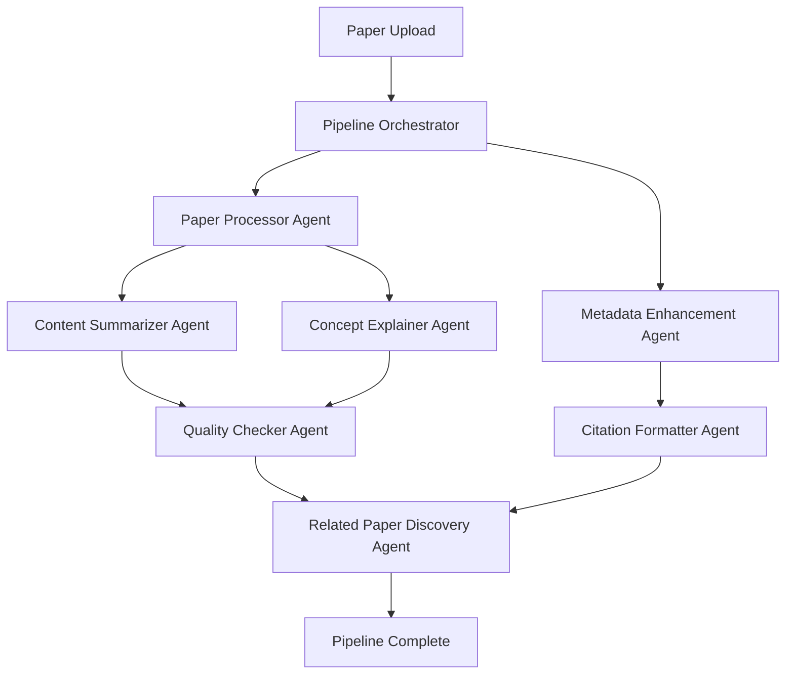
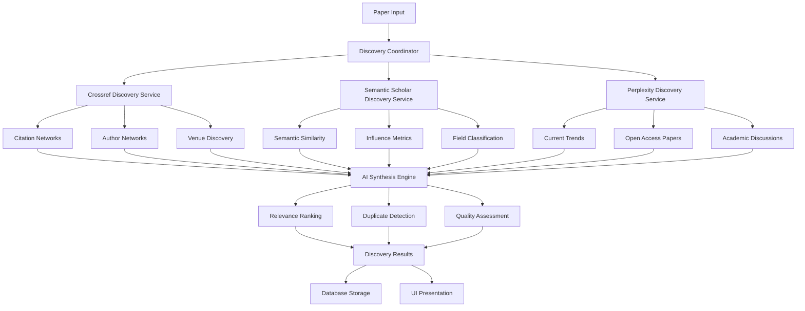

# Answer42 - AI-Powered Academic Research Platform


Answer42 is a sophisticated AI-powered platform for academic researchers, students, and scholars to upload, analyze, and interact with research papers using multiple AI providers. The platform combines advanced paper processing with intelligent chat capabilities and a revolutionary multi-agent processing pipeline to make academic research more efficient and insightful.

## Table of Contents

- [What is Answer42?](#what-is-answer42)
- [Technology Stack](#technology-stack)
- [Architecture Overview](#architecture-overview)
- [Project Structure](#project-structure)
- [Core Features](#core-features)
- [Multi-Agent Processing Pipeline](#multi-agent-processing-pipeline)
- [Related Papers Discovery System](#related-papers-discovery-system)
- [AI Integration](#ai-integration)
- [Database Design](#database-design)
- [Getting Started](#getting-started)
- [Development](#development)
- [Configuration](#configuration)

## What is Answer42?

Answer42 is a comprehensive research assistant that helps academics work with scientific papers through:

- **Intelligent Paper Processing**: Upload PDFs and extract full text, metadata, and structured information
- **Multi-Agent Processing Pipeline**: Seven specialized AI agents for comprehensive paper analysis (🆕 **NEW!**)
- **Related Papers Discovery**: Multi-source intelligent discovery of related academic papers (🆕 **NEW!**)
- **Multi-Modal AI Chat**: Three specialized chat modes using different AI providers for various research needs
- **Comprehensive Analysis**: Generate summaries, extract key findings, identify methodologies, and create glossaries
- **External Metadata Integration**: Automatic enhancement using Crossref and Semantic Scholar APIs
- **Project Organization**: Group papers into research projects for better organization
- **Credit-Based System**: Subscription model with credit management for AI operations

## Technology Stack

### Backend

- **Java 21** - Modern Java with latest features
- **Spring Boot 3.4.5** - Enterprise application framework
- **Spring Security** - Authentication and authorization
- **Spring Data JPA** - Database access with Hibernate
- **Spring AI** - Unified AI provider integration
- **PostgreSQL** - Primary database with JSONB support
- **JWT** - Stateless authentication tokens
- **Lombok** - Reduced boilerplate code

### Frontend

- **Vaadin 24.7.3** - Full-stack Java web framework
- **Custom CSS Themes** - Responsive design with dark mode support
- **Progressive Web App** - Offline capabilities and mobile support

### AI Providers

- **Anthropic Claude** - Paper-specific analysis and chat
- **OpenAI GPT-4** - Cross-reference analysis and general chat
- **Perplexity** - Research exploration and external knowledge

### External APIs

- **Crossref API** - Citation network analysis and bibliographic discovery
- **Semantic Scholar API** - Semantic similarity and influence analysis
- **Perplexity API** - Real-time research trends and open access discovery

### Development Tools

- **Maven** - Build automation and dependency management
- **Checkstyle, PMD, SpotBugs** - Code quality and static analysis
- **Spring Boot DevTools** - Development hot-reload

## Architecture Overview

Answer42 follows a clean layered architecture with a sophisticated multi-agent processing system and intelligent discovery capabilities:

```
┌─────────────────────┐
│   Vaadin Views      │  User Interface Layer
├─────────────────────┤
│   Controllers       │  REST API Layer  
├─────────────────────┤
│   Services          │  Business Logic Layer
├─────────────────────┤
│  Multi-Agent        │  AI Processing Layer (🆕 NEW!)
│  Pipeline System    │  Seven Specialized Agents
├─────────────────────┤
│  Discovery System   │  Multi-Source Paper Discovery (🆕 NEW!)
│  (Crossref, S2, AI) │  Citation Networks & Semantic Analysis
├─────────────────────┤
│   Repositories      │  Data Access Layer
├─────────────────────┤
│   PostgreSQL        │  Database Layer
└─────────────────────┘
```

### Key Design Patterns

- **MVC Architecture** - Clear separation of concerns
- **Multi-Agent Pattern** - Specialized AI agents for different tasks (🆕 **NEW!**)
- **Multi-Source Discovery Pattern** - Intelligent paper discovery from multiple APIs (🆕 **NEW!**)
- **Repository Pattern** - Data access abstraction
- **Service Layer** - Business logic encapsulation
- **Dependency Injection** - Loose coupling via Spring IoC
- **Component-Based UI** - Reusable Vaadin components

## Core Features

### 📄 Paper Management

- **PDF Upload & Processing**: Extract text content and metadata from academic papers
- **Real-time Pipeline Processing**: Live progress tracking during multi-agent analysis (🆕 **NEW!**)
- **Metadata Enhancement**: Automatic enrichment via Crossref and Semantic Scholar APIs
- **Comprehensive Storage**: Store papers with full text, abstracts, authors, citations, and analysis results
- **Organization**: Group papers into research projects for better management
- **Bulk Upload**: Process multiple papers simultaneously with parallel pipeline processing

### 🔍 Related Papers Discovery (🆕 **NEW!**)

**Intelligent multi-source discovery system for comprehensive research exploration:**

1. **Multi-Source Discovery**
   
   - **Crossref API Integration**: Citation network analysis and bibliographic discovery
   - **Semantic Scholar API**: Semantic similarity and influence metrics analysis
   - **Perplexity API**: Real-time research trends and open access paper discovery
   - **AI Synthesis Engine**: Intelligent combination and ranking of results from all sources

2. **Advanced Discovery Features**
   
   - **Citation Networks**: Forward and backward citation analysis with relationship mapping
   - **Semantic Similarity**: AI-powered related paper discovery based on content similarity
   - **Author Networks**: Comprehensive researcher tracking and collaboration analysis
   - **Field Evolution**: Historical and current research trends in specific domains
   - **Real-time Context**: Current academic discussions and developments

3. **Interactive Discovery Interface**
   
   - **Smart Filtering**: Filter by discovery source, relationship type, and relevance score
   - **Citation Network Visualization**: Interactive graph-based citation network exploration
   - **Paper Bookmarking**: Save interesting discoveries for future reference
   - **Feedback Collection**: Structured user feedback to improve discovery algorithms
   - **Detailed Statistics**: Comprehensive discovery analytics and source breakdown

4. **Quality Assessment & Ranking**
   
   - **AI-Powered Relevance Scoring**: Multi-factor ranking algorithm using Claude
   - **Duplicate Detection**: Intelligent paper merging and deduplication across sources
   - **Source Reliability Scoring**: Quality assessment based on API source and completeness
   - **User Feedback Integration**: Continuous improvement through user preference learning

### 🤖 Multi-Modal AI Chat

**Three specialized chat modes optimized for different research needs:**

1. **Paper Chat (Anthropic Claude)**
   
   - Deep analysis of individual papers
   - Contextual Q&A about paper content
   - Generate summaries, key findings, and glossaries
   - One-click analysis buttons for common tasks

2. **Cross-Reference Chat (OpenAI GPT-4)**
   
   - Compare multiple papers simultaneously
   - Identify agreements, contradictions, and research gaps
   - Relationship analysis between different studies
   - Methodology and results comparison

3. **Research Explorer (Perplexity)**
   
   - External research and fact-checking
   - Discover related papers and research
   - Verify claims against current literature
   - General academic research assistance

### 📊 Intelligent Analysis

- **Automated Summaries**: Brief, standard, and detailed summaries
- **Key Findings Extraction**: Identify main contributions and results
- **Methodology Analysis**: Extract and analyze research methods
- **Concept Glossaries**: Generate definitions for technical terms
- **Citation Analysis**: Process and structure reference lists
- **Quality Assessment**: AI-powered quality scoring and feedback

### 👤 User Management

- **Secure Authentication**: JWT-based authentication with Spring Security
- **User Profiles**: Customizable user preferences and settings
- **Subscription Management**: Credit-based system with multiple tiers
- **Progress Tracking**: Monitor paper processing and analysis status

## Multi-Agent Processing Pipeline

🆕 **NEW FEATURE**: Answer42 now features a sophisticated multi-agent processing pipeline that automatically analyzes papers using seven specialized AI agents.

### Pipeline Architecture

The multi-agent system processes papers through coordinated AI agents, each optimized for specific tasks:



### Specialized AI Agents

**🔧 Paper Processor Agent** (OpenAI GPT-4)

- PDF text extraction and structure analysis
- Section identification (introduction, methods, results, etc.)
- Table and figure recognition
- Mathematical notation processing

**📚 Metadata Enhancement Agent** (OpenAI GPT-4)

- Crossref API integration for bibliographic data
- Semantic Scholar API integration for citation metrics
- DOI resolution and validation
- Author disambiguation and affiliation resolution

**📝 Content Summarizer Agent** (Anthropic Claude)

- Multi-level summary generation (brief, standard, detailed)
- Executive summaries for non-specialists
- Technical summaries for domain experts
- Key findings extraction with confidence scoring

**🧠 Concept Explainer Agent** (OpenAI GPT-4)

- Technical term identification and explanation
- Concept relationship mapping
- Education level-appropriate explanations
- Real-world analogies for complex concepts

**✅ Quality Checker Agent** (Anthropic Claude)

- Multi-dimensional accuracy verification
- Hallucination detection and fact-checking
- Content consistency analysis
- Bias detection and quality scoring

**📖 Citation Formatter Agent** (OpenAI GPT-4)

- Reference list parsing and structuring
- Multiple citation style formatting (APA, MLA, Chicago, IEEE)
- DOI validation and metadata enrichment
- Bibliography generation with quality assessment

**🔍 Related Paper Discovery Agent** (🆕 **NEW!**) (Anthropic Claude)

- Multi-source paper discovery coordination
- AI-powered relevance score enhancement
- Result synthesis and deduplication
- Discovery metadata tracking and storage

### Pipeline Features

**Real-time Progress Tracking**

- Live agent status updates in the Papers view
- Individual agent progress indicators
- Estimated completion times
- WebSocket-powered real-time updates

**Intelligent Task Management**

- Database-driven task lifecycle management
- Spring Event system integration
- Automatic retry mechanisms and error handling
- Agent memory and context management

**Cost-Optimized Processing**

- Token usage tracking and analytics
- Credit-based pricing integration
- Performance monitoring and optimization
- User-aware API key management

## Related Papers Discovery System

🆕 **NEW FEATURE**: Answer42's Related Papers Discovery System provides comprehensive research landscape exploration through multi-source intelligent discovery.

### Discovery Architecture

The system combines multiple academic APIs with AI synthesis for comprehensive paper discovery:



### Discovery Sources

**🔗 Crossref API Discovery**

- Forward citations (papers that cite this work)
- Backward citations (papers this work cites)
- Author network discovery and publication venue exploration
- Subject classification and temporal analysis
- Rate-limited processing (45 requests/second)

**🧠 Semantic Scholar API Discovery**

- Semantic similarity analysis using paper embeddings
- Influence metrics and impact assessment
- Research field classification and author disambiguation
- Citation context analysis
- Free tier integration (100 requests/minute)

**🌐 Perplexity API Discovery**

- Real-time research trend analysis
- Current academic discussions and debates
- Open access paper discovery
- Press coverage and impact tracking
- Trend-aware discovery (10 requests/minute)

### AI Synthesis Engine

**Intelligent Result Processing**

- **Multi-source Deduplication**: DOI, title, and author-based paper matching
- **AI-Powered Relevance Enhancement**: Claude-based scoring using 5-factor algorithm
- **Quality Filtering**: Configurable thresholds with source reliability assessment
- **Batch Processing**: Optimal AI API usage with error handling and fallback

**Advanced Ranking Algorithm**

1. **Base Relevance Score**: From discovery source APIs
2. **Relationship Importance**: Weighted by relationship type (citations > similarity > trends)
3. **Citation Impact**: Based on citation count and influence metrics
4. **Data Completeness**: Higher scores for papers with rich metadata
5. **Source Reliability**: Crossref > Semantic Scholar > Perplexity weighting

### Discovery Database Schema

**Comprehensive Storage System**

- **discovered_papers**: 38 columns with complete paper metadata from all sources
- **paper_relationships**: 13 columns tracking relationship types and strength
- **discovery_results**: 26 columns for discovery session tracking and metrics
- **discovery_feedback**: 20 columns for user feedback and algorithm improvement

**Performance Optimization**

- 31 database indexes for fast querying and filtering
- JSONB fields for flexible metadata storage
- Efficient relationship mapping and discovery result aggregation

### Discovery UI Components

**Interactive Discovery Interface**

- **RelatedPapersSection**: Main discovery results with filtering and statistics
- **CitationNetworkDialog**: Interactive citation network visualization
- **PaperDetailsDialog**: Comprehensive paper information display
- **DiscoveryFeedbackDialog**: Structured user feedback collection
- **Real-time Progress Tracking**: Live discovery status updates

**User Experience Features**

- **Smart Filtering**: By source, relationship type, and relevance score
- **Paper Bookmarking**: Save discoveries with visual feedback
- **Discovery Statistics**: Real-time analytics and source breakdown
- **Feedback Integration**: User preferences for algorithm improvement

## AI Integration

Answer42 uses **Spring AI** for unified AI provider management with optimized model selection:

### Provider-Specific Optimizations

```java
// Anthropic Claude - Best for deep paper analysis
@Value("${spring.ai.anthropic.chat.options.model}")
private String anthropicModel = "claude-3-7-sonnet-latest";

// OpenAI GPT-4 - Optimal for cross-reference analysis  
@Value("${spring.ai.openai.chat.options.model}")
private String openaiModel = "gpt-4o";

// Perplexity - Specialized for research and external knowledge
@Value("${spring.ai.perplexity.chat.options.model}")
private String perplexityModel = "llama-3.1-sonar-small-128k-online";
```

### Chat Session Management

- **Contextual Memory**: Maintain conversation history within sessions
- **Paper Context Injection**: Automatically include relevant paper content
- **Multi-Paper Support**: Handle conversations spanning multiple papers
- **Real-time Processing**: Stream responses for better user experience

### Discovery API Integration

- **Rate Limiting**: Enterprise-grade throttling with circuit breakers
- **Caching**: Multi-level caching with 24-hour duration
- **Error Resilience**: Graceful degradation and fallback mechanisms
- **Cost Tracking**: Comprehensive API usage monitoring

## Database Design

### Core Entities

**Users**

- Authentication and profile information
- Subscription and credit tracking
- User preferences and settings

**Papers**

- Complete paper metadata and content
- Processing status and analysis results
- External API integration data (Crossref, Semantic Scholar)
- JSONB fields for flexible metadata storage

**Chat Sessions**

- AI conversation history and context
- Associated papers and analysis results
- Provider-specific configurations

**Projects**

- Paper organization and grouping
- Research project metadata
- Collaboration features

**Discovery System (🆕 NEW!)**

- **Discovered Papers**: Multi-source paper metadata and discovery information
- **Paper Relationships**: Citation and similarity relationship tracking
- **Discovery Results**: Session-based discovery tracking and analytics
- **Discovery Feedback**: User feedback for algorithm improvement

### JSONB Usage

The platform leverages PostgreSQL's JSONB for flexible data storage:

```java
@JdbcTypeCode(SqlTypes.JSON)
@Column(name = "metadata", columnDefinition = "jsonb")
private JsonNode metadata;

@JdbcTypeCode(SqlTypes.JSON)
@Column(name = "key_findings", columnDefinition = "jsonb")
private JsonNode keyFindings;

@JdbcTypeCode(SqlTypes.JSON)
@Column(name = "topics", columnDefinition = "jsonb")
private List<String> topics;
```

### Theme System

Answer42 uses a structured theme system based on Vaadin best practices:

1. **Consistent Variables**: CSS custom properties for colors, spacing, shadows, etc.
2. **Component Modularity**: Styles organized by component type
3. **Dark Mode Support**: Built-in support for light and dark themes
4. **Responsive Design**: Mobile-first approach with responsive breakpoints
5. **Design System Integration**: Leverages Vaadin Lumo design system

The theme is activated by loading each CSS file in the AppShell class:

```java
@CssImport("./styles/themes/answer42/main.css")
@CssImport("./styles/themes/answer42/styles.css")
@CssImport("./styles/themes/answer42/components/auth-forms.css")
@CssImport("./styles/themes/answer42/components/main-layout.css")
@CssImport("./styles/themes/answer42/components/dashboard.css")
@CssImport("./styles/themes/answer42/components/papers.css")
@CssImport("./styles/themes/answer42/components/discovery.css")
```

## Database Schema Management

**Dump the entire schema**

```bash
supabase db dump --schema public > schema.sql
```

**Dump specific schema**

```bash
supabase db dump --schema answer42 > answer42_schema.sql
```

**Dump with data**

```bash
supabase db dump --data-only > data.sql
```

**Dump structure only (no data)**

```bash
supabase db dump --schema-only > structure.sql
```

**Dump specific tables**

```bash
supabase db dump --table papers --table users > specific_tables.sql
```

### Entity Design Guidelines

- **Database**: snake_case naming convention
- **Java**: camelCase naming convention
- **Entity properties**: Must map to database column names using `@Column`, `@JoinColumn`, `@JoinTable`

**Use Lombok for entities:**

```java
@Data // Lombok annotation for getters, setters, equals, hashCode, toString
@NoArgsConstructor // Lombok for no-args constructor
@AllArgsConstructor // Lombok for all-args constructor

// JPA Default Loading Strategies
@OneToOne    // EAGER by default
@ManyToOne   // EAGER by default
@OneToMany   // LAZY by default
@ManyToMany  // LAZY by default

@UpdateTimestamp // called on insert and update
```

### JSON Fields

For complex attributes, leverage PostgreSQL's JSONB type with Hibernate:

```java
import org.hibernate.annotations.JdbcTypeCode;
import org.hibernate.type.SqlTypes;

@Entity
@Table(name = "table_name", schema = "answer42")
@Data
@NoArgsConstructor
public class YourEntity {

    @Id
    @GeneratedValue(strategy = GenerationType.UUID)
    private UUID id;

    // Use JdbcTypeCode annotation for JSON object fields
    @JdbcTypeCode(SqlTypes.JSON)
    @Column(columnDefinition = "jsonb")
    private Map<String, Object> attributes;

    // For array types stored as JSONB, use List<String>
    @JdbcTypeCode(SqlTypes.JSON)
    @Column(columnDefinition = "jsonb")
    private List<String> topics;
}
```

## Getting Started

### Prerequisites

- **Java 21** or later
- **Maven 3.8** or later  
- **PostgreSQL 14** or later
- **AI API Keys** (OpenAI, Anthropic, Perplexity)

### Quick Start

1. **Clone the repository**
   
   ```bash
   git clone https://github.com/yourusername/answer42.git
   cd answer42
   ```

2. **Configure environment variables**
   Create a `.env` file in the project root:
   
   ```env
   OPENAI_API_KEY=your_openai_api_key
   ANTHROPIC_API_KEY=your_anthropic_api_key
   PERPLEXITY_API_KEY=your_perplexity_api_key
   ```

3. **Set up PostgreSQL**
   
   - Create a database named `postgres`
   - Create schema: `CREATE SCHEMA answer42;`
   - Update connection details in `application.properties`

4. **Build and run**
   
   ```bash
   mvn clean install
   mvn spring-boot:run
   ```

5. **Access the application**
   Open your browser to `http://localhost:8080`

## Development

### Running in Development Mode

```bash
mvn spring-boot:run
```

This enables:

- Vaadin development mode with hot reload
- Detailed SQL logging  
- Development-specific configurations

### Code Quality Tools

The project includes comprehensive code quality checks:

```bash
# Run code style checks
mvn checkstyle:check

# Run static analysis
mvn pmd:check

# Find potential bugs
mvn spotbugs:check

# Run all quality checks
mvn clean verify
```

### Building for Production

```bash
mvn clean package -Pproduction
```

This creates an optimized build with:

- Minified frontend resources
- Production Vaadin compilation
- Optimized JAR/WAR packaging

## Configuration

### Key Configuration Files

**application.properties**

- Database connection settings
- AI provider configurations
- Security and JWT settings
- Vaadin development options

**AI Provider Settings**

```properties
# Anthropic Configuration
spring.ai.anthropic.api-key=${ANTHROPIC_API_KEY}
spring.ai.anthropic.chat.options.model=claude-3-7-sonnet-latest
spring.ai.anthropic.chat.options.temperature=0.7

# OpenAI Configuration  
spring.ai.openai.api-key=${OPENAI_API_KEY}
spring.ai.openai.chat.options.model=gpt-4o
spring.ai.openai.chat.options.temperature=0.7

# Perplexity Configuration
spring.ai.perplexity.api-key=${PERPLEXITY_API_KEY}
spring.ai.perplexity.chat.options.model=llama-3.1-sonar-small-128k-online
```

**Discovery API Configuration**

```properties
# Discovery System Configuration
discovery.enabled=true
discovery.semantic-scholar.base-url=https://api.semanticscholar.org/graph/v1
discovery.crossref.base-url=https://api.crossref.org/works
discovery.max-papers-per-source=50
discovery.cache.duration-hours=24
discovery.rate-limit.enabled=true
discovery.rate-limit.crossref.requests-per-second=45
discovery.rate-limit.semantic-scholar.requests-per-minute=100
discovery.rate-limit.perplexity.requests-per-minute=10
```

**Database Configuration**

```properties
spring.datasource.url=jdbc:postgresql://localhost:54322/postgres
spring.jpa.properties.hibernate.default_schema=answer42
spring.jpa.hibernate.ddl-auto=update
```

---

**Answer42** - Making academic research more intelligent, one paper at a time. 🚀📚
