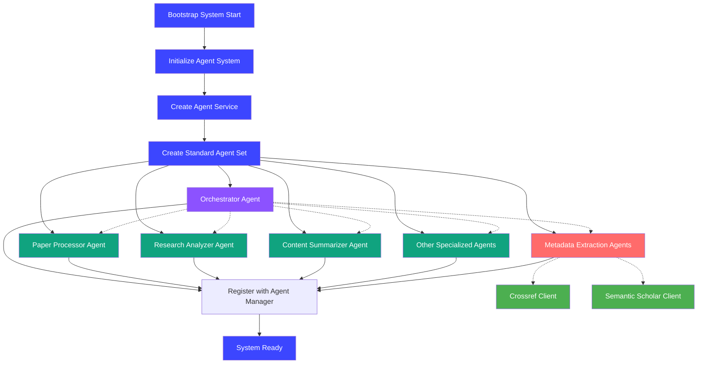
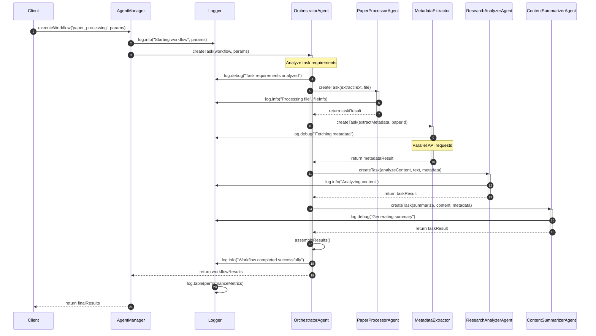
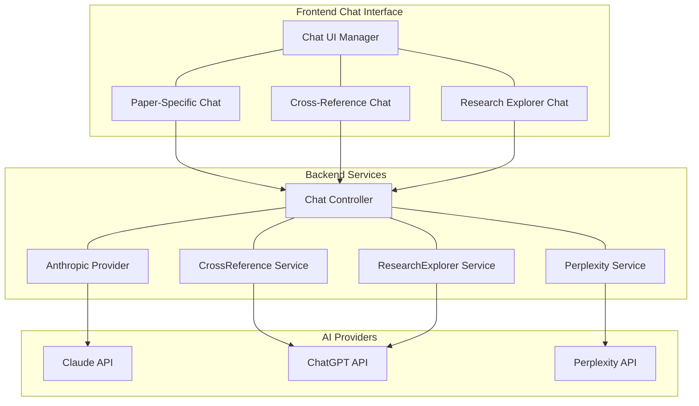

# Answer42 - Academic Research Assistant


Answer42 is an AI-powered platform designed to help researchers, students, and academics manage and analyze scientific papers, making research more efficient and collaborative.

## Table of Contents

- [Architecture Overview](#architecture-overview)
- [Technology Stack](#technology-stack)
- [Project Structure](#project-structure)
- [Key Features](#key-features)
- [Authentication and Security](#authentication-and-security)
- [Database Schema](#database-schema)
- [AI Integration](#ai-integration)
- [Theme System](#theme-system)
- [Getting Started](#getting-started)
- [Development](#development)
- [Production Build](#production-build)
- [API Documentation](#api-documentation)

## Architecture Overview

Answer42 follows a modern layered architecture with clear separation of concerns:

```
+------------------+
|   Presentation   |
|    (Vaadin UI)   |
+------------------+
         |
+------------------+
|   Business Logic |
|    (Services)    |
+------------------+
         |
+------------------+
|  Data Access     |
|  (Repositories)  |
+------------------+
         |
+------------------+
|    Database      |
|   (PostgreSQL)   |
+------------------+
```

### Layers

1. **Presentation Layer**: Vaadin-based UI components, views, and layouts
2. **Business Logic Layer**: Service classes containing application logic
3. **Data Access Layer**: Repository interfaces for database operations
4. **Database Layer**: PostgreSQL database for data persistence

### Architecture Patterns

- **MVC (Model-View-Controller)**: Separation of data, presentation, and control logic
- **Dependency Injection**: Using Spring's IoC container
- **Repository Pattern**: For data access abstraction
- **Service Pattern**: For business logic encapsulation
- **JWT-based Authentication**: For secure API access

## Technology Stack

### Backend

- **Java 21**: Core programming language
- **Spring Boot 3.4.5**: Application framework
- **Spring Security**: Authentication and authorization
- **Spring Data JPA**: Database access
- **Spring AI**: AI integration
- **Spring Transaction**: Standard transaction management
- **JWT (JSON Web Tokens)**: Stateless authentication
- **PostgreSQL (Supabase)**: Relational database
- **Hibernate**: ORM with JSONB support

### Frontend

- **Vaadin 24.7.3**: Java web framework for building UIs
- **HTML/CSS/JavaScript**: Web technologies
- **PWA Support**: Progressive Web App capabilities

### Development Tools

- **Maven**: Dependency management and build automation
- **Spring Boot DevTools**: Development utilities
- **JUnit**: Testing framework
- **Supabase**: Database hosting

### AI Models

- **Claude (Anthropic)**: AI assistant capabilities
- **Perplexity API**: Research and knowledge features

## Project Structure

```
answer42/
├── src/
│   ├── main/
|   |   └── frontend/
|   |   |    └── styles/
|   |   |        └── themes/
│   |   |           └── answer42/           # Custom theme
|   |   |             ├── theme.json        # Theme configuration
│   |   |             ├── styles.css        # Global variables
|   │   |             ├── main.css          # Main styles
|   │   |             └── components/       # Component-specific styles
│   │   ├── java/
│   │   │   └── com/samjdtechnologies/answer42/
│   │   │       ├── config/              # Configuration classes
│   │   │       ├── controller/          # REST controllers
│   │   │       ├── model/               # Data models (entities)
│   │   │       ├── repository/          # Data access interfaces
│   │   │       ├── security/            # Security configuration
│   │   │       ├── service/             # Business logic services
│   │   │       └── ui/                  # Vaadin UI components
│   │   │           ├── constants/       # UI constants
│   │   │           ├── layout/          # Layout components
│   │   │           ├── service/         # UI-specific services
│   │   │           └── views/           # View components
│   │   ├── resources/
│   │   │   ├── META-INF/resources/      # Static resources
│   │   │   ├── static/                  # Static web assets
│   │   │   └── application.properties   # Application configuration
│   └── test/                            # Test classes
├── product-requirement-docs/            # Documentation
├── pom.xml                              # Maven configuration
├── .env                                 # Environment variables (not committed to version control)
└── README.md                            # Project documentation
```

## Key Features

- **Paper Management**: Upload, organize, and manage scientific papers
- **AI Paper Analysis**: Get automatic summaries, key points, and concept explanations
- **Content Extraction**: Extract full text and identify paper sections with AI
- **Research Projects**: Organize papers into customizable research projects
- **Intelligent Chat**: Ask questions about papers and receive accurate responses
- **Cross-Reference Analysis**: Compare multiple papers to find connections and gaps
- **Study Tools**: Generate flashcards, practice questions, and concept maps
- **External Metadata**: Integration with Crossref and Semantic Scholar APIs for enhanced paper information
- **User Authentication**: Secure login/registration system
- **Dashboard**: Overview of papers, projects, and activities
- **Progressive Web App**: Installable application with offline support

## Authentication and Security

Answer42 implements a comprehensive security system:

- **JWT-based Authentication**: Secure, stateless authentication
- **Spring Security**: Role-based access control
- **Password Encryption**: Secure password storage
- **CSRF Protection**: Protection against cross-site request forgery
- **Session Management**: Secure session handling

## Database Schema

The application uses PostgreSQL with the following core entities:

1. **User**: User account information
2. **Paper**: Research paper metadata
3. **Project**: Research project details
4. **AIChat**: AI conversation history
5. **Subscription**: User subscription details

### JSON Fields

For complex attributes, we leverage PostgreSQL's JSONB type with Hibernate:

#### Object/Map JSON Fields

```java
import org.hibernate.annotations.JdbcTypeCode;
import org.hibernate.type.SqlTypes;

@Entity
public class YourEntity {

    @Id
    @GeneratedValue(strategy = GenerationType.UUID)
    private UUID id;

    // Use JdbcTypeCode annotation for JSON object fields
    @JdbcTypeCode(SqlTypes.JSON)
    @Column(columnDefinition = "jsonb")
    private Map<String, Object> attributes;

    // Rest of your entity...
}
```

#### List/Array JSON Fields

For array types stored as JSONB, we use List<String> with the same annotations:

```java
@Entity
@Table(name = "papers", schema = "answer42")
public class Paper {

    // Other fields...

    // Changed from String[] to List<String>
    @JdbcTypeCode(SqlTypes.JSON)
    @Column(columnDefinition = "jsonb")
    private List<String> topics;

    public List<String> getTopics() {
        return topics;
    }

    public void setTopics(List<String> topics) {
        this.topics = topics;
    }

    // Rest of your entity...
}
```

This approach provides the flexibility of schema-less data within a relational database context while maintaining type safety and easy serialization/deserialization.

## AI Integration

AI integration is managed through Spring AI, providing a unified interface for different AI providers.

### Agent System

The platform utilizes a multi-agent system to handle various AI operations:

- **Orchestrator Agent**: Routes operations to appropriate specialized agents
- **Paper Processor**: Extracts and processes text from PDF documents
- **Research Analyzer**: Analyzes papers for metadata and content
- **Content Summarizer**: Generates concise summaries of papers
- **Concept Explainer**: Explains complex concepts within papers
- **Citation Formatter**: Extracts and formats citations properly
- **Quality Checker**: Ensures accuracy of AI-generated content
- **Embedding Generator**: Creates vector embeddings for semantic search
- **Perplexity Researcher**: Conducts external research when needed

#### Agent Bootstrapping Process

Our system initializes agents through a standardized bootstrapping process:

1. The `initializeAgentSystem()` function in  starts the process
2. An `AgentFactory` creates a standard set of agents including the orchestrator
3. Each agent is registered with the `agentManager` singleton
4. Specialized agents are linked to the orchestrator for task routing
5. System-wide agents are created at startup, while user-specific agents are created on demand

enum AgentProvider {
  OPENAI = 'openai',
  ANTHROPIC = 'anthropic',
  PERPLEXITY = 'perplexity',
}

enum AgentType {
  ORCHESTRATOR = 'orchestrator',
  PAPER_PROCESSOR = 'paper-processor',
  RESEARCH_ANALYZER = 'research-analyzer',
  CONTENT_SUMMARIZER = 'content-summarizer',
  CONCEPT_EXPLAINER = 'concept-explainer',
  CITATION_FORMATTER = 'citation-formatter',
  EMBEDDING_GENERATOR = 'embedding-generator',
  QUALITY_CHECKER = 'quality-checker',
  PERPLEXITY_RESEARCHER = 'perplexity-researcher',
  PERPLEXITY_PAPER_ANALYZER = 'perplexity-paper-analyzer',
  FLASHCARD_CREATOR = 'flashcard-creator',
  PRACTICE_QUESTIONS_CREATOR = 'practice-questions-creator',
  CONCEPT_MAP_CREATOR = 'concept-map-creator',
  GENERAL = 'general',
}

export const RECOMMENDED_PROVIDER: Record<AgentType, AgentProvider> = {

  [AgentType.ORCHESTRATOR]: AgentProvider.OPENAI,
  [AgentType.PAPER_PROCESSOR]: AgentProvider.OPENAI,
  [AgentType.RESEARCH_ANALYZER]: AgentProvider.OPENAI,
  [AgentType.CONTENT_SUMMARIZER]: AgentProvider.ANTHROPIC,
  [AgentType.CONCEPT_EXPLAINER]: AgentProvider.OPENAI,
  [AgentType.QUALITY_CHECKER]: AgentProvider.ANTHROPIC,
  [AgentType.CITATION_FORMATTER]: AgentProvider.OPENAI,
  [AgentType.PERPLEXITY_RESEARCHER]: AgentProvider.PERPLEXITY,
  [AgentType.PERPLEXITY_PAPER_ANALYZER]: AgentProvider.PERPLEXITY,
  [AgentType.EMBEDDING_GENERATOR]: AgentProvider.OPENAI,
  [AgentType.FLASHCARD_CREATOR]: AgentProvider.OPENAI,
  [AgentType.PRACTICE_QUESTIONS_CREATOR]: AgentProvider.OPENAI,
  [AgentType.CONCEPT_MAP_CREATOR]: AgentProvider.ANTHROPIC,
  [AgentType.GENERAL]: AgentProvider.OPENAI,

};

This process ensures all agents are properly initialized with appropriate models and configurations.



#### Orchestrator Pattern

The orchestrator pattern is central to our agent architecture:

1. **Central Coordination**: The orchestrator agent acts as the entry point for all complex AI operations
2. **Task Routing**: Based on task requirements, the orchestrator delegates to specialized agents
3. **Workflow Management**: For multi-step operations, the orchestrator maintains state and sequences
4. **Dependency Resolution**: The orchestrator resolves dependencies between agent operations
5. **Error Handling**: Centralized error handling and recovery strategies are implemented
6. **Logging and Monitoring**: Comprehensive logging of all operations with multi-level verbosity

The orchestrator uses a task-based API where each request is converted to a structured task with clear inputs and expected outputs.



### Chat System

Answer42 implements a multi-provider chat system with three specialized interfaces:



#### Paper-Specific Chat (Claude AI)

- Uses Anthropic's Claude models for deep paper understanding
- Optimized for contextual questions about specific papers
- Provides source citations for answers with confidence scores
- Implemented as a direct provider service with paper context

#### Cross-Reference Chat (ChatGPT)

- Powered by OpenAI's GPT-4 models through `CrossReferenceChatService`
- Specialized for comparing multiple papers to find agreements and contradictions
- Structures responses with relationship analysis between papers
- Provides section-by-section comparisons of methods, results, and conclusions

#### Research Explorer Chat (Perplexity/OpenAI Hybrid)

- Frontend features Perplexity's "Deep Research" capabilities
- Uses `ResearchExplorerChatService` (OpenAI) for structural analysis
- Uses `PerplexityResearchService` for external research and citations
- Features three modes: General Search, Verify Claims, and Discover Papers
- Implements a credit-based quota system based on subscription tier

Each chat interface operates independently from the agent system, providing specialized research assistance based on different AI providers' strengths.

## Theme System

Answer42 uses a structured theme system based on Vaadin best practices:

```
answer42/
├── src/
│   ├── main/
|   |   └── frontend/
|   |   |    └── styles/
|   |   |        └── themes/
│   |   |           └── answer42/           # Custom theme
|   |   |             ├── theme.json        # Theme configuration
│   |   |             ├── styles.css        # Global variables
|   │   |             ├── main.css          # Main styles
|   │   |             └── components/       # Component-specific styles
```

### Key Theme Features

1. **Consistent Variables**: CSS custom properties for colors, spacing, shadows, etc.
2. **Component Modularity**: Styles organized by component type
3. **Dark Mode Support**: Built-in support for light and dark themes
4. **Responsive Design**: Mobile-first approach with responsive breakpoints
5. **Design System Integration**: Leverages Vaadin Lumo design system

The theme is activated by loading each css inthe AppShell class.

@CssImport("./styles/themes/answer42/main.css")

@CssImport("./styles/themes/answer42/styles.css")

@CssImport("./styles/themes/answer42/components/auth-forms.css")

@CssImport("./styles/themes/answer42/components/main-layout.css")

@CssImport("./styles/themes/answer42/components/dashboard.css")

@CssImport("./styles/themes/answer42/components/papers.css")

## Getting Started

### Prerequisites

- Java 21 or later
- Maven 3.8 or later
- PostgreSQL 14 or later (or Supabase account)
- API keys for AI services

### Environment Variables

The application requires the following environment variables:

```
# AI API Keys
OPENAI_API_KEY=your_openai_api_key
ANTHROPIC_API_KEY=your_anthropic_api_key
PERPLEXITY_API_KEY=your_perplexity_api_key
```

You can set these up in two ways:

1. Create a `.env` file in the project root (never commit this file to version control)
2. Set the environment variables directly in your system

The application includes an `EnvironmentConfig` class that loads variables from the `.env` file if present.

### Installation

1. Clone the repository:
   
   ```
   git clone https://github.com/yourusername/answer42.git
   cd answer42
   ```

2. Set up the environment variables described above

3. Build the application:
   
   ```
   mvn clean install
   ```

4. Run the application:
   
   ```
   mvn spring-boot:run
   ```

5. Access the application at http://localhost:8080

## Development

### Running in Development Mode

```
mvn spring-boot:run
```

Vaadin development mode is enabled by default, providing hot reloading of UI changes.

### Configuration

Core application configuration is located in `src/main/resources/application.properties`.

Key configuration properties:

- Database connection settings
- Spring transaction management
- AI provider API keys
- JWT authentication settings
- Logging configuration

## Production Build

To build for production:

```
mvn clean package -Pproduction
```

This builds an optimized version with:

- Minified frontend resources
- Production-ready settings
- WAR file for deployment

## API Documentation

The application exposes REST APIs for authentication and data access:

- `/api/auth/*`: Authentication endpoints
- `/api/test`: Test endpoint for connectivity verification

Detailed API documentation is available in the codebase comments.

## License

[License Information]

## Contributors

[Contributors Information]
