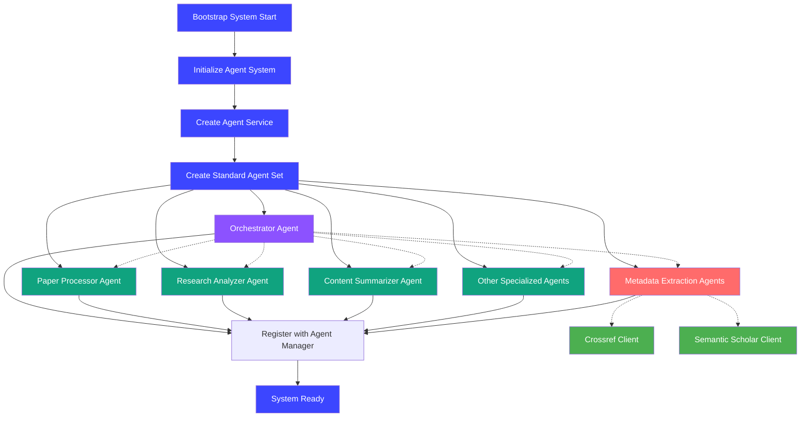
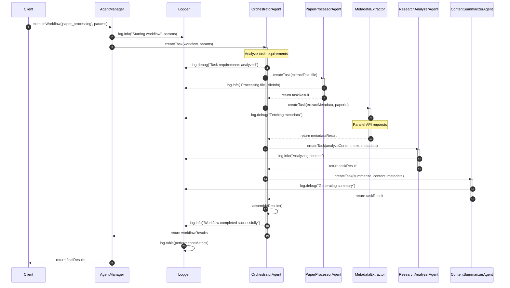

Agent Bootstrapping Process

Our system initializes agents through a standardized bootstrapping process:

1. The `initializeAgentSystem()` function in starts the process
2. An `AgentFactory` creates a standard set of agents including the orchestrator
3. Each agent is registered with the `agentManager` singleton
4. Specialized agents are linked to the orchestrator for task routing
5. System-wide agents are created at startup, while user-specific agents are created on demand

enum AgentProvider {
 OPENAI = 'openai',
 ANTHROPIC = 'anthropic',
 PERPLEXITY = 'perplexity',
}

enum AgentType {
 ORCHESTRATOR = 'orchestrator',
 PAPER_PROCESSOR = 'paper-processor',
 RESEARCH_ANALYZER = 'research-analyzer',
 CONTENT_SUMMARIZER = 'content-summarizer',
 CONCEPT_EXPLAINER = 'concept-explainer',
 CITATION_FORMATTER = 'citation-formatter',
 EMBEDDING_GENERATOR = 'embedding-generator',
 QUALITY_CHECKER = 'quality-checker',
 PERPLEXITY_RESEARCHER = 'perplexity-researcher',
 PERPLEXITY_PAPER_ANALYZER = 'perplexity-paper-analyzer',
 FLASHCARD_CREATOR = 'flashcard-creator',
 PRACTICE_QUESTIONS_CREATOR = 'practice-questions-creator',
 CONCEPT_MAP_CREATOR = 'concept-map-creator',
 GENERAL = 'general',
}

export const RECOMMENDED_PROVIDER: Record<AgentType, AgentProvider> = {

};

Agent Implementations

Each agent will be implemented as a separate module with standardized interfaces:

```
// Base Agent interface
interface AIAgent {
  process(input: AgentInput): Promise<AgentOutput>;
  getName(): string;
  getCapabilities(): string[];
}

// Orchestrator Agent implementation
class OrchestratorAgent implements AIAgent {
  private agents: Map<string, AIAgent>;

  constructor(agents: AIAgent[]) {
    this.agents = new Map();
    agents.forEach(agent => {
      this.agents.set(agent.getName(), agent);
    });
  }

  async process(input: AgentInput): Promise<AgentOutput> {
    // Determine which agents to use based on the task
    const taskPlan = this.createTaskPlan(input);

    // Execute the plan
    const results = await this.executePlan(taskPlan, input);

    // Integrate results
    const integratedResult = this.integrateResults(results);

    // Final quality check
    const qualityChecker = this.agents.get('QualityChecker');
    if (qualityChecker) {
      const qualityInput = {
        ...input,
        intermediateResult: integratedResult
      };
      const qualityResult = await qualityChecker.process(qualityInput);

      // If quality issues found, address them
      if (qualityResult.needsRevision) {
        return this.handleRevision(qualityResult, input);
      }
    }

    return integratedResult;
  }

  // Additional methods...
}
```

### 6.3 Agent Communication Protocol

Agents will communicate using a standardized message format:

```
interface AgentMessage {
  messageId: string;
  senderId: string;
  recipientId: string;
  messageType: 'REQUEST' | 'RESPONSE' | 'ERROR';
  content: {
    task: string;
    data: any;
    metadata: {
      confidence?: number;
      processingTime?: number;
      sources?: string[];
    }
  };
  timestamp: number;
}
```

This process ensures all agents are properly initialized with appropriate models and configurations.



#### Orchestrator Pattern

The orchestrator pattern is central to our agent architecture:

1. **Central Coordination**: The orchestrator agent acts as the entry point for all complex AI operations
2. **Task Routing**: Based on task requirements, the orchestrator delegates to specialized agents
3. **Workflow Management**: For multi-step operations, the orchestrator maintains state and sequences
4. **Dependency Resolution**: The orchestrator resolves dependencies between agent operations
5. **Error Handling**: Centralized error handling and recovery strategies are implemented
6. **Logging and Monitoring**: Comprehensive logging of all operations with multi-level verbosity

The orchestrator uses a task-based API where each request is converted to a structured task with clear inputs and expected outputs.


