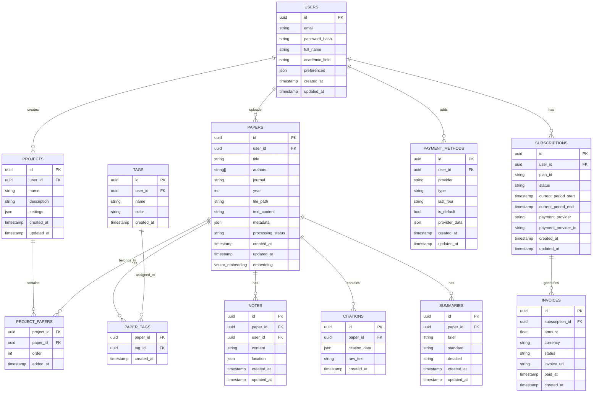

# Answer42: Technical Design Document

**Version:** 1.0  
**Date:** March 29, 2025  
**Status:** Draft

---

## Table of Contents

1. [Introduction](#1-introduction)
2. [Architecture Overview](#2-architecture-overview)
3. [Frontend Design](#3-frontend-design)
4. [Backend Design](#4-backend-design)
5. [Database Schema](#5-database-schema)
6. [AI System Design](#6-ai-system-design)
7. [API Specifications](#7-api-specifications)
8. [Authentication & Authorization](#8-authentication--authorization)
9. [File Storage Design](#9-file-storage-design)
10. [Payment System Integration](#10-payment-system-integration)
11. [User Interface Design](#11-user-interface-design)
12. [Device Optimization](#12-device-optimization)
13. [Performance Considerations](#13-performance-considerations)
14. [Security Implementation](#14-security-implementation)
15. [Testing Strategy](#15-testing-strategy)
16. [Deployment Architecture](#16-deployment-architecture)

---

## 1. Introduction

This technical design document details the implementation specifications for Answer42, an AI-powered research assistant platform. It serves as a bridge between the product requirements document and actual implementation, providing engineers with the necessary technical details to build the system.

### 1.1 Document Purpose

This document aims to:
- Define the system architecture and component relationships
- Specify implementation details for all major features
- Provide data models and API specifications
- Document technical decisions and their rationales
- Serve as a reference for development and future maintenance

### 1.2 Scope

This design document covers all technical aspects of the Answer42 MVP as specified in the PRD, including:
- Frontend implementation
- Backend services
- Database design
- AI system architecture
- Authentication and security
- PDF processing pipeline
- Payment integration
- Mobile optimization

### 1.3 Related Documents

- Answer42 Product Requirements Document
- Answer42 Development Plan
- Answer42 API Documentation (to be developed)
- Answer42 UI/UX Guidelines (to be developed)

---

## 2. Architecture Overview

Answer42 follows a modern, scalable architecture with clear separation of concerns and modular design.

### 2.1 High-Level Architecture


### 2.2 Technology Stack

| Layer | Technologies |
|-------|--------------|
| Frontend | Next.js, TypeScript, React, Tailwind CSS, PDF.js |
| Backend | Node.js, Express, TypeScript, OpenAPI |
| Database | PostgreSQL via Supabase, pgvector extension |
| Storage | Supabase Storage (S3-compatible) |
| AI | OpenAI API, Anthropic API, Perplexity API, Ollama |
| Authentication | Supabase Auth, JWT |
| Payments | Stripe, BTCPay Server |
| Deployment | Docker, Kubernetes (optional) |
| CI/CD | GitHub Actions |
| Monitoring | Prometheus, Grafana |

### 2.3 System Principles

- **Modularity**: All components should have clear interfaces and single responsibilities
- **Scalability**: Services should be designed to scale horizontally
- **Maintainability**: Code should be well-documented and follow established patterns
- **Security**: Security should be built-in at every layer, not added as an afterthought
- **Performance**: System should be optimized for both initial load and runtime performance
- **Mobile-first**: All features must be designed with mobile usage as the primary consideration
- **Resilience**: System should gracefully handle failures of dependencies

---

## 3. Frontend Design

### 3.1 Application Structure

```
answer42/
├── public/
├── src/
│   ├── components/
│   │   ├── auth/
│   │   ├── common/
│   │   ├── dashboard/
│   │   ├── layout/
│   │   ├── papers/
│   │   ├── pdf/
│   │   ├── ai/
│   │   ├── payment/
│   │   └── study/
│   ├── contexts/
│   │   ├── Answer42AuthContext.tsx
│   │   ├── Answer42PaperContext.tsx
│   │   ├── Answer42AIContext.tsx
│   │   ├── Answer42UIContext.tsx
│   │   └── Answer42PaymentContext.tsx
│   ├── hooks/
│   │   ├── useAnswer42Auth.ts
│   │   ├── useAnswer42Papers.ts
│   │   ├── useAnswer42AI.ts
│   │   └── useAnswer42Payment.ts
│   ├── lib/
│   │   ├── api/
│   │   ├── pdf/
│   │   ├── ai/
│   │   └── utils/
│   ├── pages/
│   │   ├── api/
│   │   ├── auth/
│   │   ├── dashboard/
│   │   ├── papers/
│   │   ├── settings/
│   │   ├── subscription/
│   │   ├── _app.tsx
│   │   └── index.tsx
│   ├── styles/
│   ├── types/
│   └── utils/
├── tailwind.config.js
├── next.config.js
└── tsconfig.json
```

### 3.2 Component Architecture

All components will follow the naming convention `Answer42[ComponentName].tsx` and will be structured using:

- Functional components with hooks
- TypeScript interfaces for props
- Separation of presentation and logic
- Composition over inheritance
- Mobile-first responsive design

Example component architecture:

```typescript
// Answer42PaperCard.tsx
import React from 'react';
import { Paper } from '@/types/paper';
import { useAnswer42Papers } from '@/hooks/useAnswer42Papers';

interface Answer42PaperCardProps {
  paper: Paper;
  isSelected?: boolean;
  onSelect?: (paperId: string) => void;
}

export const Answer42PaperCard: React.FC<Answer42PaperCardProps> = ({
  paper,
  isSelected = false,
  onSelect,
}) => {
  const { getPaperThumbnail } = useAnswer42Papers();
  
  const handleSelect = () => {
    if (onSelect) {
      onSelect(paper.id);
    }
  };
  
  return (
    <div 
      className={`rounded-lg p-4 border ${isSelected ? 'border-primary-500 bg-primary-50' : 'border-gray-200'}`}
      onClick={handleSelect}
    >
      <div className="flex items-start">
        {paper.thumbnail && (
          
        )}
        <div>
          <h3 className="font-medium text-gray-900">{paper.title}</h3>
          <p className="text-sm text-gray-500">{paper.authors.join(', ')}</p>
          <p className="text-xs text-gray-400">{paper.journal}, {paper.year}</p>
          {paper.tags && paper.tags.length > 0 && (
            <div className="flex flex-wrap mt-2">
              {paper.tags.map(tag => (
                <span 
                  key={tag} 
                  className="text-xs bg-gray-100 text-gray-600 px-2 py-1 rounded mr-1 mb-1"
                >
                  {tag}
                </span>
              ))}
            </div>
          )}
        </div>
      </div>
    </div>
  );
};
```

### 3.3 State Management

React Context will be used for state management, organized by domain:

- **Answer42AuthContext**: User authentication, profile, permissions
- **Answer42PaperContext**: Paper management, organization, tagging
- **Answer42AIContext**: AI providers, model settings, processing state
- **Answer42UIContext**: UI state, theme, preferences
- **Answer42PaymentContext**: Subscription status, payment methods

Each context will be paired with custom hooks for easier consumption:

```typescript
// useAnswer42Papers.ts
import { useContext } from 'react';
import { Answer42PaperContext } from '@/contexts/Answer42PaperContext';

export const useAnswer42Papers = () => {
  const context = useContext(Answer42PaperContext);
  
  if (!context) {
    throw new Error('useAnswer42Papers must be used within an Answer42PaperProvider');
  }
  
  return context;
};
```

### 3.4 Responsive Design Implementation

Mobile-first design will be implemented using:

- Tailwind CSS breakpoints (`sm`, `md`, `lg`, `xl`, `2xl`)
- Responsive component layouts
- Touch-optimized UI elements
- Bottom navigation on mobile, sidebar on desktop
- Conditional rendering based on screen size
- Media queries for fine-tuning

Example responsive implementation:

```tsx
// Answer42Navigation.tsx
import { useMediaQuery } from '@/hooks/useMediaQuery';

export const Answer42Navigation = () => {
  const isMobile = useMediaQuery('(max-width: 768px)');
  
  return isMobile ? <Answer42MobileNavigation /> : <Answer42DesktopNavigation />;
};
```

### 3.5 PDF Handling

PDF.js will be used for PDF rendering and text extraction:

- Custom PDF viewer component with annotation support
- Text layer for selection and highlighting
- Section identification with machine learning
- Caching mechanisms for improved performance
- Mobile-optimized viewing experience

---

## 4. Backend Design

### 4.1 Service Architecture

The backend follows a modular service-oriented architecture:


### 4.2 Service Implementation Details

Each service will be implemented as a separate module with clear interfaces:

```typescript
// answer42.paper-service.ts
import { PaperRepository } from './repositories/paper.repository';
import { AIService } from './ai.service';
import { StorageService } from './storage.service';
import { Paper, PaperMetadata, PaperSummary } from '../types';

export class PaperService {
  constructor(
    private paperRepository: PaperRepository,
    private aiService: AIService,
    private storageService: StorageService,
  ) {}
  
  async uploadPaper(userId: string, file: Buffer, filename: string): Promise<Paper> {
    // Store the paper
    const paperLocation = await this.storageService.storePaper(userId, file, filename);
    
    // Extract text
    const text = await this.extractText(paperLocation);
    
    // Extract metadata
    const metadata = await this.extractMetadata(text);
    
    // Create paper record
    const paper = await this.paperRepository.create({
      userId,
      title: metadata.title,
      authors: metadata.authors,
      journal: metadata.journal,
      year: metadata.year,
      location: paperLocation,
      text,
      metadata,
    });
    
    // Start async processing
    this.processNewPaper(paper.id).catch(console.error);
    
    return paper;
  }
  
  async processNewPaper(paperId: string): Promise<void> {
    // Get paper
    const paper = await this.paperRepository.findById(paperId);
    if (!paper) throw new Error('Paper not found');
    
    // Generate summary
    const summary = await this.aiService.generateSummary(paper.text);
    
    // Extract key terms
    const keyTerms = await this.aiService.extractKeyTerms(paper.text);
    
    // Extract citations
    const citations = await this.aiService.extractCitations(paper.text);
    
    // Update paper with processed data
    await this.paperRepository.update(paperId, {
      summary,
      keyTerms,
      citations,
      processingStatus: 'COMPLETED',
    });
  }
  
  // Other methods...
}
```

### 4.3 API Structure

The API will follow RESTful principles with versioning:

```
/api/v1/auth
  POST /register
  POST /login
  POST /logout
  GET /me
  PUT /me

/api/v1/papers
  GET /
  POST /
  GET /:id
  PUT /:id
  DELETE /:id
  POST /:id/process
  GET /:id/summary
  GET /:id/citations
  
/api/v1/projects
  GET /
  POST /
  GET /:id
  PUT /:id
  DELETE /:id
  POST /:id/papers
  DELETE /:id/papers/:paperId
  
/api/v1/ai
  POST /process
  POST /explain
  POST /chat
  GET /providers
  
/api/v1/hardware
  GET /capabilities
  GET /recommendations
  
/api/v1/payments
  GET /plans
  POST /subscribe
  GET /subscription
  PUT /subscription
  POST /payment-methods
```

### 4.4 Middleware Implementation

Express middleware will be used for:

- Authentication validation
- Request logging
- Error handling
- Rate limiting
- CORS configuration
- Request validation
- Response compression

Example middleware setup:

```typescript
import express from 'express';
import cors from 'cors';
import helmet from 'helmet';
import compression from 'compression';
import { authMiddleware } from './middlewares/auth';
import { loggerMiddleware } from './middlewares/logger';
import { errorMiddleware } from './middlewares/error';
import { rateLimiterMiddleware } from './middlewares/rate-limiter';

const app = express();

// Global middlewares
app.use(express.json());
app.use(cors());
app.use(helmet());
app.use(compression());
app.use(loggerMiddleware);
app.use(rateLimiterMiddleware);

// Routes
app.use('/api/v1/auth', authRoutes);
app.use('/api/v1/papers', authMiddleware, paperRoutes);
app.use('/api/v1/projects', authMiddleware, projectRoutes);
app.use('/api/v1/ai', authMiddleware, aiRoutes);
app.use('/api/v1/hardware', hardwareRoutes);
app.use('/api/v1/payments', authMiddleware, paymentRoutes);

// Error handling (must be last)
app.use(errorMiddleware);
```

---

## 5. Database Schema

### 5.1 Entity Relationship Diagram



### 5.2 Table Definitions

Table specifications with Supabase SQL:

```sql
-- Users table
CREATE TABLE users (
  id UUID PRIMARY KEY DEFAULT uuid_generate_v4(),
  email TEXT UNIQUE NOT NULL,
  full_name TEXT,
  academic_field TEXT,
  preferences JSONB DEFAULT '{}',
  created_at TIMESTAMP WITH TIME ZONE DEFAULT NOW(),
  updated_at TIMESTAMP WITH TIME ZONE DEFAULT NOW()
);

-- Projects table
CREATE TABLE projects (
  id UUID PRIMARY KEY DEFAULT uuid_generate_v4(),
  user_id UUID REFERENCES users(id) ON DELETE CASCADE,
  name TEXT NOT NULL,
  description TEXT,
  settings JSONB DEFAULT '{}',
  created_at TIMESTAMP WITH TIME ZONE DEFAULT NOW(),
  updated_at TIMESTAMP WITH TIME ZONE DEFAULT NOW()
);

-- Papers table
CREATE TABLE papers (
  id UUID PRIMARY KEY DEFAULT uuid_generate_v4(),
  user_id UUID REFERENCES users(id) ON DELETE CASCADE,
  title TEXT NOT NULL,
  authors TEXT[] NOT NULL,
  journal TEXT,
  year INTEGER,
  file_path TEXT NOT NULL,
  text_content TEXT,
  metadata JSONB DEFAULT '{}',
  processing_status TEXT DEFAULT 'PENDING',
  created_at TIMESTAMP WITH TIME ZONE DEFAULT NOW(),
  updated_at TIMESTAMP WITH TIME ZONE DEFAULT NOW()
);

-- Enable vector extension
CREATE EXTENSION IF NOT EXISTS vector;

-- Add vector column to papers
ALTER TABLE papers ADD COLUMN embedding VECTOR(1536);

-- Project Papers junction table
CREATE TABLE project_papers (
  project_id UUID REFERENCES projects(id) ON DELETE CASCADE,
  paper_id UUID REFERENCES papers(id) ON DELETE CASCADE,
  "order" INTEGER DEFAULT 0,
  added_at TIMESTAMP WITH TIME ZONE DEFAULT NOW(),
  PRIMARY KEY (project_id, paper_id)
);

-- Tags table
CREATE TABLE tags (
  id UUID PRIMARY KEY DEFAULT uuid_generate_v4(),
  user_id UUID REFERENCES users(id) ON DELETE CASCADE,
  name TEXT NOT NULL,
  color TEXT DEFAULT '#6B7280',
  created_at TIMESTAMP WITH TIME ZONE DEFAULT NOW()
);

-- Paper Tags junction table
CREATE TABLE paper_tags (
  paper_id UUID REFERENCES papers(id) ON DELETE CASCADE,
  tag_id UUID REFERENCES tags(id) ON DELETE CASCADE,
  created_at TIMESTAMP WITH TIME ZONE DEFAULT NOW(),
  PRIMARY KEY (paper_id, tag_id)
);

-- Notes table
CREATE TABLE notes (
  id UUID PRIMARY KEY DEFAULT uuid_generate_v4(),
  paper_id UUID REFERENCES papers(id) ON DELETE CASCADE,
  user_id UUID REFERENCES users(id) ON DELETE CASCADE,
  content TEXT NOT NULL,
  location JSONB DEFAULT '{}',
  created_at TIMESTAMP WITH TIME ZONE DEFAULT NOW(),
  updated_at TIMESTAMP WITH TIME ZONE DEFAULT NOW()
);

-- Citations table
CREATE TABLE citations (
  id UUID PRIMARY KEY DEFAULT uuid_generate_v4(),
  paper_id UUID REFERENCES papers(id) ON DELETE CASCADE,
  citation_data JSONB NOT NULL,
  raw_text TEXT,
  created_at TIMESTAMP WITH TIME ZONE DEFAULT NOW()
);

-- Summaries table
CREATE TABLE summaries (
  id UUID PRIMARY KEY DEFAULT uuid_generate_v4(),
  paper_id UUID REFERENCES papers(id) ON DELETE CASCADE,
  brief TEXT,
  standard TEXT,
  detailed TEXT,
  created_at TIMESTAMP WITH TIME ZONE DEFAULT NOW(),
  updated_at TIMESTAMP WITH TIME ZONE DEFAULT NOW()
);

-- Subscriptions table
CREATE TABLE subscriptions (
  id UUID PRIMARY KEY DEFAULT uuid_generate_v4(),
  user_id UUID REFERENCES users(id) ON DELETE CASCADE,
  plan_id TEXT NOT NULL,
  status TEXT NOT NULL,
  current_period_start TIMESTAMP WITH TIME ZONE,
  current_period_end TIMESTAMP WITH TIME ZONE,
  payment_provider TEXT NOT NULL,
  payment_provider_id TEXT,
  created_at TIMESTAMP WITH TIME ZONE DEFAULT NOW(),
  updated_at TIMESTAMP WITH TIME ZONE DEFAULT NOW()
);

-- Payment Methods table
CREATE TABLE payment_methods (
  id UUID PRIMARY KEY DEFAULT uuid_generate_v4(),
  user_id UUID REFERENCES users(id) ON DELETE CASCADE,
  provider TEXT NOT NULL,
  type TEXT NOT NULL,
  last_four TEXT,
  is_default BOOLEAN DEFAULT FALSE,
  provider_data JSONB DEFAULT '{}',
  created_at TIMESTAMP WITH TIME ZONE DEFAULT NOW(),
  updated_at TIMESTAMP WITH TIME ZONE DEFAULT NOW()
);

-- Invoices table
CREATE TABLE invoices (
  id UUID PRIMARY KEY DEFAULT uuid_generate_v4(),
  subscription_id UUID REFERENCES subscriptions(id) ON DELETE SET NULL,
  amount NUMERIC(10,2) NOT NULL,
  currency TEXT NOT NULL,
  status TEXT NOT NULL,
  invoice_url TEXT,
  paid_at TIMESTAMP WITH TIME ZONE,
  created_at TIMESTAMP WITH TIME ZONE DEFAULT NOW()
);
```

### 5.3 Indexes and Optimizations

```sql
-- Search index on papers
CREATE INDEX papers_title_idx ON papers USING GIN (to_tsvector('english', title));
CREATE INDEX papers_text_content_idx ON papers USING GIN (to_tsvector('english', text_content));

-- Vector search index
CREATE INDEX papers_embedding_idx ON papers USING ivfflat (embedding vector_cosine_ops) WITH (lists = 100);

-- Other performance indexes
CREATE INDEX papers_user_id_idx ON papers (user_id);
CREATE INDEX projects_user_id_idx ON projects (user_id);
CREATE INDEX notes_paper_id_idx ON notes (paper_id);
CREATE INDEX citations_paper_id_idx ON citations (paper_id);
CREATE INDEX subscriptions_user_id_idx ON subscriptions (user_id);
CREATE INDEX payment_methods_user_id_idx ON payment_methods (user_id);
```

### 5.4 Row-Level Security Policies (Supabase)

```sql
-- Enable RLS
ALTER TABLE users ENABLE ROW LEVEL SECURITY;
ALTER TABLE projects ENABLE ROW LEVEL SECURITY;
ALTER TABLE papers ENABLE ROW LEVEL SECURITY;
ALTER TABLE project_papers ENABLE ROW LEVEL SECURITY;
ALTER TABLE tags ENABLE ROW LEVEL SECURITY;
ALTER TABLE paper_tags ENABLE ROW LEVEL SECURITY;
ALTER TABLE notes ENABLE ROW LEVEL SECURITY;
ALTER TABLE citations ENABLE ROW LEVEL SECURITY;
ALTER TABLE summaries ENABLE ROW LEVEL SECURITY;
ALTER TABLE subscriptions ENABLE ROW LEVEL SECURITY;
ALTER TABLE payment_methods ENABLE ROW LEVEL SECURITY;
ALTER TABLE invoices ENABLE ROW LEVEL SECURITY;

-- Users policy (users can only access their own data)
CREATE POLICY users_policy ON users
  FOR ALL
  USING (auth.uid() = id);

-- Projects policy
CREATE POLICY projects_policy ON projects
  FOR ALL
  USING (auth.uid() = user_id);

-- Papers policy
CREATE POLICY papers_policy ON papers
  FOR ALL
  USING (auth.uid() = user_id);

-- Project papers policy
CREATE POLICY project_papers_policy ON project_papers
  FOR ALL
  USING (
    EXISTS (
      SELECT 1 FROM projects 
      WHERE projects.id = project_papers.project_id 
      AND projects.user_id = auth.uid()
    )
  );

-- Similar policies for other tables...
```

---

## 6. AI System Design

### 6.1 Agent Architecture

The AI system follows a multi-agent architecture with specialized roles:


### 6.2 Agent Implementations

Each agent will be implemented as a separate module with standardized interfaces:

```typescript
// Base Agent interface
interface AIAgent {
  process(input: AgentInput): Promise<AgentOutput>;
  getName(): string;
  getCapabilities(): string[];
}

// Orchestrator Agent implementation
class OrchestratorAgent implements AIAgent {
  private agents: Map<string, AIAgent>;
  
  constructor(agents: AIAgent[]) {
    this.agents = new Map();
    agents.forEach(agent => {
      this.agents.set(agent.getName(), agent);
    });
  }
  
  async process(input: AgentInput): Promise<AgentOutput> {
    // Determine which agents to use based on the task
    const taskPlan = this.createTaskPlan(input);
    
    // Execute the plan
    const results = await this.executePlan(taskPlan, input);
    
    // Integrate results
    const integratedResult = this.integrateResults(results);
    
    // Final quality check
    const qualityChecker = this.agents.get('QualityChecker');
    if (qualityChecker) {
      const qualityInput = {
        ...input,
        intermediateResult: integratedResult
      };
      const qualityResult = await qualityChecker.process(qualityInput);
      
      // If quality issues found, address them
      if (qualityResult.needsRevision) {
        return this.handleRevision(qualityResult, input);
      }
    }
    
    return integratedResult;
  }
  
  // Additional methods...
}
```

### 6.3 Agent Communication Protocol

Agents will communicate using a standardized message format:

```typescript
interface AgentMessage {
  messageId: string;
  senderId: string;
  recipientId: string;
  messageType: 'REQUEST' | 'RESPONSE' | 'ERROR';
  content: {
    task: string;
    data: any;
    metadata: {
      confidence?: number;
      processingTime?: number;
      sources?: string[];
    }
  };
  timestamp: number;
}
```

### 6.4 Provider Abstraction Layer

The system will support multiple AI providers through an abstraction layer:

```typescript
// AI Provider interface
interface AIProvider {
  generateCompletion(prompt: string, options: CompletionOptions): Promise<string>;
  generateEmbedding(text: string): Promise<number[]>;
  generateChat(messages: ChatMessage[], options: ChatOptions): Promise<ChatResponse>;
  getModelList(): Promise<AIModel[]>;
  getName(): string;
  getCosts(): ProviderCosts;
}

// Implementation for OpenAI
class OpenAIProvider implements AIProvider {
  private api: OpenAI;
  
  constructor(apiKey: string) {
    this.api = new OpenAI({ apiKey });
  }
  
  async generateCompletion(prompt: string, options: CompletionOptions): Promise<string> {
    const response = await this.api.completions.create({
      model: options.model || 'gpt-4',
      prompt,
      max_tokens: options.maxTokens || 500,
      temperature: options.temperature || 0.7,
    });
    
    return response.choices[0].text;
  }
  
  async generateEmbedding(text: string): Promise<number[]> {
    const response = await this.api.embeddings.create({
      model: 'text-embedding-ada-002',
      input: text
    });
    
    return response.data[0].embedding;
  }
  
  // Other methods...
}

// Similar implementations for Anthropic, Perplexity, and Ollama
```

### 6.5 Hardware Detection and Local Models

The hardware detection service will analyze the user's system capabilities and recommend appropriate local models:

```typescript
interface HardwareCapabilities {
  cpu: {
    cores: number;
    model: string;
    speed: number;
  };
  memory: {
    total: number; // in MB
    available: number; // in MB
  };
  gpu: {
    available: boolean;
    model?: string;
    vram?: number; // in MB
  };
  storage: {
    available: number; // in MB
  };
}

interface ModelRequirements {
  minimumRam: number; // in MB
  recommendedRam: number; // in MB
  minimumVram?: number; // in MB
  recommendedVram?: number; // in MB
  diskSpace: number; // in MB
  supportsGpu: boolean;
  cpuOnly: boolean;
}

class HardwareDetectionService {
  async detectCapabilities(): Promise<HardwareCapabilities> {
    // Implementation to detect CPU, RAM, GPU, etc.
    // ...
  }
  
  async getRecommendedModels(capabilities: HardwareCapabilities): Promise<OllamaModel[]> {
    const models = await this.getAllAvailableModels();
    
    return models.filter(model => {
      // Check if model requirements are met
      return this.modelMeetsRequirements(model, capabilities);
    }).sort((a, b) => {
      // Sort by suitability score
      return this.calculateSuitabilityScore(b, capabilities) - 
             this.calculateSuitabilityScore(a, capabilities);
    });
  }
  
  private modelMeetsRequirements(model: OllamaModel, capabilities: HardwareCapabilities): boolean {
    // Check memory
    if (model.requirements.minimumRam > capabilities.memory.available) {
      return false;
    }
    
    // Check GPU if model supports/requires it
    if (model.requirements.supportsGpu && !model.requirements.cpuOnly) {
      if (!capabilities.gpu.available) {
        return false;
      }
      
      if (model.requirements.minimumVram && 
          capabilities.gpu.vram < model.requirements.minimumVram) {
        return false;
      }
    }
    
    // Check storage
    if (model.requirements.diskSpace > capabilities.storage.available) {
      return false;
    }
    
    return true;
  }
  
  // Other methods...
}
```

### 6.6 Agentic System Integration

The agentic system will be integrated with the rest of the application through:

1. **API Endpoints**: Dedicated endpoints for agent interactions
2. **WebSockets**: For real-time agent communication during chat
3. **Background Processing**: For long-running paper analysis tasks
4. **Caching**: For efficient reuse of agent results

Integration points:

```
/api/v1/ai/agents
  GET /                  # List available agents
  POST /:agentName       # Invoke specific agent
  
/api/v1/ai/orchestrator
  POST /process          # Process a request through the orchestrator
  POST /chat             # Start or continue a chat session
  
/api/v1/papers/:id/analyze
  POST /                 # Start analysis of a paper
  GET /status            # Check analysis status
  GET /results           # Get analysis results
```

---

## 7. API Specifications

### 7.1 Authentication Endpoints

```yaml
/api/v1/auth/register:
  post:
    summary: Register a new user
    requestBody:
      content:
        application/json:
          schema:
            type: object
            properties:
              email:
                type: string
                format: email
              password:
                type: string
                minLength: 8
              fullName:
                type: string
            required:
              - email
              - password
    responses:
      201:
        description: User registered successfully
      400:
        description: Invalid request data
      409:
        description: Email already in use

/api/v1/auth/login:
  post:
    summary: Log in an existing user
    requestBody:
      content:
        application/json:
          schema:
            type: object
            properties:
              email:
                type: string
                format: email
              password:
                type: string
            required:
              - email
              - password
    responses:
      200:
        description: Login successful
        content:
          application/json:
            schema:
              type: object
              properties:
                token:
                  type: string
                user:
                  type: object
      401:
        description: Invalid credentials
```

### 7.2 Paper Management Endpoints

```yaml
/api/v1/papers:
  get:
    summary: List user's papers
    parameters:
      - name: page
        in: query
        schema:
          type: integer
          default: 1
      - name: limit
        in: query
        schema:
          type: integer
          default: 20
      - name: search
        in: query
        schema:
          type: string
      - name: tags
        in: query
        schema:
          type: array
          items:
            type: string
    responses:
      200:
        description: List of papers
  post:
    summary: Upload a new paper
    requestBody:
      content:
        multipart/form-data:
          schema:
            type: object
            properties:
              file:
                type: string
                format: binary
              metadata:
                type: object
    responses:
      201:
        description: Paper uploaded successfully

/api/v1/papers/{id}:
  get:
    summary: Get paper details
    parameters:
      - name: id
        in: path
        required: true
        schema:
          type: string
          format: uuid
    responses:
      200:
        description: Paper details
      404:
        description: Paper not found
  put:
    summary: Update paper details
    parameters:
      - name: id
        in: path
        required: true
        schema:
          type: string
          format: uuid
    requestBody:
      content:
        application/json:
          schema:
            type: object
            properties:
              title:
                type: string
              authors:
                type: array
                items:
                  type: string
              journal:
                type: string
              year:
                type: integer
              metadata:
                type: object
    responses:
      200:
        description: Paper updated successfully
      404:
        description: Paper not found
  delete:
    summary: Delete a paper
    parameters:
      - name: id
        in: path
        required: true
        schema:
          type: string
          format: uuid
    responses:
      204:
        description: Paper deleted successfully
      404:
        description: Paper not found
```

### 7.3 AI Interaction Endpoints

```yaml
/api/v1/ai/process:
  post:
    summary: Process a paper or text through the AI system
    requestBody:
      content:
        application/json:
          schema:
            type: object
            properties:
              paperId:
                type: string
                format: uuid
              text:
                type: string
              tasks:
                type: array
                items:
                  type: string
                  enum:
                    - summarize
                    - explain
                    - extract_citations
                    - generate_flashcards
                    - generate_questions
              options:
                type: object
    responses:
      200:
        description: Processing results
      202:
        description: Processing started (for async operations)

/api/v1/ai/chat:
  post:
    summary: Chat with the AI about papers
    requestBody:
      content:
        application/json:
          schema:
            type: object
            properties:
              message:
                type: string
              paperIds:
                type: array
                items:
                  type: string
                  format: uuid
              conversationId:
                type: string
              options:
                type: object
    responses:
      200:
        description: AI response
```

### 7.4 Payment and Subscription Endpoints

```yaml
/api/v1/payments/plans:
  get:
    summary: Get available subscription plans
    responses:
      200:
        description: List of available plans

/api/v1/payments/subscribe:
  post:
    summary: Create a new subscription
    requestBody:
      content:
        application/json:
          schema:
            type: object
            properties:
              planId:
                type: string
              paymentMethodId:
                type: string
              couponCode:
                type: string
    responses:
      200:
        description: Subscription created successfully

/api/v1/payments/bitcoin:
  post:
    summary: Create Bitcoin payment
    requestBody:
      content:
        application/json:
          schema:
            type: object
            properties:
              planId:
                type: string
              discountCode:
                type: string
    responses:
      200:
        description: Bitcoin payment details
        content:
          application/json:
            schema:
              type: object
              properties:
                invoiceUrl:
                  type: string
                amount:
                  type: string
                address:
                  type: string
                expiresAt:
                  type: string
                  format: date-time
```

---

## 8. Authentication & Authorization

### 8.1 Authentication Flow

The authentication flow follows a dual-path approach with enhanced navigation and session handling to prevent redirection loops and improve security.


The enhanced authentication system now includes:
1. Frontend throttling for navigation to prevent redirect loops
2. Direct window.location-based redirection during logout for clean state reset
3. Proper session handling with refresh token support
4. Consistent auth state management across the application
5. A fully styled and functional Profile page for user account management

For testing and development, we provide scripts to create test users and verify the authentication flow:
- `api/scripts/create-test-user.js` - Creates a test user account
- `api/scripts/test-auth.js` - Tests authentication endpoints
- `api/scripts/test-logout.js` - Tests the logout process
- `frontend/scripts/test-auth-flow.js` - Tests the complete authentication cycle
- `frontend/scripts/test-logout-flow.js` - Tests front-end logout behavior

See the [Authentication Guide](./authentication-guide.md) for detailed implementation notes and troubleshooting.

### 8.2 JWT Implementation

JWT tokens will be implemented using Supabase Auth with:

- Short-lived access tokens (1 hour)
- Refresh tokens for seamless reauthorization
- Secure, HTTP-only cookies for token storage
- CSRF protection mechanisms

### 8.3 Permission Model

The system will use role-based and resource-based permissions:

```typescript
enum UserRole {
  FREE = 'free',
  STUDENT = 'student',
  RESEARCHER = 'researcher',
  ADMIN = 'admin',
}

interface Permission {
  action: string; // 'read', 'write', 'delete', etc.
  resource: string; // 'paper', 'project', 'citation', etc.
  conditions?: any; // Additional conditions (e.g., ownership)
}

// Role to permissions mapping
const rolePermissions: Record<UserRole, Permission[]> = {
  [UserRole.FREE]: [
    { action: 'read', resource: 'paper', conditions: { ownership: true } },
    { action: 'write', resource: 'paper', conditions: { ownership: true, limit: 5 } },
    // ...
  ],
  [UserRole.STUDENT]: [
    { action: 'read', resource: 'paper', conditions: { ownership: true } },
    { action: 'write', resource: 'paper', conditions: { ownership: true, limit: 50 } },
    // ...
  ],
  // ...
};

// Permission checking
function hasPermission(user: User, action: string, resource: string, context: any): boolean {
  const role = user.role || UserRole.FREE;
  const permissions = rolePermissions[role];
  
  const permission = permissions.find(p => p.action === action && p.resource === resource);
  if (!permission) return false;
  
  // Check conditions
  if (permission.conditions) {
    if (permission.conditions.ownership && context.userId !== user.id) {
      return false;
    }
    
    if (permission.conditions.limit) {
      // Check usage limits
      // ...
    }
  }
  
  return true;
}
```

### 8.4 OAuth Integration

For social login, the system will support:

- Google OAuth
- Microsoft/Academic OAuth
- GitHub OAuth (for research code repositories)

Implementation using Supabase Auth providers:

```typescript
import { createClient } from '@supabase/supabase-js'

const supabase = createClient(
  'https://your-supabase-url.supabase.co',
  'your-supabase-key'
)

// Google Sign In
async function signInWithGoogle() {
  const { data, error } = await supabase.auth.signInWithOAuth({
    provider: 'google',
    options: {
      redirectTo: 'https://answer42.app/auth/callback',
      scopes: 'email profile'
    }
  });
  
  if (error) throw error;
  return data;
}
```

---

## 9. File Storage Design

### 9.1 Storage Architecture


### 9.2 File Organization

Files will be organized in Supabase Storage with the following structure:

```
papers/
  ├── [user_id]/
  │   ├── [paper_id]/
  │   │   ├── original.pdf
  │   │   ├── thumbnail.png
  │   │   ├── extracted_text.json
  │   │   └── metadata.json
  │   └── ...
  └── ...
exports/
  ├── [user_id]/
  │   ├── [export_id].zip
  │   └── ...
  └── ...
profile/
  ├── [user_id]/
  │   ├── avatar.png
  │   └── ...
  └── ...
```

### 9.3 PDF Processing Pipeline

The PDF processing pipeline consists of:

1. **Upload & Validation**
   - Check file type, size, and integrity
   - Scan for malware/viruses
   - Generate unique IDs

2. **Storage**
   - Store the original file
   - Create thumbnail
   - Record metadata

3. **Text Extraction**
   - Extract raw text
   - Identify document structure
   - Recognize headers, paragraphs, figures, tables
   - Extract references

4. **Vectorization**
   - Generate embeddings for the entire document
   - Generate embeddings for sections
   - Store in pgvector

5. **AI Processing**
   - Generate summaries
   - Extract key concepts
   - Format citations
   - Create study materials

### 9.4 Caching Strategy

To improve performance and reduce costs:

- PDF rendering will use client-side caching
- Extracted text will be cached in Redis
- Common AI operations will have result caching
- CDN for static assets and public files

---

## 10. Payment System Integration

### 10.1 Payment Provider Integration


### 10.2 Stripe Integration

```typescript
// Payment Service using Stripe
import Stripe from 'stripe';

export class StripePaymentService {
  private stripe: Stripe;
  
  constructor(apiKey: string) {
    this.stripe = new Stripe(apiKey, {
      apiVersion: '2023-10-16',
    });
  }
  
  async createSubscription(customerId: string, priceId: string): Promise<Stripe.Subscription> {
    return this.stripe.subscriptions.create({
      customer: customerId,
      items: [{ price: priceId }],
      payment_behavior: 'default_incomplete',
      expand: ['latest_invoice.payment_intent'],
    });
  }
  
  async createCustomer(email: string, name: string): Promise<Stripe.Customer> {
    return this.stripe.customers.create({
      email,
      name,
      metadata: {
        userId: userId,
      },
    });
  }
  
  // Additional methods for handling payments, subscriptions, etc.
}
```

### 10.3 BTCPay Server Integration

```typescript
// Bitcoin Payment Service using BTCPay Server
import { BTCPayClient } from 'btcpay';

export class BTCPayService {
  private client: BTCPayClient;
  
  constructor(config: BTCPayConfig) {
    this.client = new BTCPayClient(config);
  }
  
  async createInvoice(amount: number, currency: string, metadata: any): Promise<BTCPayInvoice> {
    return this.client.createInvoice({
      price: amount,
      currency,
      orderId: metadata.orderId,
      itemDesc: metadata.description,
      notificationUrl: `${process.env.NEXT_PUBLIC_API_URL}/api/v1/payments/btcpay-webhook`,
      redirectURL: `${process.env.FRONTEND_URL}/subscription/success`,
      metadata,
    });
  }
  
  async getInvoiceStatus(invoiceId: string): Promise<BTCPayInvoiceStatus> {
    return this.client.getInvoice(invoiceId);
  }
  
  // Additional methods
}
```

### 10.4 Subscription Management

The subscription system will handle:

- Plan upgrades and downgrades
- Prorated billing
- Usage tracking
- Payment method management
- Invoice generation
- Discount application (including Bitcoin discounts)

```typescript
class SubscriptionService {
  constructor(
    private db: Database,
    private stripeService: StripePaymentService,
    private btcPayService: BTCPayService,
    private paypalService: PayPalService,
  ) {}
  
  async createSubscription(userId: string, planId: string, paymentMethod: PaymentMethod): Promise<Subscription> {
    // Get user
    const user = await this.db.users.findById(userId);
    if (!user) throw new Error('User not found');
    
    // Check for existing subscription
    const existingSubscription = await this.db.subscriptions.findByUserId(userId);
    if (existingSubscription) {
      // Handle upgrade/downgrade logic
      return this.changeSubscription(existingSubscription.id, planId, paymentMethod);
    }
    
    // Create new subscription based on payment method type
    switch (paymentMethod.type) {
      case 'stripe':
        return this.createStripeSubscription(user, planId, paymentMethod);
      case 'bitcoin':
        return this.createBitcoinSubscription(user, planId);
      case 'paypal':
        return this.createPayPalSubscription(user, planId, paymentMethod);
      default:
        throw new Error('Unsupported payment method');
    }
  }
  
  // Other methods...
}
```

---

## 11. User Interface Design

### 11.1 Component Library

The UI will use a customized Tailwind CSS design system with these key components:

```
components/
├── common/
│   ├── Answer42Button.tsx
│   ├── Answer42Card.tsx
│   ├── Answer42Input.tsx
│   ├── Answer42Select.tsx
│   ├── Answer42Tabs.tsx
│   ├── Answer42Modal.tsx
│   ├── Answer42Tooltip.tsx
│   └── Answer42Toast.tsx
├── layout/
│   ├── Answer42Page.tsx
│   ├── Answer42Sidebar.tsx
│   ├── Answer42Header.tsx
│   ├── Answer42Footer.tsx
│   ├── Answer42MobileNav.tsx
│   └── Answer42Container.tsx
└── specialized/
    ├── Answer42PaperCard.tsx
    ├── Answer42PDFViewer.tsx
    ├── Answer42ChatWindow.tsx
    ├── Answer42SummaryCard.tsx
    └── Answer42TagSelector.tsx
```

### 11.2 Screen Designs

Key screens with layout and component requirements:

**Dashboard Screen:**
```
+----------------------------------+
| Header                           |
+--------+-------------------------+
|        |                         |
|        |  Projects               |
|        |  +-------------------+  |
|        |  | Project Cards     |  |
|        |  +-------------------+  |
|        |                         |
| Sidebar|  Recent Papers          |
|        |  +-------------------+  |
|        |  | Paper Cards       |  |
|        |  +-------------------+  |
|        |                         |
|        |  Activity               |
|        |  +-------------------+  |
|        |  | Activity Feed     |  |
|        |  +-------------------+  |
|        |                         |
+--------+-------------------------+
|            Mobile Nav            |
+----------------------------------+
```

**Paper View Screen:**
```
+----------------------------------+
| Header                           |
+--------+-------------------------+
|        |                         |
|        |  Paper Title            |
|        |  Authors, Journal, Date |
|        |                         |
|        |  +-------------------+  |
|        |  |                   |  |
|        |  |                   |  |
|        |  |  PDF Viewer       |  |
| Sidebar|  |                   |  |
|        |  |                   |  |
|        |  +-------------------+  |
|        |                         |
|        |  +-------------------+  |
|        |  | Summary           |  |
|        |  +-------------------+  |
|        |                         |
|        |  +-------------------+  |
|        |  | AI Chat           |  |
|        |  +-------------------+  |
|        |                         |
+--------+-------------------------+
|            Mobile Nav            |
+----------------------------------+
```

**AI Chat Screen:**
```
+----------------------------------+
| Header                           |
+--------+-------------------------+
|        |                         |
|        |  Chat with Papers       |
|        |                         |
|        |  +-------------------+  |
|        |  | Selected Papers   |  |
|        |  +-------------------+  |
|        |                         |
|        |  +-------------------+  |
|        |  |                   |  |
|        |  |                   |  |
| Sidebar|  |  Chat Window      |  |
|        |  |                   |  |
|        |  |                   |  |
|        |  |                   |  |
|        |  +-------------------+  |
|        |                         |
|        |  +-------------------+  |
|        |  | Input + Actions   |  |
|        |  +-------------------+  |
|        |                         |
+--------+-------------------------+
|            Mobile Nav            |
+----------------------------------+
```

### 11.3 Color Scheme

Primary color palette:

```css
:root {
  --primary-50: #eef2ff;
  --primary-100: #e0e7ff;
  --primary-200: #c7d2fe;
  --primary-300: #a5b4fc;
  --primary-400: #818cf8;
  --primary-500: #6366f1;
  --primary-600: #4f46e5;
  --primary-700: #4338ca;
  --primary-800: #3730a3;
  --primary-900: #312e81;
  --primary-950: #1e1b4b;
  
  --gray-50: #f9fafb;
  --gray-100: #f3f4f6;
  --gray-200: #e5e7eb;
  --gray-300: #d1d5db;
  --gray-400: #9ca3af;
  --gray-500: #6b7280;
  --gray-600: #4b5563;
  --gray-700: #374151;
  --gray-800: #1f2937;
  --gray-900: #111827;
  --gray-950: #030712;
  
  --success: #10b981;
  --warning: #f59e0b;
  --error: #ef4444;
  --info: #3b82f6;
}
```

### 11.4 Typography

```css
:root {
  --font-sans: 'Inter', -apple-system, BlinkMacSystemFont, 'Segoe UI', Roboto, sans-serif;
  --font-mono: 'JetBrains Mono', Menlo, Monaco, Consolas, monospace;
  --font-serif: 'Merriweather', Georgia, Cambria, serif;
}

body {
  font-family: var(--font-sans);
  line-height: 1.5;
  -webkit-font-smoothing: antialiased;
}

h1, h2, h3, h4, h5, h6 {
  font-weight: 600;
  line-height: 1.25;
}

code, pre {
  font-family: var(--font-mono);
}

blockquote {
  font-family: var(--font-serif);
}
```


---
## 12. Device Optimization

This section replaces the previous "Mobile Optimization" section to reflect our balanced approach to optimizing for both mobile and desktop experiences.

### 12.1 Responsive Design Implementation

The application implements a responsive design approach focusing on mobile-first with significant desktop optimizations:

```tsx
// Example of the response design system
import React from 'react';
import { useMediaQuery } from '@/hooks/useMediaQuery';
import { Answer42Header } from './Answer42Header';
import { Answer42Sidebar } from './Answer42Sidebar';
import { Answer42MobileNav } from './Answer42MobileNav';
import { Answer42DesktopControls } from './Answer42DesktopControls';
import { Answer42Toast } from './Answer42Toast';

interface Answer42LayoutProps {
  children: React.ReactNode;
}

export function Answer42Layout({ children }: Answer42LayoutProps) {
  const isMobile = useMediaQuery('(max-width: 768px)');
  const isTablet = useMediaQuery('(min-width: 769px) and (max-width: 1024px)');
  const isDesktop = useMediaQuery('(min-width: 1025px)');
  const isLargeDesktop = useMediaQuery('(min-width: 1440px)');
  
  return (
    <div className="min-h-screen bg-gray-50">
      <Answer42Toast />
      
      {isMobile ? (
        <div className="flex flex-col min-h-screen">
          <Answer42Header minimal />
          <main className="flex-1 pt-16 pb-16">
            {children}
          </main>
          <Answer42MobileNav />
        </div>
      ) : (
        <div className="flex min-h-screen">
          <Answer42Sidebar 
            collapsed={isTablet} 
            expanded={isLargeDesktop}
          />
          <div className="flex-1">
            <Answer42Header />
            <main className={`pt-16 px-6 py-6 ${isDesktop ? 'ml-64' : 'ml-20'}`}>
              {children}
            </main>
            {isDesktop && <Answer42DesktopControls />}
          </div>
        </div>
      )}
    </div>
  );
}
```

### 12.2 Desktop Input Optimizations

Desktop interactions will be optimized for mouse and keyboard:

```tsx
// Custom hook for advanced keyboard navigation
import { useEffect, useState, useRef } from 'react';

export function useKeyboardNavigation<T extends HTMLElement>(
  containerSelector: string,
  itemSelector: string,
  options?: {
    onSelect?: (element: HTMLElement) => void;
    loop?: boolean;
    initialIndex?: number;
  }
) {
  const [focusedIndex, setFocusedIndex] = useState(options?.initialIndex || -1);
  const containerRef = useRef<T | null>(null);
  
  useEffect(() => {
    const container = document.querySelector<T>(containerSelector);
    if (!container) return;
    
    containerRef.current = container;
    
    const handleKeyDown = (e: KeyboardEvent) => {
      const items = Array.from(
        container.querySelectorAll<HTMLElement>(itemSelector)
      );
      
      if (!items.length) return;
      
      let newIndex = focusedIndex;
      
      switch (e.key) {
        case 'ArrowDown':
        case 'j':
          e.preventDefault();
          newIndex = focusedIndex < items.length - 1 
            ? focusedIndex + 1 
            : (options?.loop ? 0 : focusedIndex);
          break;
        case 'ArrowUp':
        case 'k':
          e.preventDefault();
          newIndex = focusedIndex > 0 
            ? focusedIndex - 1 
            : (options?.loop ? items.length - 1 : focusedIndex);
          break;
        case 'Enter':
        case ' ':
          e.preventDefault();
          if (focusedIndex >= 0 && focusedIndex < items.length) {
            options?.onSelect?.(items[focusedIndex]);
          }
          break;
      }
      
      if (newIndex !== focusedIndex) {
        setFocusedIndex(newIndex);
        
        // Scroll item into view if needed
        if (newIndex >= 0 && newIndex < items.length) {
          items[newIndex].scrollIntoView({
            behavior: 'smooth',
            block: 'nearest',
          });
          
          // Focus the element for screen readers
          items[newIndex].focus({ preventScroll: true });
        }
      }
    };
    
    container.addEventListener('keydown', handleKeyDown);
    
    return () => {
      container.removeEventListener('keydown', handleKeyDown);
    };
  }, [containerSelector, itemSelector, focusedIndex, options]);
  
  return {
    focusedIndex,
    setFocusedIndex,
    containerRef,
  };
}
```

### 12.3 Touch Optimizations

Mobile touch experience will be optimized through:

```tsx
// Advanced touch gestures for PDF navigation
import { useSwipe } from '@/hooks/useSwipe';

interface PDFTouchNavigationProps {
  onPageChange: (newPage: number) => void;
  currentPage: number;
  totalPages: number;
}

export function PDFTouchNavigation({
  onPageChange,
  currentPage,
  totalPages
}: PDFTouchNavigationProps) {
  const { swipeData, handlers } = useSwipe({
    minDistance: 50,
    preventScrollOnHorizontal: true
  });
  
  // Handle page changes based on swipe
  useEffect(() => {
    if (swipeData.direction === 'left' && currentPage < totalPages) {
      onPageChange(currentPage + 1);
    } else if (swipeData.direction === 'right' && currentPage > 1) {
      onPageChange(currentPage - 1);
    }
  }, [swipeData.direction, currentPage, totalPages, onPageChange]);
  
  return (
    <div 
      className="absolute inset-0 z-10"
      {...handlers}
      aria-hidden="true"
    >
      <div className="page-indicator absolute bottom-4 left-1/2 transform -translate-x-1/2 bg-black bg-opacity-50 text-white rounded-full px-3 py-1 text-sm">
        {currentPage} / {totalPages}
      </div>
    </div>
  );
}
```

### 12.4 Device Capability Detection

A comprehensive device capability detection system will be implemented:

```typescript
// device-capability-detection.ts
export interface DeviceCapabilities {
  hasTouch: boolean;
  hasPointer: boolean;
  hasCoarsePointer: boolean;
  hasFinePointer: boolean;
  hasHover: boolean;
  hasKeyboard: boolean;
  pointerType: 'mouse' | 'touch' | 'pen' | 'mixed' | 'unknown';
  screenSize: 'small' | 'medium' | 'large' | 'xlarge';
  deviceType: 'mobile' | 'tablet' | 'desktop' | 'unknown';
  preferredInteraction: 'touch' | 'pointer' | 'mixed';
  hasHighPrecisionEvents: boolean;
  supportsOfflineMode: boolean;
}

export class DeviceCapabilityDetector {
  private capabilities: DeviceCapabilities;
  
  constructor() {
    // Default capabilities
    this.capabilities = {
      hasTouch: false,
      hasPointer: false,
      hasCoarsePointer: false,
      hasFinePointer: false,
      hasHover: false,
      hasKeyboard: false,
      pointerType: 'unknown',
      screenSize: 'medium',
      deviceType: 'unknown',
      preferredInteraction: 'mixed',
      hasHighPrecisionEvents: false,
      supportsOfflineMode: false
    };
    
    // Initialize detection
    this.detectCapabilities();
  }
  
  private detectCapabilities() {
    // Touch detection
    this.capabilities.hasTouch = 'ontouchstart' in window || 
      navigator.maxTouchPoints > 0;
    
    // Pointer detection
    this.capabilities.hasPointer = window.matchMedia('(pointer: fine)').matches ||
      window.matchMedia('(pointer: coarse)').matches;
    
    this.capabilities.hasFinePointer = window.matchMedia('(pointer: fine)').matches;
    this.capabilities.hasCoarsePointer = window.matchMedia('(pointer: coarse)').matches;
    
    // Hover detection
    this.capabilities.hasHover = window.matchMedia('(hover: hover)').matches;
    
    // Keyboard detection (best guess based on device & pointer)
    this.capabilities.hasKeyboard = this.capabilities.hasFinePointer || 
      !this.capabilities.hasTouch;
    
    // Screen size detection
    const width = window.innerWidth;
    if (width < 640) {
      this.capabilities.screenSize = 'small';
    } else if (width < 1024) {
      this.capabilities.screenSize = 'medium';
    } else if (width < 1440) {
      this.capabilities.screenSize = 'large';
    } else {
      this.capabilities.screenSize = 'xlarge';
    }
    
    // Device type detection (best guess)
    if (this.capabilities.hasTouch && !this.capabilities.hasFinePointer && width < 768) {
      this.capabilities.deviceType = 'mobile';
    } else if (this.capabilities.hasTouch && width < 1024) {
      this.capabilities.deviceType = 'tablet';
    } else if (this.capabilities.hasFinePointer || width >= 1024) {
      this.capabilities.deviceType = 'desktop';
    }
    
    // Preferred interaction mode
    if (this.capabilities.hasTouch && !this.capabilities.hasFinePointer) {
      this.capabilities.preferredInteraction = 'touch';
    } else if (this.capabilities.hasFinePointer && !this.capabilities.hasTouch) {
      this.capabilities.preferredInteraction = 'pointer';
    } else {
      this.capabilities.preferredInteraction = 'mixed';
    }
    
    // High precision events
    this.capabilities.hasHighPrecisionEvents = this.capabilities.hasFinePointer;
    
    // Offline support detection
    this.capabilities.supportsOfflineMode = 'serviceWorker' in navigator && 
      'indexedDB' in window;
    
    // Determine pointer type based on capabilities
    if (this.capabilities.hasFinePointer && !this.capabilities.hasTouch) {
      this.capabilities.pointerType = 'mouse';
    } else if (this.capabilities.hasTouch && !this.capabilities.hasFinePointer) {
      this.capabilities.pointerType = 'touch';
    } else if (navigator.maxTouchPoints === 1 && this.capabilities.hasFinePointer) {
      this.capabilities.pointerType = 'pen';
    } else if (this.capabilities.hasTouch && this.capabilities.hasFinePointer) {
      this.capabilities.pointerType = 'mixed';
    }
  }
  
  getCapabilities(): DeviceCapabilities {
    return { ...this.capabilities };
  }
  
  // React hook wrapper
  getDeviceCapabilitiesHook() {
    return () => this.getCapabilities();
  }
}

// Initialize as a singleton
export const deviceCapabilityDetector = new DeviceCapabilityDetector();

// React hook for component use
export function useDeviceCapabilities() {
  const [capabilities, setCapabilities] = useState<DeviceCapabilities>(
    deviceCapabilityDetector.getCapabilities()
  );
  
  useEffect(() => {
    // Update capabilities on window resize
    const handleResize = () => {
      setCapabilities(deviceCapabilityDetector.getCapabilities());
    };
    
    window.addEventListener('resize', handleResize);
    return () => window.removeEventListener('resize', handleResize);
  }, []);
  
  return capabilities;
}
```
## 13. Performance Considerations

### 13.1 Frontend Performance Optimization

#### 13.1.1 Code Splitting and Lazy Loading

Next.js built-in features will be used for code splitting and lazy loading:

```typescript
// Lazy load PDF viewer component
import dynamic from 'next/dynamic';

const Answer42PDFViewer = dynamic(
  () => import('@/components/pdf/Answer42PDFViewer'),
  {
    loading: () => <Answer42LoadingPDFPlaceholder />,
    ssr: false, // PDF.js works better when not server-side rendered
  }
);
```

#### 13.1.2 Image Optimization

Next.js Image component will be used for automatic optimization:

```tsx
import Image from 'next/image';

export const Answer42PaperThumbnail: React.FC<{ paper: Paper }> = ({ paper }) => {
  return (
    <div className="relative w-16 h-20 overflow-hidden rounded">
      <Image
        src={paper.thumbnailUrl || '/images/default-paper.png'}
        alt={paper.title}
        fill
        sizes="64px"
        className="object-cover"
        priority={false}
      />
    </div>
  );
};
```

#### 13.1.3 Bundle Size Optimization

- Tree-shaking with ES modules
- Production builds with dead code elimination
- Dependency optimization

```javascript
// next.config.js
module.exports = {
  // Only import used icons from Lucide
  transpilePackages: ['lucide-react'],
  webpack(config) {
    // Custom webpack configurations for optimization
    return config;
  },
};
```

### 13.2 Backend Performance Optimization

#### 13.2.1 Caching Strategy

Redis will be used for caching frequently accessed data:

```typescript
// cache.service.ts
import { createClient } from 'redis';

export class CacheService {
  private client;
  
  constructor() {
    this.client = createClient({
      url: process.env.REDIS_URL
    });
    this.client.connect();
  }
  
  async get<T>(key: string): Promise<T | null> {
    const data = await this.client.get(key);
    if (!data) return null;
    return JSON.parse(data);
  }
  
  async set<T>(key: string, value: T, ttlSeconds?: number): Promise<void> {
    await this.client.set(key, JSON.stringify(value), {
      EX: ttlSeconds
    });
  }
  
  // Additional methods...
}
```

#### 13.2.2 Database Query Optimization

- Use prepared statements
- Implement query result caching
- Optimize indexes for common queries

```typescript
// Optimized paper repository with caching
export class PaperRepository {
  constructor(
    private db: Database,
    private cache: CacheService
  ) {}
  
  async findById(id: string): Promise<Paper | null> {
    // Try cache first
    const cacheKey = `paper:${id}`;
    const cachedPaper = await this.cache.get<Paper>(cacheKey);
    if (cachedPaper) return cachedPaper;
    
    // Fall back to database
    const paper = await this.db.papers.findUnique({
      where: { id },
      include: {
        tags: true,
        summary: true
      }
    });
    
    // Cache for future requests
    if (paper) {
      await this.cache.set(cacheKey, paper, 3600); // 1 hour TTL
    }
    
    return paper;
  }
  
  // Other methods...
}
```

#### 13.2.3 API Response Compression

```typescript
// server.ts
import compression from 'compression';
import express from 'express';

const app = express();

// Compress all HTTP responses
app.use(compression({
  // Don't compress responses with this request header
  filter: (req, res) => {
    if (req.headers['x-no-compression']) {
      return false;
    }
    // Default compression filter function
    return compression.filter(req, res);
  },
  // Compression level (0-9)
  level: 6
}));
```

### 13.3 Database Performance

#### 13.3.1 Query Optimization

Regular EXPLAIN analysis will be performed on queries:

```sql
-- Example analyze query to optimize
EXPLAIN ANALYZE
SELECT p.*, 
       array_agg(DISTINCT t.name) as tags,
       s.brief, s.standard, s.detailed
FROM papers p
LEFT JOIN paper_tags pt ON p.id = pt.paper_id
LEFT JOIN tags t ON pt.tag_id = t.id
LEFT JOIN summaries s ON p.id = s.paper_id
WHERE p.user_id = $1
GROUP BY p.id, s.id
ORDER BY p.created_at DESC
LIMIT 20 OFFSET 0;
```

#### 13.3.2 Connection Pooling

```typescript
// database.ts
import { Pool } from 'pg';

const pool = new Pool({
  user: process.env.DB_USER,
  host: process.env.DB_HOST,
  database: process.env.DB_NAME,
  password: process.env.DB_PASSWORD,
  port: Number(process.env.DB_PORT),
  max: 20, // Maximum number of clients in the pool
  idleTimeoutMillis: 30000, // How long a client is allowed to remain idle
  connectionTimeoutMillis: 2000, // How long to wait for a connection
});
```

#### 13.3.3 Pagination and Limiting

All list endpoints will implement pagination:

```typescript
// papers.controller.ts
async getPapers(req: Request, res: Response) {
  const userId = req.user.id;
  const page = parseInt(req.query.page as string) || 1;
  const limit = parseInt(req.query.limit as string) || 20;
  const offset = (page - 1) * limit;
  
  const papers = await this.paperService.getPapers(userId, { limit, offset });
  const total = await this.paperService.countPapers(userId);
  
  res.json({
    data: papers,
    pagination: {
      page,
      limit,
      total,
      totalPages: Math.ceil(total / limit)
    }
  });
}
```

### 13.4 AI Cost and Performance Optimization

#### 13.4.1 Token Usage Optimization

```typescript
// ai.service.ts
export class AIOptimizationService {
  // Context truncation to fit within token limits
  truncateContext(text: string, maxTokens: number): string {
    const estimatedTokens = this.estimateTokens(text);
    
    if (estimatedTokens <= maxTokens) {
      return text;
    }
    
    // Truncate sections with strategy
    return this.smartlyTruncateText(text, maxTokens);
  }
  
  // Chunk text for processing
  chunkText(text: string, chunkSize: number): string[] {
    // Implement chunking strategy
    // ...
  }
  
  // Cache expensive AI operations
  async getCachedResponse(prompt: string, options: any): Promise<string | null> {
    // Check cache first
    // ...
  }
}
```

#### 13.4.2 Batching and Parallelization

```typescript
// Process multiple papers in efficient batches
async processPaperBatch(paperIds: string[]): Promise<void> {
  // Split into optimal batch sizes
  const batches = this.createBatches(paperIds, 5);
  
  // Process batches with concurrency limits
  await Promise.all(batches.map(batch => 
    Promise.all(batch.map(id => this.processPaper(id)))
  ));
  
  // Add monitoring for batch processing
  const batchSizes = batches.map(batch => batch.length);
  this.metrics.recordBatchSizes(batchSizes);
  
  // Adaptive batch sizing based on system load
  this.updateOptimalBatchSize();
}

// Helper function to create batches
private createBatches<T>(items: T[], batchSize: number): T[][] {
  const batches: T[][] = [];
  for (let i = 0; i < items.length; i += batchSize) {
    batches.push(items.slice(i, i + batchSize));
  }
  return batches;
}

// Adaptive batch sizing
private updateOptimalBatchSize(): void {
  const systemLoad = this.getSystemLoad();
  const processingTimes = this.metrics.getRecentProcessingTimes();
  
  // Calculate optimal batch size based on current conditions
  if (systemLoad > 0.8 && this.currentBatchSize > 2) {
    // System under heavy load, reduce batch size
    this.currentBatchSize--;
  } else if (systemLoad < 0.5 && processingTimes.average < this.targetProcessingTime) {
    // System has capacity, increase batch size up to maximum
    this.currentBatchSize = Math.min(this.maxBatchSize, this.currentBatchSize + 1);
  }
  
  this.logger.info(`Updated optimal batch size to ${this.currentBatchSize}`);
}
```

#### 13.4.3 Prompt Engineering

Prompts will be carefully engineered and tested for token efficiency:

```typescript
// prompt-templates.ts
export const SUMMARY_PROMPT_TEMPLATE = `
You are summarizing a research paper. Focus on these key elements:
1. Main hypothesis
2. Methodology
3. Key findings
4. Limitations

Keep your summary concise and focus on the most important information.

PAPER TEXT:
{{paperText}}
`;
```

---

## 14. Security Implementation

### 14.1 Authentication Security

#### 14.1.1 JWT Implementation

```typescript
// auth.service.ts
import jwt from 'jsonwebtoken';

export class AuthService {
  private readonly JWT_SECRET = process.env.JWT_SECRET!;
  private readonly JWT_EXPIRES_IN = '1h';
  private readonly JWT_REFRESH_EXPIRES_IN = '7d';
  
  generateToken(userId: string): string {
    return jwt.sign({ sub: userId }, this.JWT_SECRET, {
      expiresIn: this.JWT_EXPIRES_IN
    });
  }
  
  generateRefreshToken(userId: string): string {
    return jwt.sign({ sub: userId, type: 'refresh' }, this.JWT_SECRET, {
      expiresIn: this.JWT_REFRESH_EXPIRES_IN
    });
  }
  
  verifyToken(token: string): { sub: string } | null {
    try {
      return jwt.verify(token, this.JWT_SECRET) as { sub: string };
    } catch (error) {
      return null;
    }
  }
  
  // Other methods...
}
```

#### 14.1.2 Password Security

```typescript
// user.service.ts
import bcrypt from 'bcrypt';

export class UserService {
  private readonly SALT_ROUNDS = 12;
  
  async hashPassword(password: string): Promise<string> {
    return bcrypt.hash(password, this.SALT_ROUNDS);
  }
  
  async validatePassword(plainPassword: string, hashedPassword: string): Promise<boolean> {
    return bcrypt.compare(plainPassword, hashedPassword);
  }
  
  // Password complexity check
  validatePasswordComplexity(password: string): boolean {
    const minLength = 8;
    const hasUppercase = /[A-Z]/.test(password);
    const hasLowercase = /[a-z]/.test(password);
    const hasNumbers = /\d/.test(password);
    const hasSpecialChar = /[!@#$%^&*(),.?":{}|<>]/.test(password);
    
    return (
      password.length >= minLength &&
      hasUppercase &&
      hasLowercase &&
      hasNumbers &&
      hasSpecialChar
    );
  }
}
```

#### 14.1.3 CSRF Protection

```typescript
// server.ts
import csrf from 'csurf';
import cookieParser from 'cookie-parser';

const app = express();

app.use(cookieParser());

// CSRF protection middleware
const csrfProtection = csrf({ cookie: true });

// Apply to routes that need protection
app.post('/api/v1/auth/login', csrfProtection, authController.login);
```

### 14.2 API Security

#### 14.2.1 Rate Limiting

```typescript
// rate-limiter.middleware.ts
import rateLimit from 'express-rate-limit';
import RedisStore from 'rate-limit-redis';
import { createClient } from 'redis';

const redisClient = createClient({
  url: process.env.REDIS_URL
});

redisClient.connect();

export const apiLimiter = rateLimit({
  store: new RedisStore({
    sendCommand: (...args: string[]) => redisClient.sendCommand(args),
  }),
  windowMs: 15 * 60 * 1000, // 15 minutes
  max: 100, // Limit each IP to 100 requests per windowMs
  standardHeaders: true,
  legacyHeaders: false,
  message: 'Too many requests, please try again later.',
});

export const authLimiter = rateLimit({
  store: new RedisStore({
    sendCommand: (...args: string[]) => redisClient.sendCommand(args),
  }),
  windowMs: 60 * 60 * 1000, // 1 hour
  max: 10, // Limit each IP to 10 login attempts per hour
  standardHeaders: true,
  legacyHeaders: false,
  message: 'Too many login attempts, please try again later.',
});
```

#### 14.2.2 Input Validation

```typescript
// validation.middleware.ts
import { Request, Response, NextFunction } from 'express';
import { validationResult, body, param, query } from 'express-validator';

export const validateLoginInput = [
  body('email').isEmail().withMessage('Must be a valid email'),
  body('password').isString().notEmpty().withMessage('Password is required'),
  
  (req: Request, res: Response, next: NextFunction) => {
    const errors = validationResult(req);
    if (!errors.isEmpty()) {
      return res.status(400).json({ errors: errors.array() });
    }
    next();
  }
];

export const validatePaperId = [
  param('id').isUUID().withMessage('Invalid paper ID format'),
  
  (req: Request, res: Response, next: NextFunction) => {
    const errors = validationResult(req);
    if (!errors.isEmpty()) {
      return res.status(400).json({ errors: errors.array() });
    }
    next();
  }
];
```

#### 14.2.3 API Key Security

```typescript
// api-key.service.ts
import crypto from 'crypto';

export class ApiKeyService {
  generateApiKey(userId: string): string {
    // Generate a random API key with a prefix indicating the user
    const randomBytes = crypto.randomBytes(32);
    const timestamp = Date.now().toString(36);
    const userPrefix = Buffer.from(userId).toString('base64').substring(0, 8);
    
    return `ak_${userPrefix}_${timestamp}_${randomBytes.toString('hex')}`;
  }
  
  hashApiKey(apiKey: string): string {
    // Store hash of the API key, not the key itself
    return crypto.createHash('sha256').update(apiKey).digest('hex');
  }
  
  validateApiKey(apiKey: string, hashedApiKey: string): boolean {
    const hash = this.hashApiKey(apiKey);
    return hash === hashedApiKey;
  }
}
```

### 14.3 Data Security

#### 14.3.1 Encryption at Rest

Supabase with PostgreSQL RLS (Row Level Security) for data protection:

```sql
-- Row-level security policy for papers
CREATE POLICY paper_access_policy ON papers
  FOR SELECT USING (auth.uid() = user_id);
  
CREATE POLICY paper_modify_policy ON papers
  FOR UPDATE USING (auth.uid() = user_id);
  
CREATE POLICY paper_delete_policy ON papers
  FOR DELETE USING (auth.uid() = user_id);
```

#### 14.3.2 Encryption in Transit

All connections use HTTPS/TLS:

```typescript
// server.ts
import https from 'https';
import fs from 'fs';

// In production, configure HTTPS
if (process.env.NODE_ENV === 'production') {
  const httpsOptions = {
    key: fs.readFileSync('/path/to/private/key.pem'),
    cert: fs.readFileSync('/path/to/certificate.pem'),
    ca: fs.readFileSync('/path/to/ca.pem')
  };
  
  https.createServer(httpsOptions, app).listen(443, () => {
    console.log('HTTPS server running on port 443');
  });
} else {
  // Development server
  app.listen(3000, () => {
    console.log('Development server running on port 3000');
  });
}
```

#### 14.3.3 Personally Identifiable Information (PII) Handling

```typescript
// user.repository.ts
export class UserRepository {
  // Mask sensitive data in logs and responses
  maskSensitiveData(user: User): User {
    if (!user) return user;
    
    return {
      ...user,
      email: this.maskEmail(user.email),
      passwordHash: undefined,
      // Other sensitive fields
    };
  }
  
  private maskEmail(email: string): string {
    const [name, domain] = email.split('@');
    if (!name || !domain) return email;
    
    const maskedName = name.length > 2 
      ? `${name.substring(0, 1)}${'*'.repeat(name.length - 2)}${name.substring(name.length - 1)}`
      : name;
      
    return `${maskedName}@${domain}`;
  }
}
```

### 14.4 Infrastructure Security

#### 14.4.1 Network Security

```typescript
// helmet middleware configuration
import helmet from 'helmet';

app.use(helmet({
  contentSecurityPolicy: {
    directives: {
      defaultSrc: ["'self'"],
      scriptSrc: ["'self'", "'unsafe-inline'", "https://js.stripe.com"],
      styleSrc: ["'self'", "'unsafe-inline'", "https://fonts.googleapis.com"],
      imgSrc: ["'self'", "data:", "https://storage.googleapis.com"],
      fontSrc: ["'self'", "https://fonts.gstatic.com"],
      connectSrc: ["'self'", "https://api.stripe.com", "https://*.supabase.co"],
      frameSrc: ["'self'", "https://js.stripe.com"],
      objectSrc: ["'none'"],
      upgradeInsecureRequests: [],
    },
  },
  crossOriginEmbedderPolicy: false, // Needed for PDF.js to work properly
}));
```

#### 14.4.2 Dependency Security

```json
// package.json
{
  "scripts": {
    "audit": "npm audit --audit-level=high",
    "preinstall": "npx npm-force-resolutions",
    "prepare": "husky install"
  },
  "resolutions": {
    // Force resolution of vulnerable dependencies
    "minimist": "^1.2.6"
  },
  "devDependencies": {
    "husky": "^7.0.0"
  }
}
```

#### 14.4.3 Container Security

Dockerfile with security best practices:

```dockerfile
# Use specific version for reproducibility
FROM node:18.16.1-alpine AS base

# Create non-root user
RUN addgroup -g 1001 -S nodejs && adduser -S nextjs -u 1001

# Set working directory
WORKDIR /app

# Install dependencies only as needed
FROM base AS deps
COPY package.json package-lock.json* ./
RUN npm ci

# Build the application
FROM base AS builder
COPY --from=deps /app/node_modules ./node_modules
COPY . .
RUN npm run build

# Production image, copy all files and run as non-root user
FROM base AS runner
ENV NODE_ENV production

# Copy necessary files
COPY --from=builder /app/public ./public
COPY --from=builder --chown=nextjs:nodejs /app/.next/standalone ./
COPY --from=builder --chown=nextjs:nodejs /app/.next/static ./.next/static

# Switch to non-root user
USER nextjs

# Expose port
EXPOSE 3000

# Define healthcheck
HEALTHCHECK --interval=30s --timeout=5s --start-period=5s --retries=3 \
  CMD wget -qO- http://localhost:3000/api/health || exit 1

# Start the server
CMD ["node", "server.js"]
```

---

## 15. Testing Strategy

### 15.1 Unit Testing

#### 15.1.1 Frontend Unit Tests

Jest and React Testing Library for component testing:

```typescript
// Answer42Button.test.tsx
import { render, screen, fireEvent } from '@testing-library/react';
import { Answer42Button } from './Answer42Button';

describe('Answer42Button', () => {
  test('renders correctly with default props', () => {
    render(<Answer42Button>Click Me</Answer42Button>);
    const button = screen.getByRole('button', { name: /click me/i });
    expect(button).toBeInTheDocument();
    expect(button).not.toBeDisabled();
    expect(button).toHaveClass('bg-primary-600');
  });
  
  test('renders in disabled state when disabled prop is true', () => {
    render(<Answer42Button disabled>Click Me</Answer42Button>);
    const button = screen.getByRole('button', { name: /click me/i });
    expect(button).toBeDisabled();
    expect(button).toHaveClass('bg-gray-300');
  });
  
  test('calls onClick handler when clicked', () => {
    const handleClick = jest.fn();
    render(<Answer42Button onClick={handleClick}>Click Me</Answer42Button>);
    
    const button = screen.getByRole('button', { name: /click me/i });
    fireEvent.click(button);
    
    expect(handleClick).toHaveBeenCalledTimes(1);
  });
});
```

#### 15.1.2 Backend Unit Tests

```typescript
// paper.service.test.ts
import { PaperService } from './paper.service';
import { mockPaperRepository, mockAIService, mockStorageService } from '../mocks';

describe('PaperService', () => {
  let paperService: PaperService;
  
  beforeEach(() => {
    // Reset mocks
    jest.clearAllMocks();
    
    // Create service with mocked dependencies
    paperService = new PaperService(
      mockPaperRepository,
      mockAIService,
      mockStorageService
    );
  });
  
  describe('uploadPaper', () => {
    it('should store paper and extract metadata', async () => {
      // Arrange
      const userId = 'user-123';
      const file = Buffer.from('test content');
      const filename = 'test-paper.pdf';
      
      mockStorageService.storePaper.mockResolvedValue('papers/user-123/paper-123/original.pdf');
      mockAIService.extractMetadata.mockResolvedValue({
        title: 'Test Paper',
        authors: ['Author One', 'Author Two'],
        journal: 'Test Journal',
        year: 2023
      });
      mockPaperRepository.create.mockResolvedValue({
        id: 'paper-123',
        userId,
        title: 'Test Paper',
        authors: ['Author One', 'Author Two'],
        journal: 'Test Journal',
        year: 2023,
        location: 'papers/user-123/paper-123/original.pdf',
        processingStatus: 'PENDING'
      });
      
      // Act
      const result = await paperService.uploadPaper(userId, file, filename);
      
      // Assert
      expect(mockStorageService.storePaper).toHaveBeenCalledWith(userId, file, filename);
      expect(mockAIService.extractMetadata).toHaveBeenCalled();
      expect(mockPaperRepository.create).toHaveBeenCalledWith(expect.objectContaining({
        userId,
        title: 'Test Paper',
        authors: ['Author One', 'Author Two'],
        journal: 'Test Journal',
        year: 2023
      }));
      expect(result).toHaveProperty('id', 'paper-123');
    });
    
    // More tests...
  });
});
```

### 15.2 Integration Testing

#### 15.2.1 API Integration Tests

```typescript
// papers.routes.test.ts
import request from 'supertest';
import { app } from '../app';
import { setupTestDatabase, cleanupTestDatabase } from '../test-utils';
import { createTestUser, generateToken } from '../auth/test-utils';

describe('Papers API', () => {
  let authToken: string;
  let userId: string;
  
  beforeAll(async () => {
    await setupTestDatabase();
    const user = await createTestUser();
    userId = user.id;
    authToken = generateToken(user.id);
  });
  
  afterAll(async () => {
    await cleanupTestDatabase();
  });
  
  describe('GET /api/v1/papers', () => {
    it('should return paginated list of papers for the authenticated user', async () => {
      // Insert test papers
      // ...
      
      // Test the API endpoint
      const response = await request(app)
        .get('/api/v1/papers')
        .set('Authorization', `Bearer ${authToken}`)
        .expect(200);
        
      expect(response.body).toHaveProperty('data');
      expect(response.body).toHaveProperty('pagination');
      expect(response.body.data).toBeInstanceOf(Array);
      expect(response.body.data.length).toBeLessThanOrEqual(20); // Default page size
    });
    
    it('should return 401 if not authenticated', async () => {
      const response = await request(app)
        .get('/api/v1/papers')
        .expect(401);
        
      expect(response.body).toHaveProperty('error');
    });
    
    // More tests...
  });
});
```

#### 15.2.2 AI Integration Tests

```typescript
// ai-orchestrator.test.ts
import { OrchestratorAgent } from './orchestrator-agent';
import { mockAgents, mockAIProviders } from '../mocks';

describe('OrchestratorAgent Integration', () => {
  let orchestrator: OrchestratorAgent;
  
  beforeEach(() => {
    // Reset mocks
    jest.clearAllMocks();
    
    // Create orchestrator with mocked agents
    orchestrator = new OrchestratorAgent(mockAgents);
  });
  
  it('should coordinate research analysis task between agents', async () => {
    // Arrange
    const input = {
      task: 'research_analysis',
      paperId: 'paper-123',
      paperText: 'Sample paper text for testing...',
      options: {}
    };
    
    // Mock agent responses
    mockAgents.get('Analyzer').process.mockResolvedValue({
      findings: ['Finding 1', 'Finding 2'],
      methodology: 'Test methodology',
      limitations: ['Limitation 1']
    });
    
    mockAgents.get('Summarizer').process.mockResolvedValue({
      brief: 'Brief summary',
      standard: 'Standard summary',
      detailed: 'Detailed summary'
    });
    
    mockAgents.get('QualityChecker').process.mockResolvedValue({
      needsRevision: false,
      confidenceScore: 0.92
    });
    
    // Act
    const result = await orchestrator.process(input);
    
    // Assert
    expect(mockAgents.get('Analyzer').process).toHaveBeenCalled();
    expect(mockAgents.get('Summarizer').process).toHaveBeenCalled();
    expect(mockAgents.get('QualityChecker').process).toHaveBeenCalled();
    
    expect(result).toHaveProperty('findings');
    expect(result).toHaveProperty('summaries');
    expect(result).toHaveProperty('confidenceScore');
  });
  
  // More tests...
});
```

### 15.3 End-to-End Testing

Cypress for end-to-end web testing:

```typescript
// cypress/integration/paper-upload.spec.ts
describe('Paper Upload Flow', () => {
  beforeEach(() => {
    // Log in before each test
    cy.login('test@example.com', 'Password123!');
    
    // Navigate to papers page
    cy.visit('/papers');
  });
  
  it('should allow uploading a PDF and show processing status', () => {
    // Click upload button
    cy.get('[data-testid="upload-button"]').click();
    
    // Upload file
    cy.get('input[type=file]').attachFile('test-paper.pdf');
    
    // Fill metadata form
    cy.get('[data-testid="paper-title"]').type('Test Paper Title');
    cy.get('[data-testid="paper-authors"]').type('Author One, Author Two');
    
    // Submit form
    cy.get('[data-testid="submit-button"]').click();
    
    // Verify success message
    cy.get('[data-testid="success-message"]').should('be.visible');
    
    // Verify paper appears in list
    cy.get('[data-testid="paper-card"]').should('contain', 'Test Paper Title');
    
    // Verify processing status
    cy.get('[data-testid="processing-status"]').should('be.visible');
  });
  
  it('should show error when uploading invalid file type', () => {
    // Click upload button
    cy.get('[data-testid="upload-button"]').click();
    
    // Upload invalid file
    cy.get('input[type=file]').attachFile('invalid.txt');
    
    // Verify error message
    cy.get('[data-testid="error-message"]').should('be.visible');
    cy.get('[data-testid="error-message"]').should('contain', 'Only PDF files are supported');
  });
});
```

### 15.4 Performance Testing

JMeter for API load testing:

```xml
<?xml version="1.0" encoding="UTF-8"?>
<jmeterTestPlan version="1.2" properties="5.0" jmeter="5.5">
  <hashTree>
    <TestPlan guiclass="TestPlanGui" testclass="TestPlan" testname="Answer42 API Load Test" enabled="true">
      <stringProp name="TestPlan.comments"></stringProp>
      <boolProp name="TestPlan.functional_mode">false</boolProp>
      <boolProp name="TestPlan.tearDown_on_shutdown">true</boolProp>
      <boolProp name="TestPlan.serialize_threadgroups">false</boolProp>
      <elementProp name="TestPlan.user_defined_variables" elementType="Arguments" guiclass="ArgumentsPanel" testclass="Arguments" testname="User Defined Variables" enabled="true">
        <collectionProp name="Arguments.arguments"/>
      </elementProp>
      <stringProp name="TestPlan.user_define_classpath"></stringProp>
    </TestPlan>
    <hashTree>
      <ThreadGroup guiclass="ThreadGroupGui" testclass="ThreadGroup" testname="Paper List API" enabled="true">
        <stringProp name="ThreadGroup.on_sample_error">continue</stringProp>
        <elementProp name="ThreadGroup.main_controller" elementType="LoopController" guiclass="LoopControlPanel" testclass="LoopController" testname="Loop Controller" enabled="true">
          <boolProp name="LoopController.continue_forever">false</boolProp>
          <intProp name="LoopController.loops">10</intProp>
        </elementProp>
        <stringProp name="ThreadGroup.num_threads">100</stringProp>
        <stringProp name="ThreadGroup.ramp_time">60</stringProp>
        <boolProp name="ThreadGroup.scheduler">false</boolProp>
        <stringProp name="ThreadGroup.duration"></stringProp>
        <stringProp name="ThreadGroup.delay"></stringProp>
        <boolProp name="ThreadGroup.same_user_on_next_iteration">true</boolProp>
      </ThreadGroup>
      <hashTree>
        <HeaderManager guiclass="HeaderPanel" testclass="HeaderManager" testname="HTTP Header Manager" enabled="true">
          <collectionProp name="HeaderManager.headers">
            <elementProp name="" elementType="Header">
              <stringProp name="Header.name">Authorization</stringProp>
              <stringProp name="Header.value">Bearer ${__property(auth_token)}</stringProp>
            </elementProp>
            <elementProp name="" elementType="Header">
              <stringProp name="Header.name">Content-Type</stringProp>
              <stringProp name="Header.value">application/json</stringProp>
            </elementProp>
            <elementProp name="" elementType="Header">
              <stringProp name="Header.name">Accept</stringProp>
              <stringProp name="Header.value">application/json</stringProp>
            </elementProp>
          </collectionProp>
        </HeaderManager>
        <hashTree/>
        <HTTPSamplerProxy guiclass="HttpTestSampleGui" testclass="HTTPSamplerProxy" testname="Get Papers List" enabled="true">
          <elementProp name="HTTPsampler.Arguments" elementType="Arguments" guiclass="HTTPArgumentsPanel" testclass="Arguments" testname="User Defined Variables" enabled="true">
            <collectionProp name="Arguments.arguments"/>
          </elementProp>
          <stringProp name="HTTPSampler.domain">${__P(api_host,localhost)}</stringProp>
          <stringProp name="HTTPSampler.port">${__P(api_port,4000)}</stringProp>
          <stringProp name="HTTPSampler.protocol">https</stringProp>
          <stringProp name="HTTPSampler.contentEncoding"></stringProp>
          <stringProp name="HTTPSampler.path">/api/v1/papers</stringProp>
          <stringProp name="HTTPSampler.method">GET</stringProp>
          <boolProp name="HTTPSampler.follow_redirects">true</boolProp>
          <boolProp name="HTTPSampler.auto_redirects">false</boolProp>
          <boolProp name="HTTPSampler.use_keepalive">true</boolProp>
          <boolProp name="HTTPSampler.DO_MULTIPART_POST">false</boolProp>
          <stringProp name="HTTPSampler.embedded_url_re"></stringProp>
          <stringProp name="HTTPSampler.connect_timeout">5000</stringProp>
          <stringProp name="HTTPSampler.response_timeout">30000</stringProp>
        </HTTPSamplerProxy>
        <hashTree>
          <ResponseAssertion guiclass="AssertionGui" testclass="ResponseAssertion" testname="Assert Status 200" enabled="true">
            <collectionProp name="Asserion.test_strings">
              <stringProp name="49586">200</stringProp>
            </collectionProp>
            <stringProp name="Assertion.custom_message"></stringProp>
            <stringProp name="Assertion.test_field">Assertion.response_code</stringProp>
            <boolProp name="Assertion.assume_success">false</boolProp>
            <intProp name="Assertion.test_type">8</intProp>
          </ResponseAssertion>
          <hashTree/>
          <JSONPathAssertion guiclass="JSONPathAssertionGui" testclass="JSONPathAssertion" testname="Assert JSON Data" enabled="true">
            <stringProp name="JSON_PATH">$.data</stringProp>
            <stringProp name="EXPECTED_VALUE"></stringProp>
            <boolProp name="JSONVALIDATION">false</boolProp>
            <boolProp name="EXPECT_NULL">false</boolProp>
            <boolProp name="INVERT">false</boolProp>
            <boolProp name="ISREGEX">true</boolProp>
          </JSONPathAssertion>
          <hashTree/>
          <DurationAssertion guiclass="DurationAssertionGui" testclass="DurationAssertion" testname="Assert Response Time" enabled="true">
            <stringProp name="DurationAssertion.duration">1000</stringProp>
          </DurationAssertion>
          <hashTree/>
        </hashTree>
      </hashTree>
      <ResultCollector guiclass="SummaryReport" testclass="ResultCollector" testname="Summary Report" enabled="true">
        <boolProp name="ResultCollector.error_logging">false</boolProp>
        <objProp>
          <name>saveConfig</name>
          <value class="SampleSaveConfiguration">
            <time>true</time>
            <latency>true</latency>
            <timestamp>true</timestamp>
            <success>true</success>
            <label>true</label>
            <code>true</code>
            <message>true</message>
            <threadName>true</threadName>
            <dataType>true</dataType>
            <encoding>false</encoding>
            <assertions>true</assertions>
            <subresults>true</subresults>
            <responseData>false</responseData>
            <samplerData>false</samplerData>
            <xml>false</xml>
            <fieldNames>true</fieldNames>
            <responseHeaders>false</responseHeaders>
            <requestHeaders>false</requestHeaders>
            <responseDataOnError>false</responseDataOnError>
            <saveAssertionResultsFailureMessage>true</saveAssertionResultsFailureMessage>
            <assertionsResultsToSave>0</assertionsResultsToSave>
            <bytes>true</bytes>
            <sentBytes>true</sentBytes>
            <url>true</url>
            <threadCounts>true</threadCounts>
            <idleTime>true</idleTime>
            <connectTime>true</connectTime>
          </value>
        </objProp>
        <stringProp name="filename"></stringProp>
      </ResultCollector>
      <hashTree/>
      <ResultCollector guiclass="GraphVisualizer" testclass="ResultCollector" testname="Graph Results" enabled="true">
        <boolProp name="ResultCollector.error_logging">false</boolProp>
        <objProp>
          <name>saveConfig</name>
          <value class="SampleSaveConfiguration">
            <time>true</time>
            <latency>true</latency>
            <timestamp>true</timestamp>
            <success>true</success>
            <label>true</label>
            <code>true</code>
            <message>true</message>
            <threadName>true</threadName>
            <dataType>true</dataType>
            <encoding>false</encoding>
            <assertions>true</assertions>
            <subresults>true</subresults>
            <responseData>false</responseData>
            <samplerData>false</samplerData>
            <xml>false</xml>
            <fieldNames>true</fieldNames>
            <responseHeaders>false</responseHeaders>
            <requestHeaders>false</requestHeaders>
            <responseDataOnError>false</responseDataOnError>
            <saveAssertionResultsFailureMessage>true</saveAssertionResultsFailureMessage>
            <assertionsResultsToSave>0</assertionsResultsToSave>
            <bytes>true</bytes>
            <sentBytes>true</sentBytes>
            <url>true</url>
            <threadCounts>true</threadCounts>
            <idleTime>true</idleTime>
            <connectTime>true</connectTime>
          </value>
        </objProp>
        <stringProp name="filename"></stringProp>
      </ResultCollector>
      <hashTree/>
    </hashTree>
  </hashTree>
</jmeterTestPlan>

```
### 15.5 Device-specific Testing

#### 15.5.1 Desktop Browser Testing

```typescript
// desktop-testing.spec.ts
describe('Desktop UI Testing', () => {
  beforeEach(() => {
    cy.viewport(1920, 1080);
    cy.login('test@example.com', 'Password123!');
  });
  
  it('should show advanced layout on desktop', () => {
    cy.visit('/papers');
    cy.get('[data-testid="desktop-sidebar"]').should('be.visible');
    cy.get('[data-testid="multi-panel-view"]').should('be.visible');
  });
  
  it('should support keyboard shortcuts', () => {
    cy.visit('/papers');
    
    // Open command palette with keyboard shortcut
    cy.get('body').type('{ctrl}k');
    cy.get('[data-testid="command-palette"]').should('be.visible');
    
    // Navigate with keyboard
    cy.get('body').type('summary');
    cy.get('[data-testid="command-result"]:first').should('contain', 'Generate Summary');
    cy.get('body').type('{enter}');
    
    // Should execute the command
    cy.get('[data-testid="summary-dialog"]').should('be.visible');
  });
  
  it('should support multi-view layouts', () => {
    cy.visit('/papers/comparison');
    
    // Should show two papers side by side
    cy.get('[data-testid="paper-view-1"]').should('be.visible');
    cy.get('[data-testid="paper-view-2"]').should('be.visible');
    
    // Should allow drag and drop between panels
    cy.get('[data-testid="paper-card-3"]').drag('[data-testid="paper-view-1"]');
    cy.get('[data-testid="paper-view-1"]').should('contain', 'Paper 3');
  });
  
  it('should support precision tools in desktop PDF viewer', () => {
    cy.visit('/papers/123');
    
    // Should show advanced annotation tools
    cy.get('[data-testid="desktop-annotation-toolbar"]').should('be.visible');
    
    // Should support precise text selection
    cy.get('[data-testid="text-layer"]').trigger('mousedown', 100, 100)
      .trigger('mousemove', 300, 100)
      .trigger('mouseup');
    cy.get('[data-testid="selection-popup"]').should('be.visible');
    
    // Should support keyboard shortcuts for annotations
    cy.get('body').type('h'); // Shortcut for highlight
    cy.get('[data-testid="highlight-annotation"]').should('be.visible');
  });
});
```

#### 15.5.2 Input Device Testing

```typescript
// input-device-testing.spec.ts
describe('Input Device Testing', () => {
  it('should support mouse interactions', () => {
    cy.visit('/papers');
    
    // Test hover states
    cy.get('[data-testid="paper-card"]:first').trigger('mouseover');
    cy.get('[data-testid="paper-card"]:first .hover-actions').should('be.visible');
    
    // Test right-click context menu
    cy.get('[data-testid="paper-card"]:first').rightclick();
    cy.get('[data-testid="context-menu"]').should('be.visible');
    cy.get('[data-testid="context-menu-item-share"]').should('be.visible');
  });
  
  it('should support keyboard navigation', () => {
    cy.visit('/papers');
    
    // Focus on the paper list
    cy.get('[data-testid="paper-list"]').focus();
    
    // Test arrow key navigation
    cy.get('body').type('{downarrow}');
    cy.get('[data-testid="paper-card"]:nth-child(2)').should('have.class', 'focused');
    
    cy.get('body').type('{downarrow}');
    cy.get('[data-testid="paper-card"]:nth-child(3)').should('have.class', 'focused');
    
    cy.get('body').type('{uparrow}');
    cy.get('[data-testid="paper-card"]:nth-child(2)').should('have.class', 'focused');
    
    // Test selection with enter key
    cy.get('body').type('{enter}');
    cy.url().should('include', '/papers/');
  });
  
  it('should support accessibility keyboard shortcuts', () => {
    cy.visit('/dashboard');
    
    // Test shortcut for search
    cy.get('body').type('/');
    cy.get('[data-testid="search-input"]').should('be.focused');
    
    // Test shortcut for help menu
    cy.get('body').type('?');
    cy.get('[data-testid="keyboard-shortcuts-modal"]').should('be.visible');
    
    // Test escape to close modal
    cy.get('body').type('{esc}');
    cy.get('[data-testid="keyboard-shortcuts-modal"]').should('not.exist');
  });
});
```

---


## 16. Deployment Architecture

### 16.1 Infrastructure Overview

The Answer42 platform will be deployed using a containerized architecture on cloud providers that support Bitcoin payments:


### 16.2 Kubernetes Configuration

The application will be deployed on Kubernetes for container orchestration:

```yaml
# frontend-deployment.yaml
apiVersion: apps/v1
kind: Deployment
metadata:
  name: answer42-frontend
  namespace: answer42
spec:
  replicas: 3
  selector:
    matchLabels:
      app: frontend
  template:
    metadata:
      labels:
        app: frontend
    spec:
      containers:
      - name: frontend
        image: answer42/frontend:1.0.0
        ports:
        - containerPort: 3000
        resources:
          limits:
            cpu: "500m"
            memory: "512Mi"
          requests:
            cpu: "200m"
            memory: "256Mi"
        livenessProbe:
          httpGet:
            path: /api/health
            port: 3000
          initialDelaySeconds: 30
          periodSeconds: 10
        readinessProbe:
          httpGet:
            path: /api/ready
            port: 3000
          initialDelaySeconds: 5
          periodSeconds: 5
        env:
        - name: NODE_ENV
          value: "production"
        - name: API_URL
          value: "https://api.answer42.app"
        - name: SUPABASE_URL
          valueFrom:
            secretKeyRef:
              name: answer42-secrets
              key: supabase-url
        - name: SUPABASE_ANON_KEY
          valueFrom:
            secretKeyRef:
              name: answer42-secrets
              key: supabase-anon-key
```

```yaml
# api-deployment.yaml
apiVersion: apps/v1
kind: Deployment
metadata:
  name: answer42-api
  namespace: answer42
spec:
  replicas: 3
  selector:
    matchLabels:
      app: api
  template:
    metadata:
      labels:
        app: api
    spec:
      containers:
      - name: api
        image: answer42/api:1.0.0
        ports:
        - containerPort: 4000
        resources:
          limits:
            cpu: "1000m"
            memory: "1Gi"
          requests:
            cpu: "500m"
            memory: "512Mi"
        livenessProbe:
          httpGet:
            path: /health
            port: 4000
          initialDelaySeconds: 30
          periodSeconds: 10
        readinessProbe:
          httpGet:
            path: /ready
            port: 4000
          initialDelaySeconds: 5
          periodSeconds: 5
        env:
        - name: NODE_ENV
          value: "production"
        - name: PORT
          value: "4000"
        - name: DATABASE_URL
          valueFrom:
            secretKeyRef:
              name: answer42-secrets
              key: database-url
        - name: REDIS_URL
          valueFrom:
            secretKeyRef:
              name: answer42-secrets
              key: redis-url
        - name: JWT_SECRET
          valueFrom:
            secretKeyRef:
              name: answer42-secrets
              key: jwt-secret
        - name: OPENAI_API_KEY
          valueFrom:
            secretKeyRef:
              name: answer42-secrets
              key: openai-api-key
        - name: ANTHROPIC_API_KEY
          valueFrom:
            secretKeyRef:
              name: answer42-secrets
              key: anthropic-api-key
        - name: PERPLEXITY_API_KEY
          valueFrom:
            secretKeyRef:
              name: answer42-secrets
              key: perplexity-api-key
        - name: STRIPE_SECRET_KEY
          valueFrom:
            secretKeyRef:
              name: answer42-secrets
              key: stripe-secret-key
        - name: BTCPAY_API_KEY
          valueFrom:
            secretKeyRef:
              name: answer42-secrets
              key: btcpay-api-key
        - name: BTCPAY_SERVER_URL
          valueFrom:
            secretKeyRef:
              name: answer42-secrets
              key: btcpay-server-url
```

### 16.3 CI/CD Pipeline

The continuous integration and deployment pipeline will be implemented using GitHub Actions:

```yaml
# .github/workflows/main.yml
name: Answer42 CI/CD Pipeline

on:
  push:
    branches: [main]
  pull_request:
    branches: [main]

jobs:
  test:
    runs-on: ubuntu-latest
    steps:
      - uses: actions/checkout@v3
      - name: Set up Node.js
        uses: actions/setup-node@v3
        with:
          node-version: '18'
          cache: 'npm'
      - name: Install dependencies
        run: npm ci
      - name: Lint code
        run: npm run lint
      - name: Run tests
        run: npm test
      - name: Run build
        run: npm run build

  build-and-push:
    needs: test
    if: github.event_name == 'push' && github.ref == 'refs/heads/main'
    runs-on: ubuntu-latest
    steps:
      - uses: actions/checkout@v3
      - name: Set up Docker Buildx
        uses: docker/setup-buildx-action@v2
      - name: Login to DockerHub
        uses: docker/login-action@v2
        with:
          username: ${{ secrets.DOCKERHUB_USERNAME }}
          password: ${{ secrets.DOCKERHUB_TOKEN }}
      - name: Build and push frontend
        uses: docker/build-push-action@v3
        with:
          context: ./frontend
          push: true
          tags: answer42/frontend:latest,answer42/frontend:${{ github.sha }}
      - name: Build and push API
        uses: docker/build-push-action@v3
        with:
          context: ./api
          push: true
          tags: answer42/api:latest,answer42/api:${{ github.sha }}
      - name: Build and push worker
        uses: docker/build-push-action@v3
        with:
          context: ./worker
          push: true
          tags: answer42/worker:latest,answer42/worker:${{ github.sha }}

  deploy:
    needs: build-and-push
    runs-on: ubuntu-latest
    steps:
      - uses: actions/checkout@v3
      - name: Set up kubectl
        uses: azure/setup-kubectl@v3
      - name: Configure Kubernetes context
        uses: azure/k8s-set-context@v3
        with:
          kubeconfig: ${{ secrets.KUBE_CONFIG }}
      - name: Update deployment manifests
        run: |
          sed -i "s/answer42\/frontend:.*/answer42\/frontend:${{ github.sha }}/g" k8s/frontend-deployment.yaml
          sed -i "s/answer42\/api:.*/answer42\/api:${{ github.sha }}/g" k8s/api-deployment.yaml
          sed -i "s/answer42\/worker:.*/answer42\/worker:${{ github.sha }}/g" k8s/worker-deployment.yaml
      - name: Deploy to Kubernetes
        run: |
          kubectl apply -f k8s/namespace.yaml
          kubectl apply -f k8s/secrets.yaml
          kubectl apply -f k8s/configmaps.yaml
          kubectl apply -f k8s/frontend-deployment.yaml
          kubectl apply -f k8s/api-deployment.yaml
          kubectl apply -f k8s/worker-deployment.yaml
          kubectl apply -f k8s/services.yaml
          kubectl apply -f k8s/ingress.yaml
      - name: Verify deployment
        run: |
          kubectl rollout status deployment/answer42-frontend -n answer42
          kubectl rollout status deployment/answer42-api -n answer42
          kubectl rollout status deployment/answer42-worker -n answer42
```

### 16.4 Database Migrations

Database migrations will be managed using Supabase migrations:

```typescript
// supabase/migrations/20250329130000_initial_schema.sql
CREATE TABLE users (
  id UUID PRIMARY KEY DEFAULT uuid_generate_v4(),
  email TEXT UNIQUE NOT NULL,
  full_name TEXT,
  academic_field TEXT,
  preferences JSONB DEFAULT '{}',
  created_at TIMESTAMP WITH TIME ZONE DEFAULT NOW(),
  updated_at TIMESTAMP WITH TIME ZONE DEFAULT NOW()
);

-- Additional tables...

-- Enable RLS
ALTER TABLE users ENABLE ROW LEVEL SECURITY;

-- Create policies
CREATE POLICY users_policy ON users
  FOR ALL
  USING (auth.uid() = id);
```

Migration script:

```bash
#!/bin/bash
# migrations.sh

# Check environment
if [ -z "$DATABASE_URL" ]; then
  echo "Error: DATABASE_URL is not set"
  exit 1
fi

# Run migrations
echo "Running migrations..."
cd supabase
for migration in migrations/*.sql; do
  echo "Applying $migration"
  psql "$DATABASE_URL" -f "$migration"
done
echo "Migrations completed"
```

### 16.5 Monitoring and Alerts

Prometheus and Grafana will be used for monitoring:

```yaml
# prometheus-configmap.yaml
apiVersion: v1
kind: ConfigMap
metadata:
  name: prometheus-config
  namespace: monitoring
data:
  prometheus.yml: |
    global:
      scrape_interval: 15s
      evaluation_interval: 15s
    
    rule_files:
      - /etc/prometheus/rules/*.yml
    
    alerting:
      alertmanagers:
      - static_configs:
        - targets:
          - alertmanager:9093
    
    scrape_configs:
      - job_name: 'kubernetes-pods'
        kubernetes_sd_configs:
        - role: pod
        relabel_configs:
        - source_labels: [__meta_kubernetes_pod_annotation_prometheus_io_scrape]
          action: keep
          regex: true
        - source_labels: [__meta_kubernetes_pod_annotation_prometheus_io_path]
          action: replace
          target_label: __metrics_path__
          regex: (.+)
        - source_labels: [__address__, __meta_kubernetes_pod_annotation_prometheus_io_port]
          action: replace
          regex: ([^:]+)(?::\d+)?;(\d+)
          replacement: $1:$2
          target_label: __address__
        - source_labels: [__meta_kubernetes_namespace]
          action: replace
          target_label: kubernetes_namespace
        - source_labels: [__meta_kubernetes_pod_name]
          action: replace
          target_label: kubernetes_pod_name
```

Alert rules:

```yaml
# alert-rules.yaml
groups:
- name: answer42-alerts
  rules:
  - alert: HighCPUUsage
    expr: avg(rate(container_cpu_usage_seconds_total{namespace="answer42"}[5m])) by (pod) > 0.8
    for: 5m
    labels:
      severity: warning
    annotations:
      summary: "High CPU usage detected"
      description: "Pod {{ $labels.pod }} has high CPU usage over 80% for more than 5 minutes."
  
  - alert: HighMemoryUsage
    expr: avg(container_memory_usage_bytes{namespace="answer42"}) by (pod) / avg(container_spec_memory_limit_bytes{namespace="answer42"}) by (pod) > 0.8
    for: 5m
    labels:
      severity: warning
    annotations:
      summary: "High memory usage detected"
      description: "Pod {{ $labels.pod }} has high memory usage over 80% for more than 5 minutes."
  
  - alert: APIHighErrorRate
    expr: sum(rate(http_requests_total{namespace="answer42", status=~"5.."}[5m])) / sum(rate(http_requests_total{namespace="answer42"}[5m])) > 0.05
    for: 2m
    labels:
      severity: critical
    annotations:
      summary: "High API error rate"
      description: "Error rate is above 5% for more than 2 minutes."
```

### 16.6 Disaster Recovery

Disaster recovery strategy includes:

#### 16.6.1 Database Backups

```yaml
# backup-cronjob.yaml
apiVersion: batch/v1
kind: CronJob
metadata:
  name: database-backup
  namespace: answer42
spec:
  schedule: "0 2 * * *"  # Run daily at 2 AM
  concurrencyPolicy: Forbid
  jobTemplate:
    spec:
      template:
        spec:
          containers:
          - name: backup
            image: postgres:14-alpine
            command:
            - /bin/sh
            - -c
            - |
              pg_dump -Fc -v -h "$DB_HOST" -U "$DB_USER" -d "$DB_NAME" > /backups/answer42-$(date +%Y%m%d%H%M).dump
              # Upload to object storage
              s3cmd put /backups/answer42-$(date +%Y%m%d%H%M).dump s3://answer42-backups/
              # Retain only last 7 daily, 4 weekly, and 3 monthly backups
              # ...rotation logic...
            env:
            - name: PGPASSWORD
              valueFrom:
                secretKeyRef:
                  name: db-credentials
                  key: password
            - name: DB_HOST
              valueFrom:
                configMapKeyRef:
                  name: db-config
                  key: host
            - name: DB_USER
              valueFrom:
                configMapKeyRef:
                  name: db-config
                  key: user
            - name: DB_NAME
              valueFrom:
                configMapKeyRef:
                  name: db-config
                  key: dbname
            volumeMounts:
            - name: backup-volume
              mountPath: /backups
          restartPolicy: OnFailure
          volumes:
          - name: backup-volume
            persistentVolumeClaim:
              claimName: backup-pvc
```

#### 16.6.2 Recovery Plan

The disaster recovery plan includes:

1. **RTO (Recovery Time Objective)**: 2 hours
2. **RPO (Recovery Point Objective)**: 24 hours (daily backups)
3. **Recovery Process**:
   - Restore latest database backup
   - Redeploy application services
   - Verify system integrity
   - Switch traffic to recovered environment

Recovery script outline:

```bash
#!/bin/bash
# disaster-recovery.sh

set -e

# Step 1: Verify backup exists
LATEST_BACKUP=$(aws s3 ls s3://answer42-backups/ | sort | tail -n 1 | awk '{print $4}')
if [ -z "$LATEST_BACKUP" ]; then
  echo "No backup found!"
  exit 1
fi

# Step 2: Download backup
echo "Downloading backup: $LATEST_BACKUP"
aws s3 cp s3://answer42-backups/$LATEST_BACKUP .

# Step 3: Restore database
echo "Restoring database..."
pg_restore -h $DB_HOST -U $DB_USER -d $DB_NAME -c -v $LATEST_BACKUP

# Step 4: Verify database integrity
echo "Verifying database..."
psql -h $DB_HOST -U $DB_USER -d $DB_NAME -c "SELECT COUNT(*) FROM users;"

# Step 5: Redeploy application components
echo "Redeploying application..."
kubectl apply -f k8s/

# Step 6: Verify application health
echo "Verifying application health..."
kubectl wait --for=condition=available --timeout=300s deployment/answer42-frontend -n answer42
kubectl wait --for=condition=available --timeout=300s deployment/answer42-api -n answer42
kubectl wait --for=condition=available --timeout=300s deployment/answer42-worker -n answer42

echo "Recovery completed successfully!"
```

### 16.7 Scaling Strategy

The system will be designed to scale both horizontally and vertically:

#### 16.7.1 Horizontal Pod Autoscaler

```yaml
# hpa.yaml
apiVersion: autoscaling/v2
kind: HorizontalPodAutoscaler
metadata:
  name: answer42-api-hpa
  namespace: answer42
spec:
  scaleTargetRef:
    apiVersion: apps/v1
    kind: Deployment
    name: answer42-api
  minReplicas: 3
  maxReplicas: 10
  metrics:
  - type: Resource
    resource:
      name: cpu
      target:
        type: Utilization
        averageUtilization: 70
  - type: Resource
    resource:
      name: memory
      target:
        type: Utilization
        averageUtilization: 70
  behavior:
    scaleUp:
      stabilizationWindowSeconds: 60
      policies:
      - type: Percent
        value: 100
        periodSeconds: 60
    scaleDown:
      stabilizationWindowSeconds: 300
      policies:
      - type: Percent
        value: 10
        periodSeconds: 60
```

#### 16.7.2 Database Scaling

For database scaling, we'll use:

1. **Read Replicas**: Direct read-only queries to replicas
2. **Connection Pooling**: PgBouncer to manage database connections
3. **Vertical Scaling**: Increase database resources during peak times

```yaml
# pgbouncer-configmap.yaml
apiVersion: v1
kind: ConfigMap
metadata:
  name: pgbouncer-config
  namespace: answer42
data:
  pgbouncer.ini: |
    [databases]
    * = host=answer42-db.default.svc.cluster.local port=5432
    
    [pgbouncer]
    listen_addr = 0.0.0.0
    listen_port = 6432
    auth_type = md5
    auth_file = /etc/pgbouncer/userlist.txt
    pool_mode = transaction
    max_client_conn = 1000
    default_pool_size = 20
    min_pool_size = 10
    reserve_pool_size = 5
    reserve_pool_timeout = 3
    server_reset_query = DISCARD ALL
    server_check_delay = 30
    server_check_query = SELECT 1
    server_lifetime = 3600
    server_idle_timeout = 600
    log_connections = 0
    log_disconnections = 0
    application_name_add_host = 1
