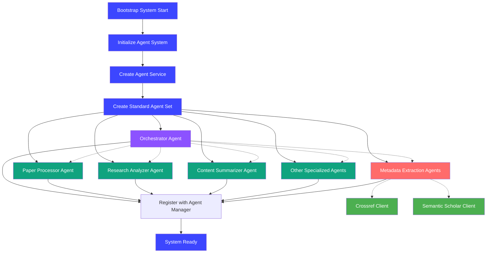
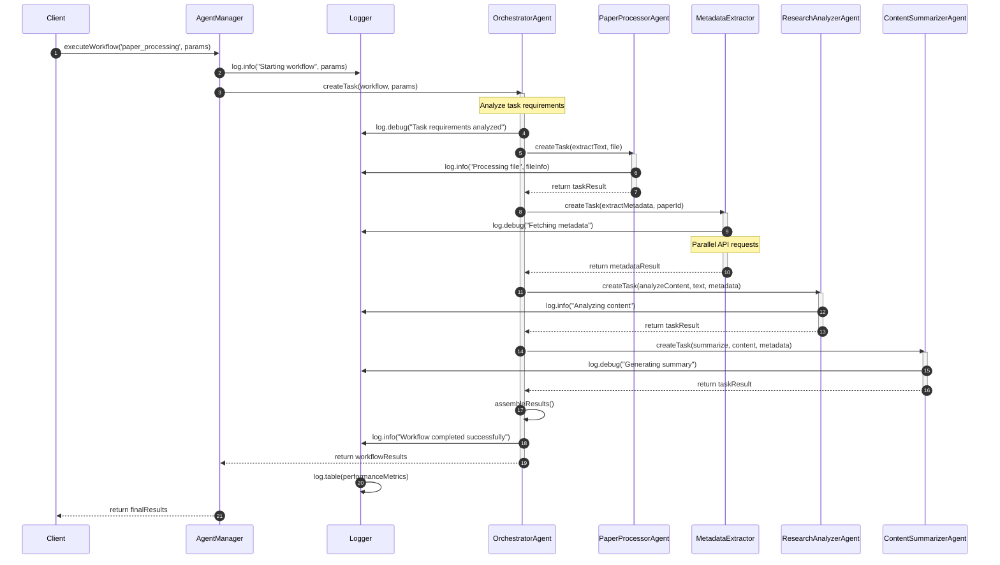
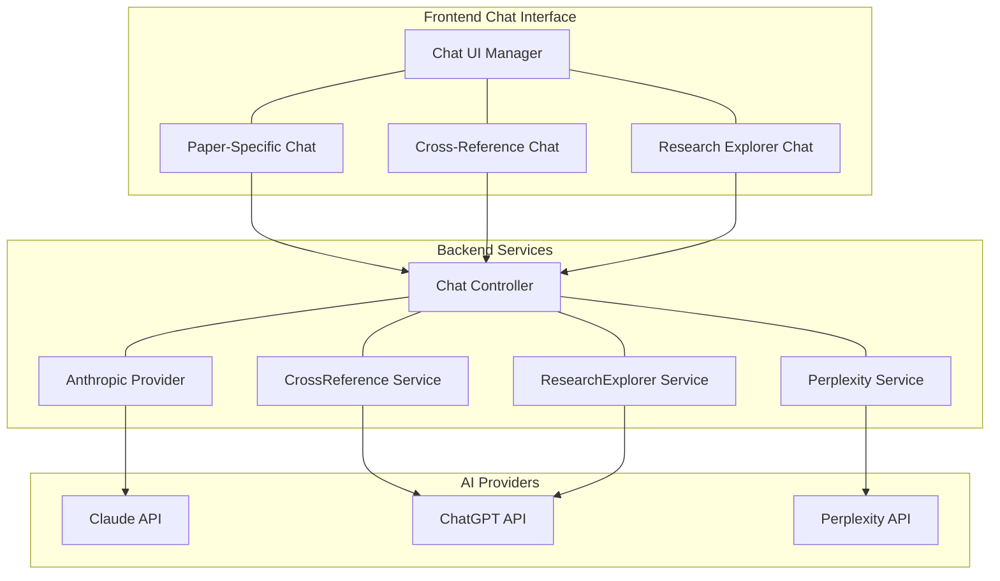

# Answer42 - Academic Research Assistant

Answer42 is an AI-powered platform designed to help researchers, students, and academics manage and analyze scientific papers, making research more efficient and collaborative.

## Key Features

- **Paper Management**: Upload, organize, and manage scientific papers
- **AI Paper Analysis**: Get automatic summaries, key points, and concept explanations
- **Content Extraction**: Extract full text and identify paper sections with AI
- **Research Projects**: Organize papers into customizable research projects
- **Intelligent Chat**: Ask questions about papers and receive accurate responses
- **Cross-Reference Analysis**: Compare multiple papers to find connections and gaps
- **Study Tools**: Generate flashcards, practice questions, and concept maps
- **External Metadata**: Integration with Crossref and Semantic Scholar APIs for enhanced paper information

## Architecture

The platform follows a modern microservices architecture:

- **Frontend**: Next.js with TypeScript for a responsive and accessible UI
- **Backend API**: Node.js/Express with TypeScript for robust API endpoints
- **Database**: PostgreSQL (managed by Supabase) for structured data storage
- **AI Services**: Agent-based system for specialized processing tasks
- **Authentication**: JWT-based auth with Supabase Auth integration
- **Orchestration**: Docker and Docker Compose for containerization

## Agent System

The platform utilizes a multi-agent system to handle various AI operations:

- **Orchestrator Agent**: Routes operations to appropriate specialized agents
- **Paper Processor**: Extracts and processes text from PDF documents
- **Research Analyzer**: Analyzes papers for metadata and content
- **Content Summarizer**: Generates concise summaries of papers
- **Concept Explainer**: Explains complex concepts within papers
- **Citation Formatter**: Extracts and formats citations properly
- **Quality Checker**: Ensures accuracy of AI-generated content
- **Embedding Generator**: Creates vector embeddings for semantic search
- **Perplexity Researcher**: Conducts external research when needed

### Agent Bootstrapping Process

Our system initializes agents through a standardized bootstrapping process:

1. The `initializeAgentSystem()` function in `api/src/bootstrap/agents.ts` starts the process
2. An `AgentFactory` creates a standard set of agents including the orchestrator
3. Each agent is registered with the `agentManager` singleton
4. Specialized agents are linked to the orchestrator for task routing
5. System-wide agents are created at startup, while user-specific agents are created on demand

This process ensures all agents are properly initialized with appropriate models and configurations.



## Orchestrator Pattern

The orchestrator pattern is central to our agent architecture:

1. **Central Coordination**: The orchestrator agent acts as the entry point for all complex AI operations
2. **Task Routing**: Based on task requirements, the orchestrator delegates to specialized agents
3. **Workflow Management**: For multi-step operations, the orchestrator maintains state and sequences
4. **Dependency Resolution**: The orchestrator resolves dependencies between agent operations
5. **Error Handling**: Centralized error handling and recovery strategies are implemented
6. **Logging and Monitoring**: Comprehensive logging of all operations with multi-level verbosity

The orchestrator uses a task-based API where each request is converted to a structured task with clear inputs and expected outputs.



## Chat System

Answer42 implements a multi-provider chat system with three specialized interfaces:



### Paper-Specific Chat (Claude AI)

- Uses Anthropic's Claude models for deep paper understanding
- Optimized for contextual questions about specific papers
- Provides source citations for answers with confidence scores
- Implemented as a direct provider service with paper context

### Cross-Reference Chat (ChatGPT)

- Powered by OpenAI's GPT-4 models through `CrossReferenceChatService`
- Specialized for comparing multiple papers to find agreements and contradictions
- Structures responses with relationship analysis between papers
- Provides section-by-section comparisons of methods, results, and conclusions

### Research Explorer Chat (Perplexity/OpenAI Hybrid)

- Frontend features Perplexity's "Deep Research" capabilities
- Uses `ResearchExplorerChatService` (OpenAI) for structural analysis
- Uses `PerplexityResearchService` for external research and citations
- Features three modes: General Search, Verify Claims, and Discover Papers
- Implements a credit-based quota system based on subscription tier

Each chat interface operates independently from the agent system, providing specialized research assistance based on different AI providers' strengths.

## Logging System

Answer42 implements a standardized logging system across both backend and frontend:

### Backend Logging

- Express middleware-based logger with request/response tracking
- Multiple log levels (DEBUG, INFO, WARN, ERROR) with environment-based configuration
- Multi-parameter support for complex objects and tabular data
- Response time monitoring and status code-based level assignment
- Automatic redaction of sensitive information (passwords, tokens, etc.)
- Special handling for performance-critical routes

### Frontend Logging

- Browser-compatible logger with identical API to backend
- Environment-aware configuration with production mode suppression
- Colored console output for better readability in development
- Table formatting support with `logger.table()` method
- Log grouping capabilities with `logger.group()` and `logger.groupEnd()`
- Error object special handling for better stack trace visualization

Both systems share a consistent API:

```typescript
// Basic logging with multiple parameters
logger.info("User logged in:", user.name, { id: user.id, role: user.role });

// Table data logging
logger.table(dataArray, LogLevel.DEBUG);

// Error logging with automatic stack trace extraction
try {
  // Operation that might fail
} catch (error) {
  logger.error("Failed to process request:", error);
}
```

## Development Setup

### Environment Configuration

The project uses different environment files for different deployment scenarios:

- **`.env.local`**: Used for local development (never committed to the repository)
- **`.env.docker`**: Used for Docker-based development (defined in `docker-setup-guide.md`)
- **`.env.test`**: Used for testing environments
- **`.env.production`**: Used for production deployment (with sensitive values loaded from secure storage)

For local development setup, copy the template files to `.env.local` and modify as needed:

```bash
# For API
cp api/.env.example api/.env.local

# For frontend
cp frontend/.env.example frontend/.env.local
```

Refer to the `docs/environment-setup.md` and `docs/docker-setup-guide.md` files for complete setup instructions.

## License

© 2025 Answer42, Inc. All rights reserved.
