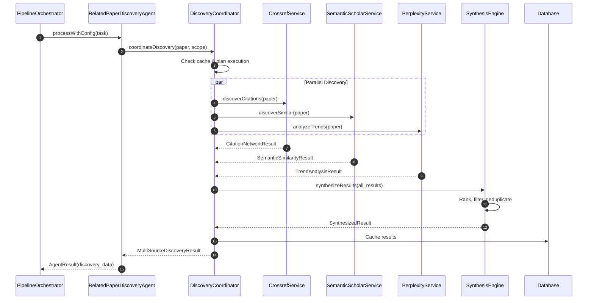
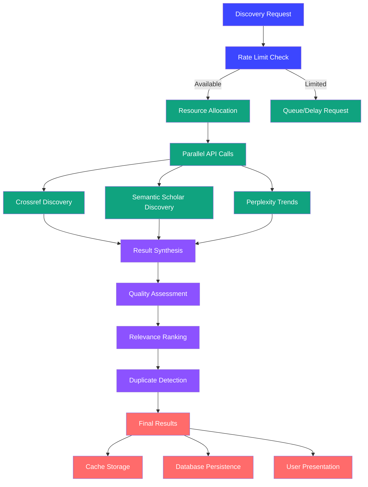

# 01. Architecture Overview - Related Paper Discovery Agent

## Overview

The RelatedPaperDiscoveryAgent represents a sophisticated multi-source research discovery system designed to automatically identify and analyze related academic papers through comprehensive citation network analysis, semantic similarity detection, and real-time research trend monitoring.

## Strategic Architecture Goals

### 🎯 **Comprehensive Discovery Coverage**

- **Multiple Discovery Vectors**: Citation networks, semantic similarity, author networks, and temporal analysis
- **Multi-Source Integration**: Crossref, Semantic Scholar, and Perplexity APIs working in harmony
- **Quality Assurance**: AI-powered relevance scoring and credibility assessment
- **User-Centric Results**: Personalized discovery based on user research patterns

### 🔧 **Production-Ready Design**

- **Scalable Architecture**: Handles high-volume paper processing efficiently
- **Resource Management**: Intelligent API rate limiting and cost optimization
- **Error Resilience**: Graceful degradation and comprehensive error recovery
- **Performance Optimization**: Caching, parallel processing, and smart resource allocation

## Core Architecture Components

### 1. Multi-Source Discovery Engine

```java
@Component
public class RelatedPaperDiscoveryAgent extends AbstractConfigurableAgent {

    private final CrossrefDiscoveryService crossrefService;
    private final SemanticScholarDiscoveryService semanticScholarService;
    private final PerplexityTrendService perplexityService;
    private final AISynthesisEngine synthesisEngine;

    @Override
    public AgentType getAgentType() {
        return AgentType.RELATED_PAPER_DISCOVERY;
    }

    @Override
    protected AgentResult processWithConfig(AgentTask task) {
        DiscoveryRequest request = task.getDiscoveryRequest();
        Paper sourcePaper = request.getSourcePaper();

        // Parallel discovery from multiple sources
        CompletableFuture<CrossrefDiscoveryResult> crossrefFuture = 
            CompletableFuture.supplyAsync(() -> 
                crossrefService.discoverRelatedPapers(sourcePaper), taskExecutor);

        CompletableFuture<SemanticScholarDiscoveryResult> semanticFuture = 
            CompletableFuture.supplyAsync(() -> 
                semanticScholarService.discoverRelatedPapers(sourcePaper), taskExecutor);

        CompletableFuture<PerplexityTrendResult> perplexityFuture = 
            CompletableFuture.supplyAsync(() -> 
                perplexityService.analyzeTrends(sourcePaper), taskExecutor);

        // Wait for all discovery operations
        CompletableFuture.allOf(crossrefFuture, semanticFuture, perplexityFuture).join();

        // Synthesize and rank results
        SynthesizedDiscoveryResult result = synthesisEngine.synthesizeResults(
            crossrefFuture.join(),
            semanticFuture.join(), 
            perplexityFuture.join(),
            request.getDiscoveryPreferences()
        );

        return AgentResult.success(result, createProcessingMetrics());
    }
}
```

### 2. Discovery Coordination Layer

```java
@Service
public class DiscoveryCoordinator {

    private final APIRateLimitManager rateLimitManager;
    private final DiscoveryCache discoveryCache;
    private final DiscoveryMetrics metrics;

    /**
     * Coordinates discovery across multiple APIs with intelligent scheduling
     */
    public CompletableFuture<MultiSourceDiscoveryResult> coordinateDiscovery(
            Paper sourcePaper, 
            DiscoveryScope scope) {

        // Check cache first
        Optional<CachedDiscoveryResult> cached = discoveryCache.get(sourcePaper.getId(), scope);
        if (cached.isPresent() && !cached.get().isStale()) {
            return CompletableFuture.completedFuture(cached.get().getResult());
        }

        // Plan discovery execution based on rate limits and resources
        DiscoveryExecutionPlan plan = planDiscoveryExecution(sourcePaper, scope);

        // Execute discovery plan
        return executeDiscoveryPlan(plan)
            .thenApply(result -> {
                // Cache results for future use
                discoveryCache.store(sourcePaper.getId(), scope, result);

                // Record metrics
                metrics.recordDiscovery(sourcePaper.getId(), scope, result);

                return result;
            });
    }

    private DiscoveryExecutionPlan planDiscoveryExecution(Paper paper, DiscoveryScope scope) {
        DiscoveryExecutionPlan.Builder builder = DiscoveryExecutionPlan.builder();

        // Crossref discovery (always included)
        if (rateLimitManager.canExecute(APIProvider.CROSSREF)) {
            builder.includeCrossref(createCrossrefTasks(paper, scope));
        }

        // Semantic Scholar discovery (if available)
        if (rateLimitManager.canExecute(APIProvider.SEMANTIC_SCHOLAR)) {
            builder.includeSemanticScholar(createSemanticScholarTasks(paper, scope));
        }

        // Perplexity trends (if requested and available)
        if (scope.includeTrends() && rateLimitManager.canExecute(APIProvider.PERPLEXITY)) {
            builder.includePerplexity(createPerplexityTasks(paper, scope));
        }

        return builder.build();
    }
}
```

### 3. Intelligent Caching System

```java
@Component
public class DiscoveryCache {

    private final AgentMemoryStoreRepository memoryRepository;
    private final CacheEvictionScheduler evictionScheduler;

    /**
     * Multi-level caching for discovery results
     */
    public Optional<CachedDiscoveryResult> get(UUID paperId, DiscoveryScope scope) {
        String cacheKey = buildCacheKey(paperId, scope);

        // Level 1: In-memory cache (fastest)
        CachedDiscoveryResult inMemory = inMemoryCache.get(cacheKey);
        if (inMemory != null && !inMemory.isStale()) {
            return Optional.of(inMemory);
        }

        // Level 2: Database cache (persistent)
        return memoryRepository.findByKey(cacheKey)
            .map(this::deserializeCachedResult)
            .filter(result -> !result.isStale());
    }

    public void store(UUID paperId, DiscoveryScope scope, MultiSourceDiscoveryResult result) {
        String cacheKey = buildCacheKey(paperId, scope);
        CachedDiscoveryResult cached = new CachedDiscoveryResult(result, Instant.now());

        // Store in both levels
        inMemoryCache.put(cacheKey, cached);

        AgentMemoryStore memory = AgentMemoryStore.builder()
            .key(cacheKey)
            .data(serializeDiscoveryResult(cached))
            .createdAt(Instant.now())
            .updatedAt(Instant.now())
            .build();

        memoryRepository.save(memory);
    }

    private String buildCacheKey(UUID paperId, DiscoveryScope scope) {
        return String.format("discovery_%s_%s", paperId, scope.hashCode());
    }
}
```

## Data Flow Architecture

### Discovery Pipeline Flow



### Resource Management Flow



## API Integration Architecture

### Rate Limiting & Resource Management

```java
@Component
public class APIRateLimitManager {

    private final Map<APIProvider, RateLimiter> rateLimiters;
    private final Map<APIProvider, CircuitBreaker> circuitBreakers;

    public APIRateLimitManager() {
        // Crossref: 50 requests per second
        rateLimiters.put(APIProvider.CROSSREF, 
            RateLimiter.create(50.0));

        // Semantic Scholar: 100 requests per 5 minutes  
        rateLimiters.put(APIProvider.SEMANTIC_SCHOLAR, 
            RateLimiter.create(100.0 / 300.0));

        // Perplexity: API key dependent
        rateLimiters.put(APIProvider.PERPLEXITY, 
            RateLimiter.create(10.0));
    }

    public boolean canExecute(APIProvider provider) {
        CircuitBreaker breaker = circuitBreakers.get(provider);
        RateLimiter limiter = rateLimiters.get(provider);

        return breaker.allowRequest() && limiter.tryAcquire();
    }

    public CompletableFuture<Void> acquirePermit(APIProvider provider) {
        return CompletableFuture.supplyAsync(() -> {
            RateLimiter limiter = rateLimiters.get(provider);
            limiter.acquire(); // Will block until permit available
            return null;
        });
    }
}
```

### Error Handling & Circuit Breaking

```java
@Component
public class DiscoveryErrorHandler {

    public CompletableFuture<DiscoveryResult> executeWithFallback(
            Supplier<CompletableFuture<DiscoveryResult>> primaryOperation,
            Supplier<CompletableFuture<DiscoveryResult>> fallbackOperation,
            String operationName) {

        return primaryOperation.get()
            .exceptionallyCompose(primaryError -> {
                LoggingUtil.warn(LOG, "executeWithFallback",
                    "Primary operation %s failed, attempting fallback: %s", 
                    operationName, primaryError.getMessage());

                if (shouldAttemptFallback(primaryError)) {
                    return fallbackOperation.get()
                        .exceptionallyCompose(fallbackError -> {
                            LoggingUtil.error(LOG, "executeWithFallback",
                                "Both primary and fallback failed for %s", 
                                fallbackError, operationName);

                            return CompletableFuture.completedFuture(
                                DiscoveryResult.partial(primaryError, fallbackError));
                        });
                } else {
                    return CompletableFuture.failedFuture(primaryError);
                }
            });
    }

    private boolean shouldAttemptFallback(Throwable error) {
        return error instanceof TimeoutException ||
               error instanceof ConnectException ||
               error instanceof RateLimitExceededException;
    }
}
```

## Performance Optimization Strategies

### 1. Intelligent Batching

```java
@Component
public class DiscoveryBatchProcessor {

    /**
     * Batches multiple discovery requests to optimize API usage
     */
    public CompletableFuture<List<DiscoveryResult>> processBatch(
            List<DiscoveryRequest> requests) {

        // Group requests by API requirements
        Map<APIProvider, List<DiscoveryRequest>> groupedRequests = 
            requests.stream().collect(Collectors.groupingBy(this::determineOptimalProvider));

        // Process each group optimally
        List<CompletableFuture<List<DiscoveryResult>>> futures = groupedRequests.entrySet()
            .stream()
            .map(entry -> processBatchForProvider(entry.getKey(), entry.getValue()))
            .collect(Collectors.toList());

        // Combine all results
        return CompletableFuture.allOf(futures.toArray(new CompletableFuture[0]))
            .thenApply(v -> futures.stream()
                .flatMap(future -> future.join().stream())
                .collect(Collectors.toList()));
    }
}
```

### 2. Smart Caching Strategy

```java
public enum CacheStrategy {
    AGGRESSIVE(Duration.ofHours(24), 0.9),    // Cache everything, long expiry
    BALANCED(Duration.ofHours(6), 0.7),      // Cache high-confidence results
    CONSERVATIVE(Duration.ofHours(1), 0.95); // Cache only highly relevant results

    private final Duration expiry;
    private final double confidenceThreshold;
}
```

### 3. Resource-Aware Scheduling

```java
@Component
public class ResourceAwareScheduler {

    public DiscoverySchedule optimizeSchedule(List<DiscoveryTask> tasks) {
        // Consider current system load
        double systemLoad = getSystemLoad();

        // Consider API rate limits
        Map<APIProvider, Double> availableCapacity = getAPICapacity();

        // Consider task priorities and dependencies
        List<DiscoveryTask> prioritizedTasks = prioritizeTasks(tasks);

        // Create optimal execution schedule
        return createOptimalSchedule(prioritizedTasks, systemLoad, availableCapacity);
    }
}
```

## Integration with Multi-Agent Pipeline

### Pipeline Stage Definition

```java
public enum PipelineStage {
    // ... existing stages ...
    RELATED_PAPER_DISCOVERY("Discover related papers", Duration.ofMinutes(8)),
    // ... remaining stages ...
}
```

### Agent Configuration

```java
@Configuration
public class RelatedPaperDiscoveryConfig {

    @Bean
    public RelatedPaperDiscoveryAgent relatedPaperDiscoveryAgent(
            AIConfig aiConfig,
            ThreadConfig threadConfig,
            CrossrefDiscoveryService crossrefService,
            SemanticScholarDiscoveryService semanticScholarService,
            PerplexityTrendService perplexityService) {

        return new RelatedPaperDiscoveryAgent(
            aiConfig, threadConfig, crossrefService, 
            semanticScholarService, perplexityService);
    }
}
```

## Success Metrics & Monitoring

### Key Performance Indicators

```java
@Component
public class DiscoveryMetrics {

    // Discovery Quality Metrics
    private final Counter discoveredPapersTotal;
    private final Histogram relevanceScoreDistribution;
    private final Counter userFeedbackPositive;
    private final Counter userFeedbackNegative;

    // Performance Metrics
    private final Timer discoveryExecutionTime;
    private final Counter apiCallsTotal;
    private final Counter cacheHits;
    private final Counter cacheMisses;

    // Error Metrics
    private final Counter apiErrors;
    private final Counter timeouts;
    private final Counter fallbackExecutions;

    public void recordDiscoverySuccess(DiscoveryResult result) {
        discoveredPapersTotal.increment(result.getDiscoveredPapers().size());

        double avgRelevance = result.getDiscoveredPapers().stream()
            .mapToDouble(DiscoveredPaper::getRelevanceScore)
            .average()
            .orElse(0.0);

        relevanceScoreDistribution.observe(avgRelevance);
    }
}
```

This architecture provides a robust, scalable foundation for comprehensive related paper discovery while maintaining optimal performance and resource utilization within Answer42's existing infrastructure.
