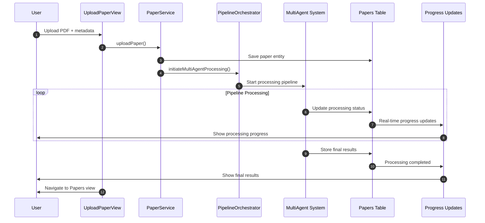
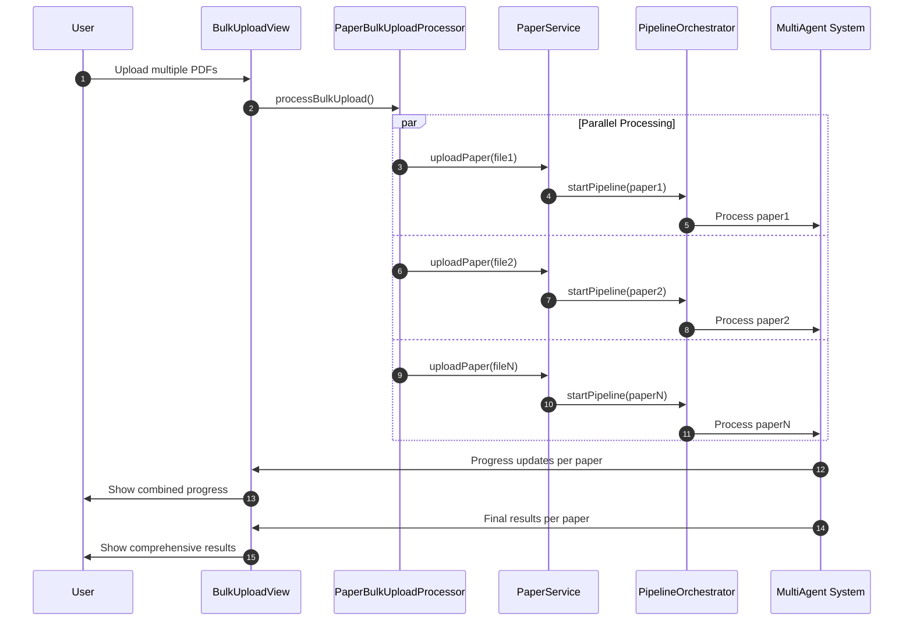

# 9.9 UI Integration: End-to-End Paper Processing

## Overview

This document details the complete integration between Answer42's existing upload views (`UploadPaperView` and `BulkUploadView`) and the multi-agent pipeline, providing a seamless end-to-end user experience from paper upload to fully processed results.

## Current Upload Flow Analysis

### UploadPaperView Integration

**Current Flow:**
1. User uploads PDF file via Vaadin Upload component
2. Form validation for title, authors, and metadata
3. `paperService.uploadPaper()` creates Paper entity
4. `paperService.updatePaperMetadata()` adds additional fields
5. Navigation to Papers view with success notification

**Enhanced Flow with Multi-Agent Pipeline:**
1. **Upload Phase** (Existing): PDF upload and basic metadata creation
2. **Pipeline Trigger** (New): Automatic multi-agent processing initiation
3. **Progress Tracking** (Enhanced): Real-time processing status updates
4. **Results Integration** (New): Processed results stored and displayed

### BulkUploadView Integration

**Current Flow:**
1. Multiple PDF files uploaded via MultiFileReceiver
2. `PaperBulkUploadProcessor.processBulkUpload()` handles batch processing
3. Progress tracking with `updateProgressInfo()` callback
4. Results display with file-by-file status

**Enhanced Flow with Multi-Agent Pipeline:**
1. **Bulk Upload Phase** (Existing): Multiple PDF processing
2. **Pipeline Orchestration** (New): Parallel multi-agent processing per paper
3. **Advanced Progress Tracking** (Enhanced): Per-paper, per-agent status updates
4. **Comprehensive Results** (New): Detailed analysis results for each paper

## Enhanced Service Integration

### PaperService Integration

```java
@Service
@Transactional
public class PaperService {
    
    private final PaperRepository paperRepository;
    private final PipelineOrchestrator pipelineOrchestrator;
    private final AgentTaskRepository agentTaskRepository;
    private final CreditService creditService;
    
    /**
     * Enhanced upload method with automatic pipeline processing.
     */
    public Paper uploadPaper(MultipartFile file, String title, String[] authors, User user) {
        try {
            // Existing upload logic
            Paper paper = createPaperEntity(file, title, authors, user);
            paperRepository.save(paper);
            
            // NEW: Trigger multi-agent pipeline processing
            initiateMultiAgentProcessing(paper, user);
            
            return paper;
            
        } catch (Exception e) {
            LoggingUtil.error(LOG, "uploadPaper", "Failed to upload paper: " + e.getMessage(), e);
            throw new PaperUploadException("Failed to upload paper", e);
        }
    }
    
    /**
     * Initiate multi-agent pipeline processing for a newly uploaded paper.
     */
    private void initiateMultiAgentProcessing(Paper paper, User user) {
        try {
            // Check user credits
            if (!creditService.hasEnoughCredits(user.getId(), "FULL_PIPELINE_PROCESSING")) {
                LoggingUtil.warn(LOG, "initiateMultiAgentProcessing", 
                    "User %s has insufficient credits for pipeline processing", user.getId());
                
                // Update paper status to indicate credit shortage
                paper.setProcessingStatus("PENDING_CREDITS");
                paper.setStatus("UPLOADED");
                paperRepository.save(paper);
                return;
            }
            
            // Create pipeline configuration
            PipelineConfiguration config = PipelineConfiguration.builder()
                .paperId(paper.getId())
                .userId(user.getId())
                .processingMode(ProcessingMode.FULL_ANALYSIS)
                .enabledAgents(Arrays.asList(
                    "paper-processor",
                    "metadata-enhancer", 
                    "content-summarizer",
                    "concept-explainer",
                    "quality-checker",
                    "citation-formatter"
                ))
                .build();
            
            // Start pipeline processing
            pipelineOrchestrator.startPipeline(config);
            
            // Update paper status
            paper.setProcessingStatus("PIPELINE_INITIATED");
            paper.setStatus("PROCESSING");
            paperRepository.save(paper);
            
            LoggingUtil.info(LOG, "initiateMultiAgentProcessing", 
                "Initiated pipeline processing for paper %s", paper.getId());
                
        } catch (Exception e) {
            LoggingUtil.error(LOG, "initiateMultiAgentProcessing", 
                "Failed to initiate pipeline processing: " + e.getMessage(), e);
            
            // Update paper status to indicate processing failure
            paper.setProcessingStatus("PIPELINE_FAILED");
            paper.setStatus("ERROR");
            paperRepository.save(paper);
        }
    }
    
    /**
     * Get processing status for UI display.
     */
    public PaperProcessingStatus getProcessingStatus(UUID paperId) {
        Paper paper = paperRepository.findById(paperId)
            .orElseThrow(() -> new EntityNotFoundException("Paper not found"));
        
        List<AgentTask> tasks = agentTaskRepository.findByReferenceIdOrderByCreatedAtAsc(paperId.toString());
        
        return PaperProcessingStatus.builder()
            .paperId(paperId)
            .overallStatus(paper.getStatus())
            .processingStatus(paper.getProcessingStatus())
            .completedAgents(getCompletedAgents(tasks))
            .failedAgents(getFailedAgents(tasks))
            .progressPercentage(calculateProgressPercentage(tasks))
            .estimatedTimeRemaining(estimateTimeRemaining(tasks))
            .lastUpdated(paper.getUpdatedAt())
            .build();
    }
}
```

### Enhanced BulkUploadProcessor Integration

```java
@Component
public class PaperBulkUploadProcessor {
    
    private final PaperService paperService;
    private final PipelineOrchestrator pipelineOrchestrator;
    private final CreditService creditService;
    
    /**
     * Enhanced bulk processing with multi-agent pipeline integration.
     */
    public void processBulkUpload(
            List<MemoryBuffer> fileBuffers,
            Map<String, FileEntry> fileEntries,
            List<String> authors,
            User user,
            Project project,
            boolean isPublic,
            PaperService paperService,
            ProjectService projectService,
            UI ui,
            Consumer<String> progressCallback) {
        
        LoggingUtil.info(LOG, "processBulkUpload", "Starting bulk upload for %d files", fileBuffers.size());
        
        // Check total credits needed
        int totalCreditsNeeded = fileBuffers.size() * getCreditCost("FULL_PIPELINE_PROCESSING", user);
        if (!creditService.hasEnoughCredits(user.getId(), totalCreditsNeeded)) {
            ui.access(() -> {
                progressCallback.accept("Insufficient credits for full pipeline processing");
                updateFileEntriesStatus(fileEntries, FileStatus.ERROR, "Insufficient credits");
            });
            return;
        }
        
        // Process each file with pipeline integration
        AtomicInteger processedCount = new AtomicInteger(0);
        int totalFiles = fileBuffers.size();
        
        // Use parallel processing for multiple papers
        CompletableFuture<Void> allTasks = CompletableFuture.allOf(
            fileBuffers.stream()
                .map(buffer -> processFileWithPipeline(
                    buffer, fileEntries, authors, user, project, isPublic,
                    processedCount, totalFiles, ui, progressCallback
                ))
                .toArray(CompletableFuture[]::new)
        );
        
        // Handle completion
        allTasks.whenComplete((result, throwable) -> {
            ui.access(() -> {
                if (throwable != null) {
                    LoggingUtil.error(LOG, "processBulkUpload", "Bulk processing failed: " + throwable.getMessage(), throwable);
                    progressCallback.accept("Bulk processing failed: " + throwable.getMessage());
                } else {
                    progressCallback.accept("Bulk processing completed successfully");
                }
            });
        });
    }
    
    /**
     * Process individual file with full pipeline integration.
     */
    private CompletableFuture<Void> processFileWithPipeline(
            MemoryBuffer buffer,
            Map<String, FileEntry> fileEntries,
            List<String> authors,
            User user,
            Project project,
            boolean isPublic,
            AtomicInteger processedCount,
            int totalFiles,
            UI ui,
            Consumer<String> progressCallback) {
        
        return CompletableFuture.runAsync(() -> {
            String fileName = buffer.getFileData().getFileName();
            FileEntry entry = fileEntries.get(fileName);
            
            if (entry == null) {
                LoggingUtil.error(LOG, "processFileWithPipeline", "FileEntry not found for: " + fileName);
                return;
            }
            
            try {
                // Update status to processing
                ui.access(() -> {
                    entry.setStatus(FileStatus.PROCESSING);
                    entry.setStatusDetail("Uploading file...");
                    updateProgress(processedCount.get(), totalFiles, "Uploading", progressCallback);
                });
                
                // Upload paper (this will trigger pipeline automatically)
                MultipartFile multipartFile = createMultipartFileFromBuffer(buffer);
                Paper paper = paperService.uploadPaper(
                    multipartFile,
                    extractTitleFromFileName(fileName),
                    authors.toArray(new String[0]),
                    user
                );
                
                // Set additional metadata
                paper.setIsPublic(isPublic);
                if (project != null) {
                    // Associate with project
                    projectService.addPaperToProject(project.getId(), paper);
                }
                
                // Store paper ID for tracking
                entry.setPaperId(paper.getId());
                
                // Monitor pipeline progress for this paper
                monitorPipelineProgress(paper.getId(), entry, ui, progressCallback);
                
                LoggingUtil.info(LOG, "processFileWithPipeline", "Successfully initiated processing for: " + fileName);
                
            } catch (Exception e) {
                LoggingUtil.error(LOG, "processFileWithPipeline", "Failed to process file: " + fileName, e);
                
                ui.access(() -> {
                    entry.setStatus(FileStatus.ERROR);
                    entry.setStatusDetail("Upload failed: " + e.getMessage());
                });
            } finally {
                int completed = processedCount.incrementAndGet();
                ui.access(() -> {
                    updateProgress(completed, totalFiles, "Processing", progressCallback);
                });
            }
        });
    }
    
    /**
     * Monitor pipeline progress for individual paper.
     */
    private void monitorPipelineProgress(UUID paperId, FileEntry entry, UI ui, Consumer<String> progressCallback) {
        // Create a scheduled task to monitor progress
        ScheduledExecutorService scheduler = Executors.newSingleThreadScheduledExecutor();
        
        scheduler.scheduleAtFixedRate(() -> {
            try {
                PaperProcessingStatus status = paperService.getProcessingStatus(paperId);
                
                ui.access(() -> {
                    // Update entry status based on pipeline progress
                    if ("COMPLETED".equals(status.getOverallStatus())) {
                        entry.setStatus(FileStatus.SUCCESS);
                        entry.setStatusDetail("Processing completed");
                        scheduler.shutdown();
                    } else if ("ERROR".equals(status.getOverallStatus())) {
                        entry.setStatus(FileStatus.ERROR);
                        entry.setStatusDetail("Processing failed");
                        scheduler.shutdown();
                    } else {
                        entry.setStatus(FileStatus.PROCESSING);
                        entry.setStatusDetail(String.format("Processing: %d%% complete", 
                            status.getProgressPercentage()));
                    }
                });
                
            } catch (Exception e) {
                LoggingUtil.error(LOG, "monitorPipelineProgress", "Error monitoring progress for paper: " + paperId, e);
                scheduler.shutdown();
            }
        }, 2, 5, TimeUnit.SECONDS); // Check every 5 seconds
    }
}
```

## Enhanced UI Components

### Real-time Progress Updates

```java
/**
 * Enhanced progress tracking component for pipeline processing.
 */
@Component
public class PipelineProgressTracker {
    
    private final PaperService paperService;
    private final UI ui;
    
    /**
     * Create real-time progress component for paper processing.
     */
    public Component createProgressComponent(UUID paperId) {
        VerticalLayout container = new VerticalLayout();
        container.addClassName("pipeline-progress-container");
        
        // Overall progress bar
        ProgressBar overallProgress = new ProgressBar(0, 100);
        overallProgress.setWidthFull();
        
        // Status label
        Span statusLabel = new Span("Initializing pipeline...");
        statusLabel.addClassName("pipeline-status-label");
        
        // Agent progress details
        VerticalLayout agentDetails = new VerticalLayout();
        agentDetails.addClassName("agent-progress-details");
        
        // Create progress items for each agent
        Map<String, Component> agentComponents = createAgentProgressComponents();
        agentDetails.add(agentComponents.values().toArray(new Component[0]));
        
        container.add(statusLabel, overallProgress, agentDetails);
        
        // Start monitoring
        startProgressMonitoring(paperId, overallProgress, statusLabel, agentComponents);
        
        return container;
    }
    
    private Map<String, Component> createAgentProgressComponents() {
        Map<String, Component> components = new HashMap<>();
        
        String[] agents = {
            "paper-processor", "metadata-enhancer", "content-summarizer",
            "concept-explainer", "quality-checker", "citation-formatter"
        };
        
        for (String agent : agents) {
            HorizontalLayout agentItem = new HorizontalLayout();
            agentItem.addClassName("agent-progress-item");
            
            Icon statusIcon = VaadinIcon.CLOCK.create();
            statusIcon.addClassName("agent-status-icon pending");
            
            Span agentName = new Span(formatAgentName(agent));
            agentName.addClassName("agent-name");
            
            Span agentStatus = new Span("Pending");
            agentStatus.addClassName("agent-status pending");
            
            agentItem.add(statusIcon, agentName, agentStatus);
            agentItem.setFlexGrow(1, agentName);
            
            components.put(agent, agentItem);
        }
        
        return components;
    }
    
    private void startProgressMonitoring(UUID paperId, ProgressBar overallProgress, 
                                       Span statusLabel, Map<String, Component> agentComponents) {
        
        ScheduledExecutorService scheduler = Executors.newSingleThreadScheduledExecutor();
        
        scheduler.scheduleAtFixedRate(() -> {
            try {
                PaperProcessingStatus status = paperService.getProcessingStatus(paperId);
                
                ui.access(() -> {
                    // Update overall progress
                    overallProgress.setValue(status.getProgressPercentage());
                    statusLabel.setText(status.getProcessingStatus());
                    
                    // Update agent statuses
                    updateAgentStatuses(agentComponents, status);
                    
                    // Stop monitoring if completed or failed
                    if ("COMPLETED".equals(status.getOverallStatus()) || 
                        "ERROR".equals(status.getOverallStatus())) {
                        scheduler.shutdown();
                    }
                });
                
            } catch (Exception e) {
                LoggingUtil.error(LOG, "startProgressMonitoring", "Error monitoring progress", e);
                scheduler.shutdown();
            }
        }, 1, 3, TimeUnit.SECONDS);
    }
    
    private void updateAgentStatuses(Map<String, Component> agentComponents, PaperProcessingStatus status) {
        for (Map.Entry<String, Component> entry : agentComponents.entrySet()) {
            String agentId = entry.getKey();
            HorizontalLayout agentItem = (HorizontalLayout) entry.getValue();
            
            Icon statusIcon = (Icon) agentItem.getComponentAt(0);
            Span agentStatus = (Span) agentItem.getComponentAt(2);
            
            if (status.getCompletedAgents().contains(agentId)) {
                statusIcon.getElement().setAttribute("icon", "vaadin:check-circle");
                statusIcon.removeClassName("pending");
                statusIcon.addClassName("completed");
                
                agentStatus.setText("Completed");
                agentStatus.removeClassName("pending");
                agentStatus.addClassName("completed");
                
            } else if (status.getFailedAgents().contains(agentId)) {
                statusIcon.getElement().setAttribute("icon", "vaadin:exclamation-circle");
                statusIcon.removeClassName("pending");
                statusIcon.addClassName("failed");
                
                agentStatus.setText("Failed");
                agentStatus.removeClassName("pending");
                agentStatus.addClassName("failed");
                
            } else if (status.getCurrentAgent() != null && status.getCurrentAgent().equals(agentId)) {
                statusIcon.getElement().setAttribute("icon", "vaadin:cog");
                statusIcon.removeClassName("pending");
                statusIcon.addClassName("processing");
                
                agentStatus.setText("Processing...");
                agentStatus.removeClassName("pending");
                agentStatus.addClassName("processing");
            }
        }
    }
}
```

### Enhanced Results Display

```java
/**
 * Component for displaying pipeline processing results.
 */
@Component
public class PipelineResultsDisplay {
    
    /**
     * Create comprehensive results display for processed paper.
     */
    public Component createResultsDisplay(Paper paper) {
        VerticalLayout container = new VerticalLayout();
        container.addClassName("pipeline-results-container");
        
        // Results summary
        Component summary = createResultsSummary(paper);
        container.add(summary);
        
        // Tabbed results view
        TabSheet resultsTabSheet = new TabSheet();
        
        // Summary tab
        if (paper.getSummaryStandard() != null) {
            Tab summaryTab = resultsTabSheet.add("Summary", createSummaryDisplay(paper));
            summaryTab.setId("summary-tab");
        }
        
        // Key findings tab
        if (paper.getKeyFindings() != null) {
            Tab findingsTab = resultsTabSheet.add("Key Findings", createFindingsDisplay(paper));
            findingsTab.setId("findings-tab");
        }
        
        // Concepts & glossary tab
        if (paper.getGlossary() != null || paper.getMainConcepts() != null) {
            Tab conceptsTab = resultsTabSheet.add("Concepts", createConceptsDisplay(paper));
            conceptsTab.setId("concepts-tab");
        }
        
        // Quality assessment tab
        if (paper.getQualityFeedback() != null) {
            Tab qualityTab = resultsTabSheet.add("Quality", createQualityDisplay(paper));
            qualityTab.setId("quality-tab");
        }
        
        // Citations tab
        if (paper.getCitations() != null) {
            Tab citationsTab = resultsTabSheet.add("Citations", createCitationsDisplay(paper));
            citationsTab.setId("citations-tab");
        }
        
        container.add(resultsTabSheet);
        return container;
    }
    
    private Component createResultsSummary(Paper paper) {
        HorizontalLayout summary = new HorizontalLayout();
        summary.addClassName("pipeline-results-summary");
        
        // Processing status badge
        Span statusBadge = new Span(paper.getStatus());
        statusBadge.addClassName("status-badge");
        statusBadge.addClassName(paper.getStatus().toLowerCase());
        
        // Quality score (if available)
        if (paper.getQualityScore() != null) {
            Span qualityScore = new Span(String.format("Quality: %.1f/10", paper.getQualityScore()));
            qualityScore.addClassName("quality-score");
            summary.add(qualityScore);
        }
        
        // Processing time
        if (paper.getUpdatedAt() != null && paper.getCreatedAt() != null) {
            Duration processingTime = Duration.between(paper.getCreatedAt(), paper.getUpdatedAt());
            Span timeSpan = new Span(String.format("Processed in: %d minutes", processingTime.toMinutes()));
            timeSpan.addClassName("processing-time");
            summary.add(timeSpan);
        }
        
        summary.add(statusBadge);
        return summary;
    }
}
```

## End-to-End User Experience Flow

### Single Paper Upload Flow



### Bulk Upload Flow



## Configuration and Error Handling

### Pipeline Configuration for UI Integration

```java
@Configuration
public class UIPipelineIntegrationConfig {
    
    @Value("${answer42.pipeline.ui.progress-update-interval:3000}")
    private long progressUpdateInterval;
    
    @Value("${answer42.pipeline.ui.enable-real-time-updates:true}")
    private boolean enableRealTimeUpdates;
    
    @Value("${answer42.pipeline.ui.max-concurrent-bulk-uploads:5}")
    private int maxConcurrentBulkUploads;
    
    @Bean
    public ProgressUpdateConfiguration progressUpdateConfig() {
        return ProgressUpdateConfiguration.builder()
            .updateInterval(Duration.ofMillis(progressUpdateInterval))
            .enableRealTimeUpdates(enableRealTimeUpdates)
            .batchSize(10)
            .build();
    }
    
    @Bean
    public BulkProcessingConfiguration bulkProcessingConfig() {
        return BulkProcessingConfiguration.builder()
            .maxConcurrentUploads(maxConcurrentBulkUploads)
            .enableParallelProcessing(true)
            .timeoutPerFile(Duration.ofMinutes(30))
            .enableProgressTracking(true)
            .build();
    }
}
```

### Error Handling and User Feedback

```java
/**
 * Centralized error handling for pipeline UI integration.
 */
@Component
public class PipelineUIErrorHandler {
    
    /**
     * Handle pipeline errors with user-friendly messages.
     */
    public void handlePipelineError(Exception error, UUID paperId, UI ui) {
        LoggingUtil.error(LOG, "handlePipelineError", "Pipeline error for paper: " + paperId, error);
        
        String userMessage = translateErrorToUserMessage(error);
        
        ui.access(() -> {
            Notification notification = Notification.show(userMessage, 5000, Notification.Position.BOTTOM_START);
            notification.addThemeVariants(NotificationVariant.LUMO_ERROR);
            
            // Update paper status
            updatePaperErrorStatus(paperId, error);
        });
    }
    
    private String translateErrorToUserMessage(Exception error) {
        if (error instanceof InsufficientCreditsException) {
            return "Insufficient credits for pipeline processing. Please upgrade your subscription.";
        } else if (error instanceof PipelineTimeoutException) {
            return "Processing is taking longer than expected. Please try again later.";
        } else if (error instanceof AIProviderException) {
            return "AI service temporarily unavailable. Processing will retry automatically.";
        } else {
            return "Processing failed. Our team has been notified and will investigate.";
        }
    }
}
```

## Implementation Integration Points

### Required Service Modifications

1. **PaperService**: Add pipeline trigger after successful upload
2. **PaperBulkUploadProcessor**: Integrate pipeline monitoring for bulk uploads
3. **UploadPaperView**: Add optional real-time progress display
4. **BulkUploadView**: Enhance progress tracking with pipeline stages

### Database Schema Integration

The existing `papers` table already supports the pipeline results through JSONB fields:
- `summary_brief`, `summary_standard`, `summary_detailed`
- `key_findings`, `methodology_details`, `main_concepts`
- `glossary`, `quality_feedback`, `citations`
- `processing_status` for tracking pipeline progress

### Credit System Integration

Pipeline processing costs are automatically handled through existing operation types:
- Single upload: `FULL_PIPELINE_PROCESSING` (15/22/30 credits)
- Individual agents: Individual operation costs as needed
- Bulk uploads: Credit validation before processing starts

## User Experience Enhancements

### Progress Indicators
- **Real-time updates**: WebSocket or polling-based progress updates
- **Per-agent status**: Visual indicators for each processing stage
- **Time estimates**: Estimated completion time based on historical data
- **Error recovery**: Clear messaging and retry options

### Results Presentation
- **Tabbed interface**: Organized results by category (summary, findings, quality, etc.)
- **Quality scoring**: Visual quality indicators and improvement suggestions
- **Interactive elements**: Expandable sections, tooltips for technical terms
- **Export options**: PDF reports, citation exports, formatted summaries

This end-to-end integration ensures that users experience a seamless transition from paper upload to fully processed results, with comprehensive progress tracking and professional results presentation throughout the multi-agent pipeline processing.
