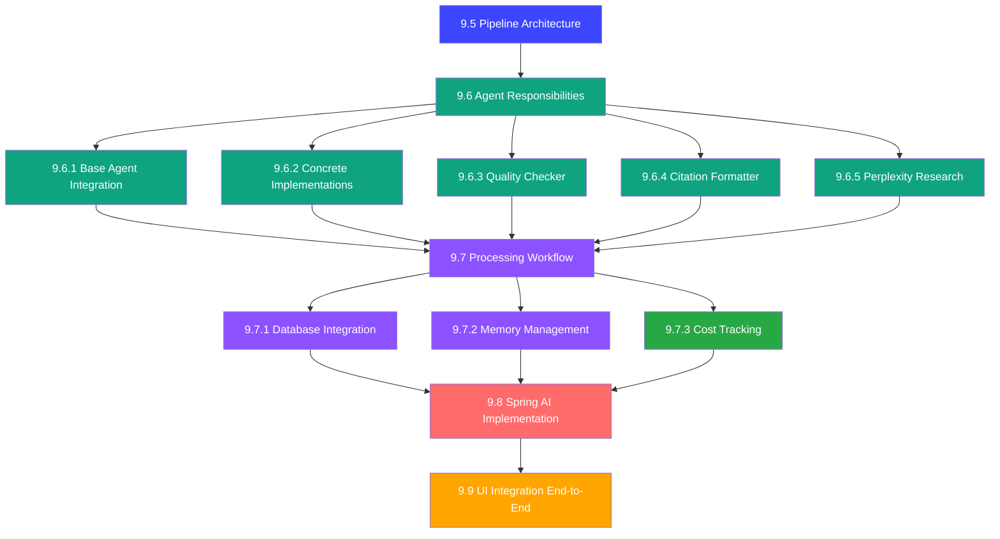

# Multi-Agent Pipeline Design Documentation

This directory contains comprehensive design documentation for the Answer42 multi-agent paper processing pipeline. The design is organized into a complete technical specification with detailed subsections covering all aspects of implementation.

## Document Overview

### [9.5 Pipeline Architecture](./9.5-pipeline-architecture.md)

**Foundation Layer - 300+ lines**

Establishes the core architectural principles and components of the multi-agent pipeline:

- **Orchestrator-based Architecture**: Central coordination of specialized agents
- **Asynchronous Processing Framework**: Non-blocking operations with progress tracking
- **Error Handling & Resilience**: Circuit breakers, retry mechanisms, and recovery strategies
- **Resource Management**: Rate limiting, memory management, and thread pool optimization
- **Monitoring & Observability**: Comprehensive metrics collection and health checks
- **Configuration Templates**: Pre-defined pipeline configurations for different use cases

**Key Components:**

- `PipelineOrchestrator` - Central workflow coordinator
- `AgentCircuitBreaker` - Prevents cascade failures
- `PipelineMemoryManager` - Resource cleanup and optimization
- `PipelineMetrics` - Performance monitoring and alerting

### [9.6 Agent Responsibilities](./9.6-agent-responsibilities.md)

**Agent Layer Overview - 300+ lines**

Defines the high-level responsibilities and coordination of all specialized agents:

- **Agent Types & Categories**: Core processing, analysis, quality verification, research
- **Provider Assignment Strategy**: Optimal AI provider selection per agent type
- **Inter-Agent Communication**: Message passing and dependency management
- **Performance Requirements**: SLA targets and optimization strategies

#### [9.6.1 Base Agent AIConfig Integration](./9.6.1-base-agent-aiconfig-integration.md)

**Base Implementation - 300+ lines**

Foundation classes for all agents with Answer42 integration:

- **SpringAIAgentBase**: Abstract base class with AIConfig integration
- **User-Aware API Keys**: Dynamic API key management per user session
- **Performance Monitoring**: Built-in metrics and health checking
- **Error Handling**: Standardized exception management and recovery

#### [9.6.2 Concrete Agent Implementations](./9.6.2-concrete-agent-implementations.md)

**Core Agents - 300+ lines**

Implementation of primary processing agents:

- **PaperProcessorAgent**: PDF text extraction and structure analysis
- **MetadataEnhancerAgent**: Crossref and Semantic Scholar integration
- **ContentSummarizerAgent**: Multi-level summarization with Claude
- **ConceptExplainerAgent**: Technical term definitions and glossaries

#### [9.6.3 Quality Checker Agent](./9.6.3-quality-checker-agent.md)

**Quality Assurance - 300+ lines**

Comprehensive quality validation and scoring:

- **Multi-Dimensional Scoring**: Content accuracy, completeness, consistency
- **Cross-Validation**: Verification against multiple sources
- **Error Detection**: Identify and flag potential issues
- **Quality Metrics**: Detailed scoring with improvement recommendations

#### [9.6.4 Citation Formatter Agent](./9.6.4-citation-formatter-agent.md)

**Citation Processing - 300+ lines**

Advanced citation extraction and formatting:

- **Multi-Format Support**: APA, MLA, Chicago, IEEE, and custom formats
- **Reference Validation**: DOI verification and metadata enhancement
- **Bibliography Generation**: Structured citation lists with links
- **Duplicate Detection**: Identify and merge duplicate references

#### [9.6.5 Perplexity Research Agent](./9.6.5-perplexity-research-agent.md)

**External Research - 300+ lines**

Integration with Perplexity API for enhanced research:

- **Fact Verification**: Cross-check claims against current literature
- **Related Research Discovery**: Find relevant papers and studies
- **Trend Analysis**: Identify research trends and emerging topics
- **Source Attribution**: Proper citation of external sources

### [9.7 Processing Workflow](./9.7-processing-workflow.md)

**Workflow Orchestration Overview - 300+ lines**

High-level workflow management and coordination:

- **Stage-Based Processing**: Discrete stages with dependencies
- **Parallel Execution**: Resource-aware concurrent processing
- **Progress Tracking**: Real-time status updates and user notifications
- **Error Recovery**: Comprehensive failure handling and recovery

#### [9.7.1 Agent Task Database Integration](./9.7.1-agent-task-database-integration.md)

**Database Layer - 300+ lines**

Complete database integration for task management:

- **AgentTask Entity**: JPA entity with JSONB metadata support
- **Task State Management**: Lifecycle tracking and status updates
- **Performance Metrics**: Execution time and resource usage tracking
- **Error Logging**: Detailed failure analysis and debugging support

#### [9.7.2 Agent Memory Integration](./9.7.2-agent-memory-integration.md)

**Memory Management - 300+ lines**

Sophisticated memory and context management:

- **Working Memory**: Session-based context storage with automatic cleanup
- **Long-term Memory**: Persistent knowledge base for improved performance
- **Context Propagation**: Inter-agent context sharing and dependency management
- **Memory Optimization**: Automatic cleanup and resource management

#### [9.7.3 Cost Tracking and Results Integration](./9.7.3-cost-tracking-and-results-integration.md)

**Cost Management - 300+ lines**

Complete integration with Answer42's cost tracking system:

- **✅ Database Schema Implementation**: Successfully added 8 uppercase operation types
- **Token Usage Tracking**: Comprehensive token counting and analytics
- **Credit Management**: Integration with existing credit system
- **Results Storage**: Agent outputs mapped to paper JSONB fields
- **Cost Analytics**: Performance monitoring and optimization insights

### [9.8 Spring AI Implementation](./9.8-spring-ai-implementation.md)

**Integration Layer - 300+ lines**

Production-ready Spring AI integration with Answer42 infrastructure:

- **AIConfig Integration**: Uses existing user-aware API key management
- **ThreadConfig Integration**: Leverages configured thread pools for async processing
- **User Session Management**: Dynamic API key updates and validation
- **Performance Monitoring**: Comprehensive metrics and error tracking

**Integration Points:**

- `AIConfig.updateKeysForUser()` - Per-user API key management
- `ThreadConfig.taskExecutor()` - Optimized thread pool configuration
- `AIProviderFactory` - Dynamic provider selection based on agent types
- `SpringAIAgentBase` - Base implementation using existing infrastructure

### [9.9 UI Integration: End-to-End](./9.9-ui-integration-end-to-end.md)

**User Experience Layer - 300+ lines**

Complete integration with Answer42's existing upload views for seamless user experience:

- **UploadPaperView Integration**: Single paper upload with pipeline processing
- **BulkUploadView Integration**: Batch upload with parallel pipeline orchestration
- **Real-time Progress Tracking**: Per-agent status updates and progress monitoring
- **Enhanced Results Display**: Comprehensive results presentation with tabbed interface
- **Error Handling & User Feedback**: User-friendly error messages and recovery options

**Key Integration Components:**

- `PipelineProgressTracker` - Real-time progress monitoring with agent-level details
- `PipelineResultsDisplay` - Tabbed results interface (Summary, Findings, Quality, Citations)
- `PipelineUIErrorHandler` - Centralized error handling with user-friendly messaging
- Enhanced `PaperService.uploadPaper()` - Automatic pipeline trigger after upload
- Enhanced `PaperBulkUploadProcessor` - Pipeline integration for bulk processing

**User Experience Flow:**

- **Single Upload**: PDF → Upload → Pipeline Processing → Real-time Progress → Results Display
- **Bulk Upload**: Multiple PDFs → Parallel Processing → Combined Progress Tracking → Comprehensive Results

## Complete Architecture Flow

## Implementation Status

### ✅ Completed Components

- **✅ 9.7.3 Cost Tracking**: Database schema updated with 8 new uppercase operation types
  - `PAPER_TEXT_EXTRACTION`, `METADATA_ENHANCEMENT`, `CONTENT_SUMMARIZATION`
  - `QUALITY_CHECKING`, `CITATION_FORMATTING`, `RESEARCH_DISCOVERY`
  - `FULL_PIPELINE_PROCESSING`, `TOKEN_USAGE_TRACKING`
- **✅ Database Integration**: All schemas compliant with existing Answer42 structure
- **✅ Design Documentation**: Complete technical specifications for all components
- **✅ End-to-End Design**: Complete UI integration with existing upload views

### 🔄 Ready for Implementation

All design documents are complete and ready for development:

1. **Base Infrastructure** (9.5, 9.6.1, 9.8): Foundation classes and Spring integration
2. **Core Agents** (9.6.2-9.6.5): Specialized processing agents
3. **Workflow Management** (9.7, 9.7.1, 9.7.2): Task orchestration and memory management
4. **UI Integration** (9.9): End-to-end user experience with existing upload views

## Design Principles

### 1. Comprehensive Separation of Concerns

- **Architecture (9.5)**: Structural foundation and orchestration patterns
- **Base Agents (9.6.1)**: Common functionality and Answer42 integration
- **Specialized Agents (9.6.2-9.6.5)**: Domain-specific processing capabilities
- **Workflow Management (9.7.x)**: Process orchestration, persistence, and cost tracking
- **Implementation (9.8)**: Spring AI integration and production readiness
- **User Experience (9.9)**: End-to-end integration with existing UI components

### 2. Scalability & Performance

- **Asynchronous Processing**: All operations are non-blocking with progress tracking
- **Parallel Execution**: Independent agents run concurrently with resource optimization
- **Memory Management**: Sophisticated context handling and automatic cleanup
- **Cost Optimization**: Token-based pricing with performance analytics
- **Bulk Processing**: Efficient parallel processing for multiple papers

### 3. Reliability & Resilience

- **Error Isolation**: Agent failures don't cascade through the system
- **Recovery Mechanisms**: Checkpointing, resumption, and fallback strategies
- **Quality Assurance**: Multi-dimensional validation and verification
- **Database Integration**: Persistent state management with JSONB flexibility
- **User Feedback**: Clear error messaging and recovery guidance

### 4. Production Readiness

- **Answer42 Integration**: Seamless integration with existing infrastructure
- **User Session Management**: Per-user API key handling and credit tracking
- **Monitoring & Observability**: Comprehensive metrics and error tracking
- **Cost Management**: Full integration with subscription and credit systems
- **User Experience**: Professional progress tracking and results presentation

## Implementation Guidelines

### File Organization Standards

- **Maximum 300 lines per file**: Ensures maintainability and focused responsibilities
- **Single Responsibility Principle**: Each class has one well-defined purpose
- **Utility Classes**: Common functionality extracted to shared utilities
- **Type Safety**: Strong typing with custom types and constants

### Code Quality Requirements

- **AIProviderFactory Usage**: ALWAYS use existing AI provider factory
- **LoggingUtil Integration**: All logging through standardized utility
- **Error Handling**: Comprehensive exception handling with context preservation
- **Testing**: Unit tests for all critical components with mocking

### Database Integration

- **Schema Compliance**: Follow answer42 naming conventions (snake_case)
- **JSONB Usage**: Leverage PostgreSQL JSONB for flexible metadata storage
- **Entity Mapping**: Use Lombok annotations with proper column mapping
- **Transaction Management**: Proper @Transactional usage for data consistency

### UI Integration

- **Existing View Enhancement**: Integrate with `UploadPaperView` and `BulkUploadView`
- **Real-time Updates**: WebSocket or polling-based progress updates
- **User-Friendly Design**: Clear progress indicators and professional results display
- **Error Handling**: Graceful error recovery with actionable user feedback

## Next Steps for Implementation

### Phase 1: Foundation (Weeks 1-2)

- Implement `SpringAIAgentBase` and core interfaces
- Set up `PipelineOrchestrator` with basic task management
- Integrate with existing `AIConfig` and `ThreadConfig`

### Phase 2: Core Agents (Weeks 3-4)

- Develop `PaperProcessorAgent` and `MetadataEnhancerAgent`
- Implement `ContentSummarizerAgent` with Claude integration
- Create `ConceptExplainerAgent` with OpenAI integration

### Phase 3: Advanced Features (Weeks 5-6)

- Implement `QualityCheckerAgent` with multi-dimensional scoring
- Develop `CitationFormatterAgent` with multiple format support
- Create `PerplexityResearchAgent` for external research

### Phase 4: Workflow Integration (Weeks 7-8)

- Implement workflow state machine and progress tracking
- Add memory management and context propagation
- Complete cost tracking and analytics integration

### Phase 5: UI Integration (Weeks 9-10)

- Enhance `PaperService` with pipeline trigger integration
- Update `UploadPaperView` and `BulkUploadView` with progress tracking
- Implement `PipelineProgressTracker` and `PipelineResultsDisplay`
- Add comprehensive error handling and user feedback

### Phase 6: Production Readiness (Weeks 11-12)

- Comprehensive testing and error handling
- Performance optimization and monitoring
- Documentation and deployment preparation
- User acceptance testing and feedback integration

## Related Documentation

- [Main System Architecture](../system_architecture/README.md)
- [Chat System Architecture](../system_architecture/10-chat-system-architecture.md)
- [Database Design](../system_architecture/04-database-design.md)
- [Technology Stack Best Practices](../Technology%20Stack%20Best%20Practices.md)
- [Coding Standards](../Coding-Standards.md)
- [Database Tables Usage Analysis](../Database-Tables-Usage-Analysis.md)

This comprehensive design provides a complete end-to-end foundation for implementing a sophisticated multi-agent paper processing pipeline that integrates seamlessly with Answer42's existing architecture and user interface, ensuring a professional user experience from upload to fully processed results.
