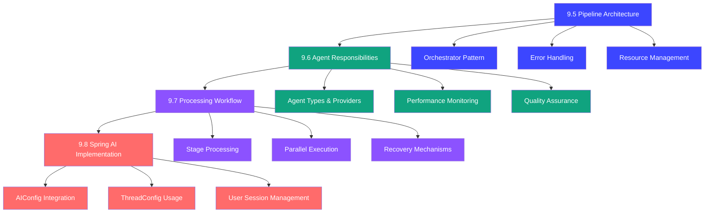

# Multi-Agent Pipeline Design Documentation

This directory contains comprehensive design documentation for the Answer42 multi-agent paper processing pipeline. The design is broken down into four key sections that build upon each other to create a complete technical specification.

## Document Overview

### [9.5 Pipeline Architecture](./9.5-pipeline-architecture.md)
**Foundation Layer - 300+ lines**

Establishes the core architectural principles and components of the multi-agent pipeline:

- **Orchestrator-based Architecture**: Central coordination of specialized agents
- **Asynchronous Processing Framework**: Non-blocking operations with progress tracking
- **Error Handling & Resilience**: Circuit breakers, retry mechanisms, and recovery strategies
- **Resource Management**: Rate limiting, memory management, and thread pool optimization
- **Monitoring & Observability**: Comprehensive metrics collection and health checks
- **Configuration Templates**: Pre-defined pipeline configurations for different use cases

**Key Components:**
- `PipelineOrchestrator` - Central workflow coordinator
- `AgentCircuitBreaker` - Prevents cascade failures
- `PipelineMemoryManager` - Resource cleanup and optimization
- `PipelineMetrics` - Performance monitoring and alerting

### [9.6 Agent Responsibilities](./9.6-agent-responsibilities.md)
**Agent Layer - 300+ lines**

Defines the responsibilities and implementation details of each specialized agent:

- **Core Processing Agents**: Paper processor, metadata enhancer
- **Analysis Agents**: Content summarizer, concept explainer
- **Quality & Verification Agents**: Quality checker, citation formatter
- **Research & Discovery Agents**: Perplexity research agent

**Provider Assignment Matrix:**
- **Anthropic Claude**: Content summarization, quality checking
- **OpenAI GPT-4**: Structure recognition, concept explanation, citation formatting
- **Perplexity**: External research and fact verification

**Key Features:**
- Agent-specific implementations with Spring AI integration
- Performance monitoring and health status tracking
- Standardized interfaces and error handling
- Provider-specific optimizations based on strengths

### [9.7 Processing Workflow](./9.7-processing-workflow.md)
**Workflow Layer - 300+ lines**

Details the complete paper processing workflow implementation:

- **Stage-Based Processing**: Discrete stages with dependencies and parallel execution
- **Workflow State Machine**: Dynamic stage routing and progress tracking
- **Parallel Processing Optimization**: Dependency analysis and resource-aware scheduling
- **Error Recovery**: Stage-level recovery, checkpointing, and fallback strategies

**Processing Stages:**
1. **Initialization** → **Text Extraction** → **Metadata Enhancement**
2. **Structure Analysis** → **Content Analysis** → **Summary Generation**
3. **Citation Processing** → **Quality Verification** → **Finalization**

**Key Components:**
- `WorkflowStateMachine` - Stage dependency management
- `ResourceAwareScheduler` - Optimal execution planning
- `WorkflowCheckpointManager` - Recovery and resumption
- `StageErrorRecoveryManager` - Failure handling strategies

### [9.8 Spring AI Implementation](./9.8-spring-ai-implementation.md)
**Integration Layer - 300+ lines**

Integrates with existing Answer42 configuration classes for production-ready implementation:

- **AIConfig Integration**: Uses existing user-aware API key management
- **ThreadConfig Integration**: Leverages configured thread pools for async processing
- **User Session Management**: Dynamic API key updates and validation
- **Performance Monitoring**: Comprehensive metrics and error tracking

**Integration Points:**
- `AIConfig.updateKeysForUser()` - Per-user API key management
- `ThreadConfig.taskExecutor()` - Optimized thread pool configuration
- `AIProviderFactory` - Dynamic provider selection based on agent types
- `SpringAIAgentBase` - Base implementation using existing infrastructure

## Architecture Flow

## Design Principles

### 1. Separation of Concerns
- **Architecture (9.5)**: Defines the structural foundation
- **Agents (9.6)**: Specifies individual agent responsibilities
- **Workflow (9.7)**: Orchestrates the processing sequence
- **Implementation (9.8)**: Integrates with existing infrastructure

### 2. Scalability & Performance
- **Asynchronous Processing**: All operations are non-blocking
- **Parallel Execution**: Independent agents run concurrently
- **Resource Optimization**: Thread pools and memory management
- **Load Balancing**: Dynamic provider selection based on capacity

### 3. Reliability & Resilience
- **Error Isolation**: Agent failures don't cascade
- **Recovery Mechanisms**: Checkpointing and resumption capabilities
- **Fallback Strategies**: Multiple levels of graceful degradation
- **Quality Assurance**: Built-in validation and verification

### 4. Extensibility & Maintenance
- **Modular Design**: Each agent can be developed independently
- **Standardized Interfaces**: Consistent patterns across all components
- **Configuration Driven**: Behavior controlled through external configuration
- **Monitoring Ready**: Comprehensive observability built-in

## Implementation Guidelines

### File Organization Standards
- **Maximum 300 lines per file**: Ensures maintainability and readability
- **Single Responsibility**: Each class has one well-defined purpose
- **Utility Classes**: Common functionality extracted to shared utilities
- **Type Safety**: Strong typing with custom types and constants

### Code Quality Standards
- **LoggingUtil Usage**: All logging through standardized utility
- **Error Handling**: Comprehensive exception handling with context
- **Documentation**: Extensive JavaDoc for all public methods
- **Testing**: Unit tests for all critical components

### Integration Requirements
- **AIConfig Compliance**: Must use existing AI provider configuration
- **ThreadConfig Usage**: Leverage configured thread pools
- **Database Schema**: Follow answer42 schema naming conventions
- **Security**: Proper API key management and validation

## Next Steps for Implementation

1. **Phase 1**: Implement base agent interfaces and orchestrator
2. **Phase 2**: Develop core processing agents (Paper Processor, Content Summarizer)
3. **Phase 3**: Add analysis agents (Concept Explainer, Quality Checker)
4. **Phase 4**: Integrate workflow state machine and error recovery
5. **Phase 5**: Complete Spring AI integration and monitoring

## Related Documentation

- [Main System Architecture](../system_architecture/README.md)
- [Chat System Architecture](../system_architecture/10-chat-system-architecture.md)
- [Database Design](../system_architecture/04-database-design.md)
- [Technology Stack Best Practices](../Technology%20Stack%20Best%20Practices.md)

This design provides a comprehensive foundation for implementing a production-ready multi-agent paper processing pipeline that integrates seamlessly with the existing Answer42 architecture while maintaining high performance, reliability, and extensibility.
