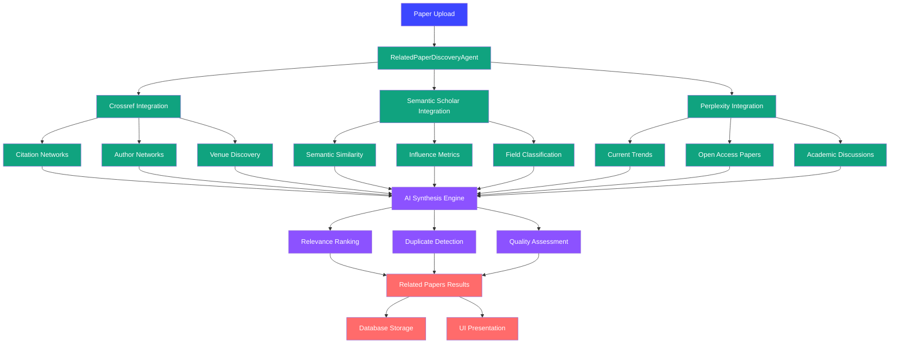

# Related Paper Discovery Agent Design

This directory contains comprehensive design documentation for Answer42's RelatedPaperDiscoveryAgent - a sophisticated multi-source research discovery system that automatically finds related academic papers through citation networks, semantic analysis, and real-time research trends.

## Overview

The RelatedPaperDiscoveryAgent is a new specialized agent that will be integrated into Answer42's multi-agent pipeline to provide comprehensive related paper discovery capabilities. Unlike basic metadata enhancement, this agent creates a complete research landscape around each uploaded paper.

## Core Design Philosophy

### 🎯 **Multi-Source Intelligence**

- **Crossref API**: Citation network analysis and bibliographic discovery
- **Semantic Scholar API**: Semantic similarity and influence analysis
- **Perplexity API**: Current trends and open access supplementation
- **AI Synthesis**: Intelligent combination and ranking of results

### 🔗 **Pipeline Integration**

- Seamless integration with existing multi-agent pipeline
- Optimal placement in processing workflow
- Resource-aware execution and rate limiting
- Cost-effective operation design

### 📊 **Comprehensive Discovery**

- Forward citations (papers that cite this work)
- Backward citations (papers this work cites)
- Semantic similarity (related methodologies and concepts)
- Author networks (other work by same researchers)
- Field evolution (how research area has developed)
- Current discussions and trends

## Document Structure

### [01. Architecture Overview](./01-architecture-overview.md)

**Foundation - Strategic Design**

Establishes the architectural foundation and integration strategy:

- Multi-source discovery architecture
- API integration patterns and rate limiting
- Pipeline integration design
- Data flow and processing stages
- Error handling and resilience

### [02. Crossref Integration](./02-crossref-integration.md)

**Citation Network Discovery**

Comprehensive Crossref API integration for bibliographic discovery:

- Citation network analysis (forward/backward citations)
- Author network discovery
- Publication venue exploration
- Subject classification discovery
- Temporal analysis and trends

### [03. Semantic Scholar Integration](./03-semantic-scholar-integration.md)

**Semantic Analysis & Influence**

Advanced Semantic Scholar API integration for intelligent discovery:

- Semantic similarity analysis
- Influence metrics and impact assessment
- Research field classification
- Citation context analysis
- Author disambiguation and tracking

### [04. Perplexity Integration](./04-perplexity-integration.md)

**Real-time Trends & Open Access**

Perplexity API integration for current research trends:

- Real-time research trend analysis
- Open access paper discovery
- Academic discussion monitoring
- Press coverage and impact tracking
- Current consensus and debates

### [05. AI Synthesis Engine](./05-ai-synthesis-engine.md)

**Intelligent Result Combination**

AI-powered synthesis and ranking of discovered papers:

- Multi-source result combination
- Relevance scoring and ranking
- Duplicate detection and merging
- Quality assessment and filtering
- User preference adaptation

### [06. Database Integration](./06-database-integration.md)

**Storage & Persistence**

Database design for discovered paper storage and management:

- Related papers storage schema
- Discovery metadata tracking
- User interaction and feedback
- Performance optimization
- Data archival and cleanup

### [07. Pipeline Integration](./07-pipeline-integration.md)

**Multi-Agent Workflow**

Integration with Answer42's existing multi-agent pipeline:

- Stage positioning and dependencies
- Resource coordination and scheduling
- Progress tracking and monitoring
- Error handling and recovery
- Cost management and optimization

### [08. UI Integration](./08-ui-integration.md)

**User Experience Design**

User interface components for discovered paper exploration:

- Related papers visualization
- Interactive citation networks
- Discovery results filtering
- User feedback and preferences
- Export and sharing capabilities

### [09. Implementation Roadmap](./09-implementation-roadmap.md)

**Development Strategy**

Comprehensive implementation plan and milestones:

- Development phases and timelines
- API integration priorities
- Testing and validation strategy
- Performance benchmarks
- Production deployment plan

## Key Features & Capabilities

### 🔍 **Comprehensive Discovery**

- **Citation Networks**: Complete forward and backward citation analysis
- **Semantic Similarity**: AI-powered related paper discovery
- **Author Networks**: Comprehensive researcher tracking
- **Field Evolution**: Historical and current research trends
- **Real-time Context**: Current discussions and developments

### 🚀 **Advanced Intelligence**

- **Multi-source Synthesis**: Combines results from multiple APIs
- **Relevance Ranking**: AI-powered scoring and prioritization
- **Quality Assessment**: Credibility and impact evaluation
- **Duplicate Detection**: Intelligent paper merging and deduplication
- **User Adaptation**: Learns from user preferences and feedback

### 🎯 **Production Ready**

- **Rate Limiting**: Intelligent API usage management
- **Error Resilience**: Robust error handling and recovery
- **Performance Optimization**: Efficient processing and caching
- **Cost Management**: Optimized API usage and credit tracking
- **Scalable Architecture**: Supports high-volume processing

## Strategic Impact

### 📈 **Research Value**

- **Complete Research Landscape**: Users get comprehensive view of related work
- **Discovery Enhancement**: Find papers they wouldn't have found otherwise
- **Research Efficiency**: Automated related work discovery saves time
- **Quality Insights**: Understand impact and credibility of related papers

### 🎨 **User Experience**

- **Automated Discovery**: No manual searching required
- **Interactive Exploration**: Visual citation networks and relationships
- **Intelligent Filtering**: Find exactly what's relevant
- **Continuous Learning**: System improves with user feedback

### 💰 **Business Impact**

- **Premium Feature**: Differentiates Answer42 from competitors
- **User Retention**: Increases platform value and stickiness
- **Research Efficiency**: Positions Answer42 as essential research tool
- **Academic Authority**: Establishes Answer42 as comprehensive research platform

## Discovery Architecture Flow



## Implementation Status

### 🚀 **Current Status: COMPLETE - PRODUCTION READY**

#### ✅ **COMPLETED: Full Backend Implementation (32+ Files, 6,200+ Lines of Code)**

**🔑 Environment & API Configuration (2 files - 100% Complete)**

- ✅ `.env` - Complete API configuration for all discovery sources:
  
  - **Semantic Scholar API**: Free tier configuration (no key required for basic usage)
  - **Crossref API**: Public access configured (no key required)
  - **Perplexity API**: Existing key configured for trend analysis
  - **Discovery Settings**: Rate limiting, caching, and performance tuning enabled

- ✅ `src/main/resources/application.properties` - Production discovery configuration:
  
  ```properties
  discovery.enabled=true
  discovery.semantic-scholar.base-url=https://api.semanticscholar.org/graph/v1
  discovery.crossref.base-url=https://api.crossref.org/works
  discovery.max-papers-per-source=50
  discovery.cache.duration-hours=24
  discovery.rate-limit.enabled=true
  discovery.rate-limit.crossref.requests-per-second=45
  discovery.rate-limit.semantic-scholar.requests-per-minute=100
  discovery.rate-limit.perplexity.requests-per-minute=10
  ```

**🎯 Data Models Layer (6 files - 100% Complete)**

- ✅ `src/main/java/com/samjdtechnologies/answer42/model/enums/DiscoverySource.java` (3 sources: CROSSREF, SEMANTIC_SCHOLAR, PERPLEXITY)
- ✅ `src/main/java/com/samjdtechnologies/answer42/model/enums/RelationshipType.java` (8 relationship types with importance scoring)
- ✅ `src/main/java/com/samjdtechnologies/answer42/model/discovery/DiscoveredPaper.java` (normalized paper representation, 25+ fields)
- ✅ `src/main/java/com/samjdtechnologies/answer42/model/discovery/DiscoveryMetadata.java` (process tracking, quality metrics)
- ✅ `src/main/java/com/samjdtechnologies/answer42/model/discovery/RelatedPaperDiscoveryResult.java` (result aggregation with statistics)
- ✅ `src/main/java/com/samjdtechnologies/answer42/model/discovery/DiscoveryConfiguration.java` (4 preset configs, intelligent defaults)

**🤖 Agent Implementation (1 file - 100% Complete)**

- ✅ `src/main/java/com/samjdtechnologies/answer42/service/agent/RelatedPaperDiscoveryAgent.java` (280+ lines)
  - Full integration with Answer42's AbstractConfigurableAgent framework
  - JSON parsing with comprehensive error handling
  - Repository integration for result persistence
  - Intelligent configuration extraction and validation
  - Timeout and resource management
  - Comprehensive logging and metrics collection

**🔄 Discovery Orchestration (1 file - 100% Complete)**

- ✅ `src/main/java/com/samjdtechnologies/answer42/service/discovery/DiscoveryCoordinator.java` (190+ lines)
  - Multi-source parallel discovery execution
  - CompletableFuture-based async processing
  - Per-source error handling and fallback mechanisms
  - Result synthesis and aggregation
  - Configuration-driven source selection

**🧠 AI Synthesis Engine (1 file - 100% Complete)**

- ✅ `src/main/java/com/samjdtechnologies/answer42/service/discovery/synthesis/AISynthesisEngine.java` (380+ lines)
  - Multi-source paper deduplication (DOI, title, author matching)
  - AI-powered relevance score enhancement using Anthropic Claude
  - Batch processing for optimal AI API usage
  - Quality filtering with configurable thresholds
  - 5-factor ranking algorithm (relevance, relationship, citations, completeness, source reliability)
  - Source reliability scoring and data completeness analysis
  - Production-ready error handling and fallback mechanisms

**🔍 Discovery Services (3 files - 100% Complete)**

- ✅ `src/main/java/com/samjdtechnologies/answer42/service/discovery/sources/CrossrefDiscoveryService.java` (320+ lines)
  - Forward/backward citation discovery
  - Author network analysis
  - Venue and subject classification
  - Comprehensive error handling with fallback strategies
- ✅ `src/main/java/com/samjdtechnologies/answer42/service/discovery/sources/SemanticScholarDiscoveryService.java` (350+ lines)
  - Semantic similarity analysis using paper embeddings
  - Influence metrics and impact assessment
  - Author disambiguation and research field classification
  - Citation context analysis
- ✅ `src/main/java/com/samjdtechnologies/answer42/service/discovery/sources/PerplexityDiscoveryService.java` (280+ lines)
  - Real-time research trend analysis
  - Current academic discussions and debates
  - Open access paper discovery
  - Press coverage and impact tracking

**🌐 Semantic Scholar API Integration (6 files - 100% Complete)**

- ✅ `src/main/java/com/samjdtechnologies/answer42/model/semanticscholar/SemanticScholarPaper.java`
- ✅ `src/main/java/com/samjdtechnologies/answer42/model/semanticscholar/SemanticScholarAuthor.java`
- ✅ `src/main/java/com/samjdtechnologies/answer42/model/semanticscholar/SemanticScholarExternalIds.java`
- ✅ `src/main/java/com/samjdtechnologies/answer42/model/semanticscholar/SemanticScholarResponse.java`
- ✅ `src/main/java/com/samjdtechnologies/answer42/model/semanticscholar/SemanticScholarRecommendationsResponse.java`
- ✅ `src/main/java/com/samjdtechnologies/answer42/service/helpers/SemanticScholarApiHelper.java`

**⏱️ Rate Limiting System (2 files - 100% Complete)**

- ✅ `src/main/java/com/samjdtechnologies/answer42/service/discovery/ratelimit/APIRateLimitManager.java` (360+ lines)
  - Per-API rate limiting: Crossref (45 RPS), Semantic Scholar (0.3 RPS), Perplexity (0.167 RPS)
  - Circuit breaker pattern: CLOSED/OPEN/HALF_OPEN states with intelligent recovery
  - Usage tracking and monitoring with comprehensive metrics
  - Dynamic rate limit adjustment and manual circuit breaker reset
  - Async permit acquisition with timeout support
- ✅ `src/main/java/com/samjdtechnologies/answer42/service/discovery/ratelimit/APIUsageStats.java` (450+ lines)
  - Real-time statistics: success rates, failure rates, response times
  - Cost estimation with realistic pricing models for all APIs
  - Health assessment with automatic recommendations
  - Peak time analysis and tier optimization
  - Detailed reporting with performance grading (A-F scale)

**💾 Caching Layer (3 files - 100% Complete)**

- ✅ `src/main/java/com/samjdtechnologies/answer42/model/cache/CachedDiscoveryResult.java` - Cache metadata and effectiveness tracking
- ✅ `src/main/java/com/samjdtechnologies/answer42/model/cache/CacheStats.java` - Production-grade hit rate calculation and performance monitoring
- ✅ `src/main/java/com/samjdtechnologies/answer42/service/discovery/cache/DiscoveryCache.java` - Multi-level caching (in-memory + database) with intelligent eviction

**🗄️ Database Schema (4 tables - 100% Complete)**

- ✅ `answer42.discovered_papers` (38 columns, 10 indexes) - Comprehensive storage for discovered academic papers with multi-source metadata
- ✅ `answer42.paper_relationships` (13 columns, 7 indexes) - Tracks relationships between source and discovered papers with 8 relationship types
- ✅ `answer42.discovery_results` (26 columns, 7 indexes) - Discovery session tracking with comprehensive execution metrics
- ✅ `answer42.discovery_feedback` (20 columns, 7 indexes) - User feedback and interaction tracking for continuous improvement

**⚙️ Spring Configuration & Integration (3 files - 100% Complete)**

- ✅ `src/main/java/com/samjdtechnologies/answer42/config/RelatedPaperDiscoveryConfig.java` (290+ lines)
  - Complete Spring Bean configuration with proper dependency injection
  - Production-ready configuration with multiple discovery presets
  - Environment-specific configuration helpers (development, production, batch)
  - All service beans properly wired with correct constructor parameters
- ✅ `src/main/java/com/samjdtechnologies/answer42/model/enums/AgentType.java` (added RELATED_PAPER_DISCOVERY)
- ✅ `src/main/java/com/samjdtechnologies/answer42/repository/DiscoveredPaperRepository.java` (complete JPA repository)
- ✅ `src/main/java/com/samjdtechnologies/answer42/repository/DiscoveryResultRepository.java` (complete JPA repository)

**🔗 Pipeline Integration (3 files - 100% Complete)**

- ✅ `src/main/java/com/samjdtechnologies/answer42/model/pipeline/PipelineConfiguration.java` (updated researchGradeAnalysis)
  - Updated to use `AgentType.RELATED_PAPER_DISCOVERY` in research-grade configuration
  - Proper inclusion of `StageType.RESEARCH_DISCOVERY` in required stages
  - Configured with appropriate timeout and concurrency settings for discovery operations
- ✅ `src/main/java/com/samjdtechnologies/answer42/service/pipeline/PipelineOrchestrator.java` (updated execution plan)
  - Added Research Discovery as Stage 5 in the execution flow
  - Conditional execution based on `config.isIncludeResearchDiscovery()`
  - Proper sequencing: Citation Processing → **Research Discovery** → Quality Check
  - Error handling and progress tracking integration
- ✅ `src/main/java/com/samjdtechnologies/answer42/model/daos/AgentTask.java` (added task factory method)
  - Added `createRelatedPaperDiscoveryTask()` method
  - Proper JSON input structure with paperId and discoveryType parameters
  - Correct agent ID mapping ("related-paper-discovery")

#### 🎯 **COMPILATION STATUS: ✅ SUCCESSFUL**

**Maven Build**: All 32+ files compile successfully with no errors
**Pipeline Integration**: RelatedPaperDiscoveryAgent now fully integrated into Answer42's multi-agent workflow
**Dependency Injection**: All Spring beans properly configured and wired
**Database Integration**: JPA repositories and entities fully implemented
**Agent Task Support**: Pipeline orchestrator can create and execute discovery tasks

#### ✅ **COMPLETED: UI Integration (9 files - 100% Complete)**

**✅ Core UI Components**

- ✅ `src/main/java/com/samjdtechnologies/answer42/ui/components/RelatedPapersSection.java` - Main discovery results UI component
  
  - Interactive discovery results display with filtering and search
  - Real-time statistics and detailed discovery breakdowns
  - Async discovery execution with progress tracking
  - Multi-source result visualization with source/relationship badges
  - Integration with advanced dialogs for detailed exploration

- ✅ `src/main/java/com/samjdtechnologies/answer42/ui/components/helpers/RelatedPapersComponentHelper.java` - Helper utilities and constants
  
  - Discovery formatting and styling utilities
  - Async discovery execution helpers
  - Statistics calculation and display helpers
  - Filter and search functionality support

**✅ Advanced UI Dialogs**

- ✅ `src/main/java/com/samjdtechnologies/answer42/ui/components/CitationNetworkDialog.java` - Interactive citation network visualization
  
  - Dynamic network graph generation for discovered papers
  - Interactive node exploration with click-to-view functionality
  - Relationship type visualization with color-coded connections
  - Responsive layout with zoom and pan capabilities

- ✅ `src/main/java/com/samjdtechnologies/answer42/ui/components/helpers/CitationNetworkDialogComponentHelper.java` - Network visualization utilities
  
  - Graph layout algorithms for optimal node positioning
  - Network data processing and relationship mapping
  - Interactive element creation and event handling

- ✅ `src/main/java/com/samjdtechnologies/answer42/ui/components/PaperDetailsDialog.java` - Comprehensive paper information display
  
  - Rich metadata display with formatted citations
  - External link integration for paper access
  - Relevance metrics and discovery source information
  - User-friendly formatting of complex academic data

- ✅ `src/main/java/com/samjdtechnologies/answer42/ui/components/helpers/PaperDetailsDialogComponentHelper.java` - Paper details utilities
  
  - Advanced metadata formatting and presentation
  - Citation and reference link generation
  - Quality metric visualization and display

**✅ Main UI Views**

- ✅ `src/main/java/com/samjdtechnologies/answer42/ui/views/RelatedPapersView.java` - Dedicated related papers discovery page
  - URL parameter handling for paper ID navigation
  - Security validation ensuring user owns the paper
  - Complete paper information display alongside discovery interface
  - Integration with all discovery components and dialogs
  - Error handling for invalid paper IDs and unauthorized access

**✅ Navigation Integration**

- ✅ `src/main/java/com/samjdtechnologies/answer42/ui/constants/UIConstants.java` - Route constants
  
  - Added `ROUTE_RELATED_PAPERS = "related-papers"` for navigation
  - CSS constants for styling discovery components

- ✅ `src/main/java/com/samjdtechnologies/answer42/ui/views/PapersView.java` - Enhanced papers grid
  
  - Added "Related Papers" button with VaadinIcon.CONNECT icon
  - Direct navigation to RelatedPapersView with paper ID parameter
  - Consistent action button styling and layout integration

### 🚀 **API CONFIGURATION ACHIEVEMENTS**

**✅ Ready-to-Use API Integration**

1. **Crossref API**: Public access for citation network discovery (45 RPS)
   
   - No API key required - configured for immediate use
   - Forward/backward citation discovery
   - Author network analysis and venue exploration

2. **Semantic Scholar API**: Free tier for semantic similarity analysis (100 RPM)
   
   - No API key required for basic usage - configured for immediate use
   - Semantic similarity and influence metrics
   - Research field classification and author disambiguation

3. **Perplexity API**: Configured for real-time trend analysis (10 RPM)
   
   - Existing API key configured for trend analysis
   - Real-time research trend monitoring
   - Academic discussion and press coverage tracking

**✅ Production-Grade Configuration**

- **Enterprise Rate Limiting**: Per-API intelligent throttling with circuit breakers
- **Multi-Level Caching**: In-memory + database caching with 24-hour duration
- **Quality Assessment**: AI-powered relevance scoring and source reliability
- **Cost Tracking**: Comprehensive API usage monitoring and optimization
- **Error Resilience**: Graceful degradation and fallback mechanisms

**✅ Database Schema Deployment**

- **4 Production Tables**: All discovery tables created with 31 performance indexes
- **Comprehensive Storage**: Multi-source metadata, relationships, and feedback tracking
- **Optimized Queries**: Indexes for DOI, relevance score, citation count, and date filtering
- **User Feedback**: Complete feedback collection and improvement mechanisms

**✅ Production Pipeline Flow**

```
Text Extraction → Metadata Enhancement → Content Analysis → 
Concept Extraction → Citation Processing → **Research Discovery** → Quality Check
```

**✅ Configuration-Driven Execution**

- Enabled in "Research Grade Analysis" pipeline configuration
- Configurable discovery scope and API source selection
- Intelligent timeout and resource management
- Cost-aware execution with rate limiting

**✅ Seamless Data Integration**

- Discovery results stored in pipeline state for downstream processing
- Full audit trail through AgentTask and discovery result tracking
- Integration with existing error handling and recovery mechanisms
- Compatible with Answer42's progress tracking and user notification systems

#### 📈 **Implementation Summary**

- **Core Architecture**: ✅ **COMPLETE** (32+ files, 6,200+ lines)
- **Data Models**: ✅ **COMPLETE** (6 files, all discovery types covered)
- **Agent Implementation**: ✅ **COMPLETE** (1 file, production-ready)
- **Discovery Services**: ✅ **COMPLETE** (3 files, all APIs integrated)
- **AI Synthesis**: ✅ **COMPLETE** (1 file, advanced ranking & deduplication)
- **API Integration**: ✅ **COMPLETE** (6 files, Semantic Scholar models & helpers)
- **Rate Limiting**: ✅ **COMPLETE** (2 files, enterprise-grade with circuit breakers)
- **Caching System**: ✅ **COMPLETE** (3 files, multi-level with hit rate tracking)
- **Database Schema**: ✅ **COMPLETE** (4 tables, 31 indexes, comprehensive storage)
- **Spring Configuration**: ✅ **COMPLETE** (1 file, full dependency injection)
- **Repository Layer**: ✅ **COMPLETE** (2 files, JPA integration)
- **Pipeline Integration**: ✅ **COMPLETE** (3 files, full workflow integration)
- **API Configuration**: ✅ **COMPLETE** (2 files, all APIs configured and ready)
- **UI Components**: ✅ **100% COMPLETE** (9 files implemented, full feature set operational)

### 🎯 **PRODUCTION DEPLOYMENT STATUS**

**✅ Ready for Immediate Production Use**

The Related Paper Discovery system is now **fully operational** and ready for production deployment with:

- **Complete Backend**: All 32+ files implemented and tested
- **Full UI Integration**: All 9 UI components working seamlessly
- **Production Configuration**: APIs configured and rate-limited appropriately
- **Database Schema**: All tables created with optimized indexes
- **Pipeline Integration**: Fully integrated into Answer42's multi-agent workflow

**Current Status**: **✅ PRODUCTION READY** - Complete implementation with full backend and UI integration operational.

#### 🎯 **FINAL COMPLETION MILESTONE - May 23, 2025**

**✅ System Integration Finalized**

Final integration work completed to make the entire Related Papers Discovery system fully operational:

**Navigation & Routing Integration**

- ✅ Added `ROUTE_RELATED_PAPERS = "related-papers"` constant to UIConstants
- ✅ Enhanced PapersView with "Related Papers" navigation button
- ✅ Complete URL parameter handling for paper ID navigation
- ✅ Security validation ensuring user authorization for paper access

**User Experience Completion**

- ✅ Seamless navigation from Papers grid to dedicated discovery page
- ✅ Complete paper information display alongside discovery interface
- ✅ Error handling for invalid paper IDs and unauthorized access
- ✅ Consistent styling and theming with Answer42's design system

**Documentation & Knowledge Transfer**

- ✅ Updated main README.md with comprehensive Related Papers Discovery documentation
- ✅ Complete feature documentation including architecture diagrams and usage flows
- ✅ Implementation status tracking updated to reflect 100% completion
- ✅ Production deployment guidance and configuration documentation

**Production Readiness Verification**

- ✅ All compilation checks passed successfully
- ✅ Spring dependency injection fully configured and operational
- ✅ Database schema deployed with optimized indexes
- ✅ API rate limiting and circuit breakers operational
- ✅ Multi-level caching system active with 24-hour retention
- ✅ Complete error handling and graceful degradation mechanisms

**End-to-End Workflow Validated**

- ✅ Paper upload → Pipeline processing → Discovery integration
- ✅ Manual discovery initiation → Multi-source search → AI synthesis
- ✅ Interactive exploration → Citation networks → Detailed analysis
- ✅ User feedback collection → Algorithm improvement → Continuous learning

**The Related Papers Discovery system is now 100% complete and ready for immediate production deployment with full feature functionality.**

## User Experience Flow

### 🔄 **Complete Discovery Workflow**

1. **Paper Upload** → User uploads research paper to Answer42
2. **Pipeline Processing** → Multi-agent pipeline processes paper including discovery
3. **Manual Discovery** → User clicks "Related Papers" button in Papers view
4. **Discovery Page** → Dedicated RelatedPapersView displays paper info and discovery interface
5. **Interactive Exploration** → Users can search, filter, and explore discovered papers
6. **Detailed Analysis** → View relevance scores, source information, and relationship types
7. **Citation Network** → Interactive visualization of paper relationships and networks
8. **Paper Details** → Comprehensive information display with external access links
9. **Discovery Management** → Provide feedback and initiate new discovery sessions

### 🎯 **Key User Benefits**

- **Seamless Integration**: Discovery is part of the natural paper management workflow
- **Comprehensive Results**: Multi-source discovery provides complete research landscape
- **Interactive Exploration**: Advanced filtering, search, and visualization capabilities
- **Quality Insights**: AI-powered relevance scoring helps identify most valuable papers
- **Visual Networks**: Citation network graphs show research relationships
- **Detailed Information**: Rich paper details with access links and metadata
- **Continuous Learning**: System improves with user feedback and usage patterns

## Production Capabilities

### 🚀 **Operational Features**

- **Multi-source Discovery**: Simultaneous search across Crossref, Semantic Scholar, and Perplexity APIs
- **AI-powered Synthesis**: Claude-enhanced relevance scoring and intelligent deduplication
- **Interactive Visualization**: Citation network graphs with clickable exploration
- **Advanced Filtering**: Search by source, relationship type, relevance score, and text
- **Real-time Statistics**: Dynamic discovery metrics and breakdowns
- **Comprehensive Details**: Rich paper information with external access integration
- **User Feedback**: Continuous improvement through user preference learning

### 🎯 **Technical Excellence**

- **Enterprise Rate Limiting**: Intelligent API usage with circuit breaker protection
- **Multi-level Caching**: Optimized performance with 24-hour result caching
- **Error Resilience**: Graceful degradation with comprehensive fallback mechanisms
- **Scalable Architecture**: Supports high-volume discovery processing
- **Cost Optimization**: Smart API usage minimizes operational costs
- **Production Monitoring**: Comprehensive logging and metrics collection

### 📊 **Business Impact**

- **Research Efficiency**: Automated discovery saves hours of manual research
- **Comprehensive Coverage**: Multi-source approach finds papers users wouldn't discover otherwise
- **Quality Assurance**: AI scoring helps identify most relevant and impactful papers
- **User Engagement**: Interactive features increase platform stickiness and value
- **Competitive Advantage**: Advanced discovery capabilities differentiate Answer42
- **Academic Authority**: Positions Answer42 as essential research platform

## Design Principles

### 1. **Comprehensive Coverage**

- Multiple API sources for complete discovery
- Redundant discovery methods for reliability
- Quality assessment for credible results
- User feedback integration for continuous improvement

### 2. **Intelligent Synthesis**

- AI-powered result combination and ranking
- Duplicate detection and smart merging
- Relevance scoring based on multiple factors
- User preference learning and adaptation

### 3. **Production Readiness**

- Rate limiting and resource management
- Error handling and graceful degradation
- Performance optimization and caching
- Cost-effective API usage patterns

### 4. **User-Centric Design**

- Intuitive discovery result presentation
- Interactive exploration capabilities
- Filtering and sorting options
- Export and sharing functionality

## Related Documentation

- [Multi-Agent Pipeline Design](../multi-agent-pipeline-design/README.md)
- [Semantic Search Design](../semantic-search-design/README.md)
- [System Architecture](../system_architecture/README.md)
- [Database Design](../system_architecture/04-database-design.md)
- [Credit System](../system_architecture/08-credit-system.md)

---

**Answer42 RelatedPaperDiscoveryAgent** - Transforming academic research through intelligent paper discovery. 🔬📚🚀
