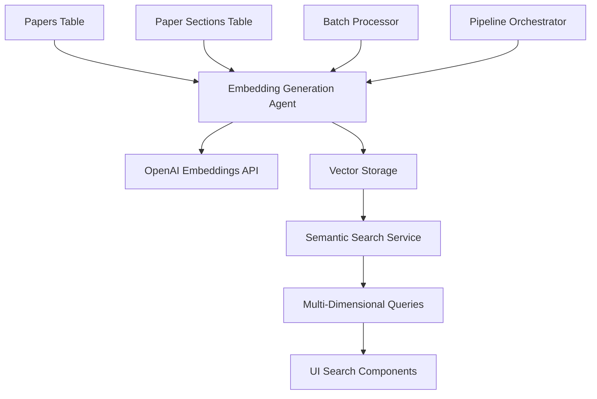

# 1. Architecture Overview

## Current Database Analysis

### Existing Structure Strengths

Answer42's current database schema provides an excellent foundation for semantic search integration:

**Papers Table (47 columns)**
- Rich JSONB fields: `key_findings`, `main_concepts`, `methodology_details`, `research_questions`, `topics`
- Structured content: `title`, `paper_abstract`, `text_content`
- External metadata: `crossref_metadata`, `semantic_scholar_metadata`
- Quality metrics: `quality_score`, `quality_feedback`

**Paper Sections Table**
- Already structured for content chunking: `paper_id`, `title`, `content`, `index`
- Perfect foundation for section-based embeddings
- Maintains paper relationships with foreign key constraints

**Separation of Concerns**
- Dedicated tables for different content types support multi-dimensional search
- JSONB flexibility allows complex metadata storage without schema changes
- Existing relationships support complex queries

### Current Limitations

**Keyword-Only Search**
- Current search relies on PostgreSQL full-text search
- Limited to exact word matching and basic relevance ranking
- Cannot capture semantic relationships between concepts

**No Similarity Matching**
- Cannot find papers with similar methodologies using different terminology
- Miss papers discussing related concepts with different vocabulary
- Limited cross-reference discovery capabilities

## Semantic Search Architecture

### High-Level Design Principles

**1. Non-Intrusive Integration**
- Build upon existing database schema without breaking changes
- Maintain backward compatibility with current functionality
- Add capabilities without removing existing features

**2. Multi-Dimensional Search**
- Content-based similarity (full paper matching)
- Methodology similarity (research approach matching)
- Findings similarity (results and conclusions matching)
- Concept similarity (technical terminology matching)
- Section-based granular matching

**3. Cost-Effective Processing**
- Batch embedding generation to minimize API costs
- Selective re-processing only when content changes
- Efficient storage using PostgreSQL native vector support

**4. Scalable Performance**
- pgvector for production-grade vector operations
- Optimized indexing strategies for similarity queries
- Parallel processing for large document collections

### System Components Overview

### Technology Stack Integration

**PostgreSQL + pgvector**
- Native vector operations in existing database
- ACID compliance for consistent data operations
- Proven scalability for production workloads
- IVFFlat indexing for approximate nearest neighbor search

**OpenAI Embeddings API**
- text-embedding-ada-002 model (1536 dimensions)
- High-quality semantic representations
- Rate limiting and cost management
- Integration with existing AIConfig

**Multi-Agent Pipeline Integration**
- Automatic embedding generation during paper processing
- Agent-based architecture for scalable processing
- Status tracking and error handling
- Memory management for processed papers

## Vector Embedding Strategy

### Embedding Dimensions

**1. Title Embeddings (1536d)**
- Semantic representation of paper titles
- Useful for finding papers on similar topics
- Fast initial filtering for relevance

**2. Abstract Embeddings (1536d)**
- Comprehensive overview representation
- Best balance of content and processing speed
- Primary dimension for most searches

**3. Content Embeddings (1536d)**
- Full paper content representation
- Most comprehensive but computationally expensive
- Used for detailed similarity analysis

**4. Concept Embeddings (1536d)**
- Generated from main_concepts JSONB field
- Technical terminology and domain-specific matching
- Efficient concept-based discovery

**5. Methodology Embeddings (1536d)**
- Generated from methodology_details JSONB field
- Research approach and technique matching
- Valuable for methodological comparisons

**6. Findings Embeddings (1536d)**
- Generated from key_findings JSONB field
- Results and conclusion similarity
- Important for outcome-based research

**7. Section Embeddings (1536d)**
- Individual paper section representations
- Granular matching within specific content areas
- Supports detailed content analysis

### Similarity Metrics

**Cosine Similarity**
- Primary metric for all embedding comparisons
- Range: 0.0 (completely different) to 1.0 (identical)
- Robust to document length variations

**Distance Thresholds**
- High similarity: > 0.8 (very similar papers)
- Medium similarity: 0.6 - 0.8 (related papers)
- Low similarity: 0.4 - 0.6 (potentially relevant)
- Below 0.4: Generally not relevant

## Integration with Existing Systems

### Multi-Agent Pipeline Integration

**Embedding Generation Agent**
- New agent type: `EMBEDDING_GENERATOR`
- Automatic processing during paper upload
- Integration with existing agent task system
- Status tracking and error handling

**Pipeline Configuration**
- Optional embedding generation stage
- Configurable based on user preferences
- Credit-based processing control
- Batch processing for cost efficiency

### Database Schema Enhancements

**Non-Breaking Changes**
- Add vector columns to existing tables
- New embedding_processing_status table
- pgvector extension installation
- Optimized indexes for vector operations

**Backward Compatibility**
- All existing queries continue to work
- Current search functionality unchanged
- Gradual migration to semantic search
- Fallback to traditional search when needed

### Cost Management Integration

**Credit System Integration**
- Embedding generation costs tracked
- User credit deduction for processing
- Batch processing to optimize costs
- Optional feature based on subscription tier

**Token Usage Tracking**
- Monitor OpenAI API usage
- Track tokens per embedding operation
- Cost analytics and optimization
- Rate limiting to prevent abuse

## Performance Considerations

### Database Performance

**Index Strategy**
- IVFFlat indexes for each embedding column
- Configurable list counts based on data size
- Separate indexes for different similarity searches
- Regular index maintenance and optimization

**Query Optimization**
- Limit result sets for performance
- Use similarity thresholds to reduce computation
- Parallel query execution where possible
- Caching strategies for common searches

### Scalability Planning

**Horizontal Scaling**
- pgvector supports read replicas
- Embedding generation can be distributed
- Search load can be balanced across instances
- Asynchronous processing for large datasets

**Storage Considerations**
- Each 1536-dimension vector: ~6KB storage
- 6 embeddings per paper: ~36KB additional storage
- Section embeddings: variable based on paper length
- Compression strategies for archived papers

## Security and Privacy

### Data Protection

**Vector Embeddings**
- Embeddings don't contain readable text
- Semantic relationships preserved without exposing content
- Safe for storage and processing
- GDPR compliance maintained

**API Security**
- OpenAI API keys secured via existing AIConfig
- Rate limiting and abuse prevention
- User-specific API key support
- Audit logging for embedding generation

### Access Control

**User Permissions**
- Semantic search respects existing paper permissions
- Private papers only searchable by owners
- Project-based access control maintained
- Admin controls for system-wide search

This architecture provides a robust foundation for semantic search while maintaining Answer42's existing functionality and design principles.
