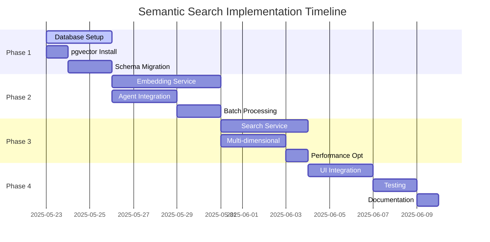

# Semantic Search Integration Design

## Overview

This directory contains the comprehensive design for integrating semantic search capabilities into Answer42 using PostgreSQL with the pgvector extension. The solution leverages existing database structures while adding vector embeddings for intelligent paper discovery and content matching.

## Design Architecture

The semantic search system is designed around the following principles:

- **PostgreSQL + pgvector**: Open-source vector database solution
- **Multi-dimensional Search**: Content, methodology, findings, concepts, and sections
- **Existing Schema Integration**: Builds on current papers and paper_sections tables
- **Multi-Agent Pipeline Integration**: Seamless integration with existing agent system
- **Non-real-time Processing**: Batch processing for cost efficiency

## Document Structure

### [01. Architecture Overview](./01-architecture-overview.md)
High-level system architecture, current database analysis, and design principles.

### [02. Database Schema](./02-database-schema.md)
pgvector setup, table modifications, and new schema additions for embedding storage.

### [03. Embedding Generation](./03-embedding-generation.md)
Embedding service implementation and agent integration for generating vector embeddings.

### [04. Semantic Search Service](./04-semantic-search-service.md)
Core search functionality with multi-dimensional similarity search capabilities.

### [05. Batch Processing](./05-batch-processing.md)
Scheduled processing, status tracking, and automated embedding generation.

### [06. UI Integration](./06-ui-integration.md)
Frontend components, search interfaces, and user experience enhancements.

### [07. Implementation Plan](./07-implementation-plan.md)
Phased implementation approach, timeline, and deployment strategy.

## Key Features

### Multi-Dimensional Search Capabilities

1. **Content Search**: Full paper content similarity matching
2. **Methodology Search**: Find papers with similar research methods
3. **Findings Search**: Discover papers with comparable results
4. **Concept Search**: Match papers by technical concepts and terminology
5. **Section Search**: Granular search within specific paper sections

### Integration Points

- **Multi-Agent Pipeline**: Automatic embedding generation during paper processing
- **Existing UI**: Enhanced search in Papers view and AI Chat modes
- **Cost Tracking**: Token usage monitoring and credit management
- **User Preferences**: Customizable search parameters and filters

### Technical Specifications

- **Vector Dimensions**: 1536 (OpenAI text-embedding-ada-002)
- **Similarity Metric**: Cosine similarity via pgvector
- **Batch Processing**: Hourly scheduled embedding generation
- **Index Strategy**: IVFFlat indexes for optimal performance
- **API Integration**: OpenAI Embeddings API with rate limiting

## Benefits

### For Researchers
- **Semantic Discovery**: Find related papers beyond keyword matching
- **Methodology Matching**: Identify papers using similar research approaches
- **Concept Exploration**: Discover papers covering related technical concepts
- **Cross-Reference Analysis**: Enhanced paper relationship identification

### For System Performance
- **Efficient Storage**: Leverages existing PostgreSQL infrastructure
- **Scalable Architecture**: pgvector designed for production workloads
- **Cost Optimization**: Batch processing reduces API costs
- **Backward Compatibility**: No impact on existing functionality

## Implementation Status

## Getting Started

1. **Review Architecture**: Start with [Architecture Overview](./01-architecture-overview.md)
2. **Database Setup**: Follow [Database Schema](./02-database-schema.md) instructions
3. **Implementation**: Proceed through phases in [Implementation Plan](./07-implementation-plan.md)

## Related Documentation

- [Multi-Agent Pipeline Design](../multi-agent-pipeline-design/README.md)
- [System Architecture](../system_architecture/README.md)
- [Database Design](../system_architecture/04-database-design.md)

## Questions and Feedback

For questions about the semantic search design or implementation, refer to the detailed documents in this directory or consult the main Answer42 documentation.
