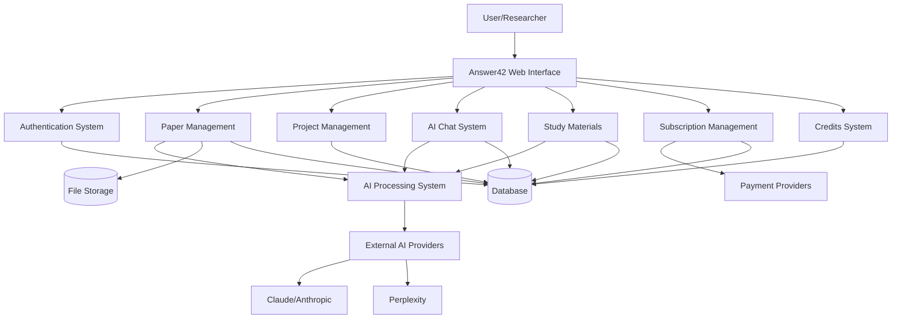

# 1. System Overview

## 1.1 Introduction

Answer42 is an AI-powered academic research assistant platform designed to revolutionize how students, academics, and professionals consume, understand, and synthesize scientific literature. The system analyzes research papers, generates summaries, explains complex concepts, creates study materials, and facilitates deeper understanding through an interactive chat interface.

## 1.2 System Objectives

The primary objectives of the Answer42 system are:

- Reduce time spent reading and understanding research papers
- Improve research comprehension through AI-powered explanation and simplification
- Enhance organization of research materials with intelligent categorization
- Facilitate citation management across multiple formats
- Generate high-quality study materials automatically
- Provide a seamless, device-optimized experience with special attention to desktop productivity

## 1.3 Architectural Principles

The Answer42 architecture adheres to the following principles:

1. **Layered Architecture**: Clear separation between presentation, business logic, and data access layers
2. **Modularity**: System components with well-defined interfaces and single responsibilities
3. **Maintainability**: Well-documented code following established patterns
4. **Security**: Built-in security at every layer
5. **Performance**: Optimized for both initial load and runtime performance
6. **Scalability**: Services designed to scale horizontally
7. **Resilience**: Graceful handling of failures and dependencies

## 1.4 High-Level Architecture

Answer42 follows a layered architecture with clear separation of concerns:

```
+------------------+
|   Presentation   |
|    (Vaadin UI)   |
+------------------+
         |
+------------------+
|   Business Logic |
|    (Services)    |
+------------------+
         |
+------------------+
|  Data Access     |
|  (Repositories)  |
+------------------+
         |
+------------------+
|    Database      |
|   (PostgreSQL)   |
+------------------+
```

### 1.4.1 Layers

1. **Presentation Layer**: Vaadin-based UI components, views, and layouts
2. **Business Logic Layer**: Service classes containing application logic
3. **Data Access Layer**: Repository interfaces for database operations
4. **Database Layer**: PostgreSQL database for data persistence

### 1.4.2 Architecture Patterns

- **MVC (Model-View-Controller)**: Separation of data, presentation, and control logic
- **Dependency Injection**: Using Spring's IoC container
- **Repository Pattern**: For data access abstraction
- **Service Pattern**: For business logic encapsulation
- **JWT-based Authentication**: For secure API access

### 1.4.3 Major Subsystems

The system is composed of the following major subsystems:

1. **User Management Subsystem**: Handles authentication, authorization, and user profiles
2. **Paper Management Subsystem**: Manages paper upload, storage, and organization
3. **AI Processing Subsystem**: Multi-agent system for paper analysis and interaction
4. **Project Management Subsystem**: Organizes papers into research projects
5. **Chat Subsystem**: Provides AI-powered chat capabilities for paper discussion
6. **Subscription Management Subsystem**: Handles user subscriptions and payments
7. **Study Materials Subsystem**: Generates study aids from papers
8. **Credits System**: Manages user credits for AI operations

### 1.4.4 System Context Diagram



## 1.5 Technology Stack

### 1.5.1 Backend

- **Java 21**: Core programming language
- **Spring Boot 3.4.5**: Application framework
- **Spring Security**: Authentication and authorization
- **Spring Data JPA**: Database access
- **Spring AI**: AI integration
- **Spring Transaction**: Standard transaction management
- **JWT (JSON Web Tokens)**: Stateless authentication
- **PostgreSQL (Supabase)**: Relational database
- **Hibernate**: ORM with JSONB support

### 1.5.2 Frontend

- **Vaadin 24.7.3**: Java web framework for building UIs
- **HTML/CSS/JavaScript**: Web technologies
- **PWA Support**: Progressive Web App capabilities

### 1.5.3 Development Tools

- **Maven**: Dependency management and build automation
- **Spring Boot DevTools**: Development utilities
- **JUnit**: Testing framework
- **Supabase**: Database hosting

### 1.5.4 AI Models

- **Claude (Anthropic)**: AI assistant capabilities
- **Perplexity API**: Research and knowledge features

## 1.6 Key Features

- **Paper Management**: Upload, organize, and manage scientific papers
- **AI Paper Analysis**: Get automatic summaries, key points, and concept explanations
- **Content Extraction**: Extract full text and identify paper sections with AI
- **Research Projects**: Organize papers into customizable research projects
- **Intelligent Chat**: Ask questions about papers and receive accurate responses
- **Cross-Reference Analysis**: Compare multiple papers to find connections and gaps
- **Study Tools**: Generate flashcards, practice questions, and concept maps
- **External Metadata**: Integration with Crossref and Semantic Scholar APIs for enhanced paper information
- **User Authentication**: Secure login/registration system
- **Dashboard**: Overview of papers, projects, and activities
- **Progressive Web App**: Installable application with offline support
- **Credit System**: Manage usage of AI operations with tiered credit allocations

## 1.7 Project Structure

```
answer42/
├── src/
│   ├── main/
|   |   └── frontend/
|   |   |    └── styles/
|   |   |        └── themes/
│   |   |           └── answer42/           # Custom theme
|   |   |             ├── theme.json        # Theme configuration
│   |   |             ├── styles.css        # Global variables
|   │   |             ├── main.css          # Main styles
|   │   |             └── components/       # Component-specific styles
│   │   ├── java/
│   │   │   └── com/samjdtechnologies/answer42/
│   │   │       ├── config/              # Configuration classes
│   │   │       ├── controller/          # REST controllers
│   │   │       ├── model/               # Data models (entities)
│   │   │       ├── repository/          # Data access interfaces
│   │   │       ├── security/            # Security configuration
│   │   │       ├── service/             # Business logic services
│   │   │       └── ui/                  # Vaadin UI components
│   │   │           ├── constants/       # UI constants
│   │   │           ├── layout/          # Layout components
│   │   │           ├── service/         # UI-specific services
│   │   │           └── views/           # View components
│   │   ├── resources/
│   │   │   ├── META-INF/resources/      # Static resources
│   │   │   ├── static/                  # Static web assets
│   │   │   └── application.properties   # Application configuration
│   └── test/                            # Test classes
├── docs/                                # Documentation
├── pom.xml                              # Maven configuration
├── .env                                 # Environment variables
└── README.md                            # Project documentation
