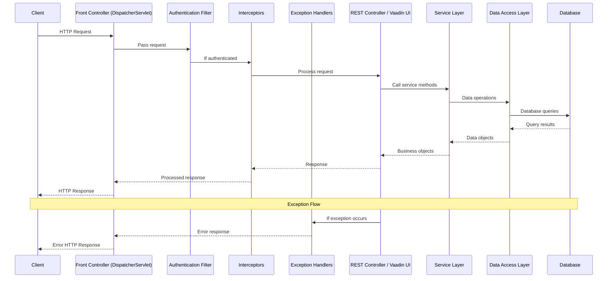

# 3. Backend Architecture

## 3.1 Overview

The Answer42 backend is built on Spring Boot 3.4.5, providing a robust, scalable, and maintainable foundation for the application. It follows a layered architecture with clear separation of concerns and leverages Spring's extensive ecosystem for dependency injection, data access, security, and AI integration.

## 3.2 Architectural Patterns

The backend implements several architectural patterns:

1. **Layered Architecture**: Clear separation between presentation, business logic, and data access layers
2. **Dependency Injection**: Spring-managed components with constructor injection
3. **Repository Pattern**: Data access abstraction through repositories
4. **Service Pattern**: Business logic encapsulation in service classes
5. **Factory Pattern**: Dynamic creation of specialized components
6. **Observer Pattern**: Event-based communication between components
7. **Template Method Pattern**: Common processing flows with customizable steps

## 3.3 Application Structure

The backend follows a standard Spring Boot application structure with package organization by feature:

```
com.samjdtechnologies.answer42/
├── config/                  # Configuration classes
│   ├── AIConfig.java        # AI provider configuration
│   ├── SecurityConfig.java  # Security configuration
│   ├── DatabaseConfig.java  # Database configuration
│   └── ThreadConfig.java    # Threading configuration
├── controller/              # REST controllers
├── model/                   # Entity and data classes
│   ├── enums/               # Enumeration types
│   ├── dto/                 # Data Transfer Objects
│   └── request/             # Request and response models
├── repository/              # Data access interfaces
├── security/                # Security-related classes
├── service/                 # Business logic services
│   └── helper/              # Service helper classes
├── ui/                      # Vaadin UI components
│   ├── constants/           # UI constants
│   ├── layout/              # Layout components
│   ├── service/             # UI-specific services
│   ├── views/               # View components
│   └── components/          # Reusable UI components
├── util/                    # Utility classes
├── transaction/             # Transaction-related classes
├── exception/               # Custom exceptions
└── Answer42Application.java # Application entry point
```

## 3.4 Key Components

### 3.4.1 Configuration

Configuration classes centralize application settings and component initialization:

```java
@Configuration
public class AppConfig {
    // Configuration properties and beans
}

@Configuration
@EnableWebSecurity
public class SecurityConfig {
    // Security configuration
}

@Configuration
public class DatabaseConfig {
    // Database configuration
}

@Configuration
@EnableAsync
@EnableScheduling
public class ThreadConfig {
    // Thread and executor configuration
}
```

### 3.4.2 Controllers

RESTful controllers handle external API requests:

```java
@RestController
@RequestMapping("/api/v1/auth")
public class AuthController {
    private final AuthenticationManager authenticationManager;
    private final JwtTokenUtil jwtTokenUtil;
    private final UserDetailsService userDetailsService;
    
    // Constructor with dependency injection
    
    @PostMapping("/login")
    public ResponseEntity<?> createAuthenticationToken(@RequestBody LoginRequest authRequest) {
        // Authentication logic
    }
    
    @PostMapping("/register")
    public ResponseEntity<?> registerUser(@RequestBody RegisterRequest registerRequest) {
        // Registration logic
    }
    
    // Additional endpoints
}
```

### 3.4.3 Services

Service classes encapsulate business logic and orchestrate operations:

```java
@Service
public class PaperService {
    private static final Logger LOG = LoggerFactory.getLogger(PaperService.class);
    
    private final PaperRepository paperRepository;
    private final StorageService storageService;
    private final PaperAnalysisService analysisService;
    
    // Constructor with dependency injection
    
    @Transactional
    public Paper createPaper(InputStream fileStream, String fileName, UUID userId) {
        try {
            // Store the file
            String filePath = storageService.storePaperFile(fileStream, fileName, userId);
            
            // Extract initial metadata
            PaperMetadata metadata = extractBasicMetadata(fileName);
            
            // Create paper entity
            Paper paper = new Paper();
            paper.setUserId(userId);
            paper.setTitle(metadata.getTitle());
            paper.setAuthors(metadata.getAuthors());
            paper.setFilePath(filePath);
            paper.setFileType(getFileExtension(fileName));
            paper.setCreatedAt(ZonedDateTime.now());
            paper.setUpdatedAt(ZonedDateTime.now());
            paper.setProcessingStatus("PENDING");
            
            // Save paper
            Paper savedPaper = paperRepository.save(paper);
            
            // Trigger async processing
            analysisService.schedulePaperProcessing(savedPaper.getId());
            
            return savedPaper;
        } catch (Exception e) {
            LoggingUtil.error(LOG, "createPaper", "Error creating paper from file %s", e, fileName);
            throw new PaperCreationException("Failed to create paper", e);
        }
    }
    
    // Additional methods for paper management
}
```

### 3.4.4 Repositories

Repository interfaces define data access operations:

```java
@Repository
public interface PaperRepository extends JpaRepository<Paper, UUID> {
    
    List<Paper> findByUserIdOrderByCreatedAtDesc(UUID userId);
    
    @Query("SELECT p FROM Paper p WHERE p.userId = :userId AND " +
           "LOWER(p.title) LIKE LOWER(CONCAT('%', :searchTerm, '%'))")
    List<Paper> searchPapersByTitle(UUID userId, String searchTerm);
    
    Optional<Paper> findByIdAndUserId(UUID id, UUID userId);
    
    @Query("SELECT COUNT(p) FROM Paper p WHERE p.userId = :userId")
    long countByUserId(UUID userId);
    
    @Query("SELECT p FROM Paper p WHERE p.userId = :userId AND " +
           "p.processingStatus = :status")
    List<Paper> findByUserIdAndStatus(UUID userId, String status);
}
```

### 3.4.5 Helper Classes

Helper classes provide specialized functionality for services:

```java
@Component
public class ChatMessageHelper {
    private final ChatMessageRepository chatMessageRepository;
    
    // Constructor with dependency injection
    
    public Integer getNextSequenceNumber(UUID sessionId) {
        return chatMessageRepository.findMaxSequenceNumberBySessionId(sessionId)
            .map(seq -> seq + 1)
            .orElse(0);
    }
    
    public Prompt createPromptFromMessages(
            ChatSession session, List<ChatMessage> messages, Map<String, Object> context) {
        // Create prompt based on session mode
    }
    
    // Additional helper methods
}
```

## 3.5 Request Processing Flow

The Spring Boot application processes requests through the following flow:



## 3.6 Spring Beans Lifecycle

Spring manages component lifecycles:

1. **Bean Instantiation**: Spring creates bean instances
2. **Dependency Injection**: Dependencies are injected via constructors
3. **Bean Post-Processing**: Post-processors customize beans
4. **Initialization**: `@PostConstruct` methods are called
5. **Usage**: Beans are used by the application
6. **Destruction**: `@PreDestroy` methods are called before bean disposal

Example of lifecycle methods:

```java
@Service
public class PaperAnalysisService {
    private static final Logger LOG = LoggerFactory.getLogger(PaperAnalysisService.class);
    
    // Dependencies
    
    @PostConstruct
    public void initialize() {
        LoggingUtil.info(LOG, "initialize", "Initializing PaperAnalysisService");
        // Initialization logic
    }
    
    @PreDestroy
    public void cleanup() {
        LoggingUtil.info(LOG, "cleanup", "Cleaning up PaperAnalysisService");
        // Cleanup logic
    }
}
```

## 3.7 Asynchronous Processing

The system leverages Spring's asynchronous processing capabilities:

```java
@Configuration
@EnableAsync
@EnableScheduling
public class ThreadConfig {
    @Value("${spring.task.execution.thread-name-prefix}")
    private String executionThreadNamePrefix;
    
    @Bean
    public Executor taskExecutor() {
        ThreadPoolTaskExecutor executor = new ThreadPoolTaskExecutor();
        executor.setThreadNamePrefix(executionThreadNamePrefix);
        executor.setCorePoolSize(4);
        executor.setMaxPoolSize(10);
        executor.setQueueCapacity(25);
        executor.setWaitForTasksToCompleteOnShutdown(true);
        executor.setAwaitTerminationSeconds(60);
        executor.initialize();
        return executor;
    }
    
    @Bean
    public ThreadPoolTaskScheduler taskScheduler() {
        ThreadPoolTaskScheduler scheduler = new ThreadPoolTaskScheduler();
        scheduler.setThreadNamePrefix(schedulingThreadNamePrefix);
        scheduler.setPoolSize(4);
        scheduler.setWaitForTasksToCompleteOnShutdown(true);
        scheduler.setAwaitTerminationSeconds(60);
        return scheduler;
    }
}
```

Services use the `@Async` annotation for non-blocking operations:

```java
@Service
public class PaperAnalysisService {
    // Dependencies
    
    @Async
    public CompletableFuture<AnalysisResult> analyzeAsync(UUID paperId) {
        return CompletableFuture.supplyAsync(() -> {
            try {
                return analyzeInternal(paperId);
            } catch (Exception e) {
                LoggingUtil.error(LOG, "analyzeAsync", 
                    "Error analyzing paper %s", e, paperId);
                throw new CompletionException(e);
            }
        });
    }
    
    @Scheduled(fixedDelay = 60000) // Run every minute
    public void processAnalysisQueue() {
        // Process pending analysis tasks
    }
}
```

## 3.8 Transaction Management

The application uses Spring's declarative transaction management:

```java
@Configuration
@EnableTransactionManagement
public class TransactionConfig {
    @Bean
    public PlatformTransactionManager transactionManager(
            EntityManagerFactory entityManagerFactory) {
        return new JpaTransactionManager(entityManagerFactory);
    }
}
```

Service methods are annotated with transaction attributes:

```java
@Service
public class PaperService {
    // Dependencies
    
    @Transactional
    public Paper createPaper(InputStream fileStream, String fileName, UUID userId) {
        // Transactional operation
    }
    
    @Transactional(readOnly = true)
    public List<Paper> getPapersForUser(UUID userId) {
        // Read-only operation
    }
    
    @Transactional(propagation = Propagation.REQUIRES_NEW)
    public void processUrgentOperation(UUID paperId) {
        // Operation in new transaction
    }
}
```

## 3.9 Exception Handling

The system implements a structured exception handling approach:

### 3.9.1 Custom Exception Hierarchy

```java
// Base exception
public class Answer42Exception extends RuntimeException {
    public Answer42Exception(String message) {
        super(message);
    }
    
    public Answer42Exception(String message, Throwable cause) {
        super(message, cause);
    }
}

// Service-specific exceptions
public class PaperException extends Answer42Exception {
    // Implementation
}

public class AuthenticationException extends Answer42Exception {
    // Implementation
}
```

### 3.9.2 Global Exception Handler

```java
@RestControllerAdvice
public class GlobalExceptionHandler {
    private static final Logger LOG = LoggerFactory.getLogger(GlobalExceptionHandler.class);
    
    @ExceptionHandler(PaperNotFoundException.class)
    public ResponseEntity<ErrorResponse> handlePaperNotFoundException(
            PaperNotFoundException ex, WebRequest request) {
        LoggingUtil.warn(LOG, "handlePaperNotFoundException", 
            "Paper not found: %s", ex.getMessage());
        
        ErrorResponse error = new ErrorResponse(
            HttpStatus.NOT_FOUND.value(),
            "Paper not found",
            ex.getMessage(),
            request.getDescription(false)
        );
        
        return new ResponseEntity<>(error, HttpStatus.NOT_FOUND);
    }
    
    @ExceptionHandler(InsufficientCreditsException.class)
    public ResponseEntity<ErrorResponse> handleInsufficientCreditsException(
            InsufficientCreditsException ex, WebRequest request) {
        LoggingUtil.warn(LOG, "handleInsufficientCreditsException", 
            "Insufficient credits: %s", ex.getMessage());
        
        ErrorResponse error = new ErrorResponse(
            HttpStatus.PAYMENT_REQUIRED.value(),
            "Insufficient credits",
            ex.getMessage(),
            request.getDescription(false)
        );
        
        return new ResponseEntity<>(error, HttpStatus.PAYMENT_REQUIRED);
    }
    
    // Additional exception handlers
    
    @ExceptionHandler(Exception.class)
    public ResponseEntity<ErrorResponse> handleGlobalException(
            Exception ex, WebRequest request) {
        LoggingUtil.error(LOG, "handleGlobalException", 
            "Unhandled exception: %s", ex, ex.getMessage());
        
        ErrorResponse error = new ErrorResponse(
            HttpStatus.INTERNAL_SERVER_ERROR.value(),
            "Internal server error",
            "An unexpected error occurred",
            request.getDescription(false)
        );
        
        return new ResponseEntity<>(error, HttpStatus.INTERNAL_SERVER_ERROR);
    }
}
```

## 3.10 Logging

The application uses a consistent logging approach with a custom utility:

```java
public class LoggingUtil {
    public static void debug(Logger logger, String method, String message, Object... args) {
        if (logger.isDebugEnabled()) {
            logger.debug("[{}] {}", method, formatMessage(message, args));
        }
    }
    
    public static void info(Logger logger, String method, String message, Object... args) {
        if (logger.isInfoEnabled()) {
            logger.info("[{}] {}", method, formatMessage(message, args));
        }
    }
    
    public static void warn(Logger logger, String method, String message, Object... args) {
        if (logger.isWarnEnabled()) {
            logger.warn("[{}] {}", method, formatMessage(message, args));
        }
    }
    
    public static void error(Logger logger, String method, String message, 
            Throwable throwable, Object... args) {
        if (logger.isErrorEnabled()) {
            logger.error("[{}] {}", method, formatMessage(message, args), throwable);
        }
    }
    
    private static String formatMessage(String message, Object... args) {
        return args.length > 0 ? String.format(message, args) : message;
    }
}
```

Usage pattern in services:

```java
@Service
public class UserService {
    private static final Logger LOG = LoggerFactory.getLogger(UserService.class);
    
    public User findByEmail(String email) {
        LoggingUtil.debug(LOG, "findByEmail", "Finding user by email: %s", email);
        // Implementation
    }
}
```

## 3.11 API Documentation

The API is documented using SpringDoc OpenAPI:

```java
@Configuration
public class OpenApiConfig {
    @Bean
    public OpenAPI customOpenAPI() {
        return new OpenAPI()
            .info(new Info()
                .title("Answer42 API")
                .version("1.0.0")
                .description("API for the Answer42 Academic Research Assistant")
                .contact(new Contact()
                    .name("Answer42 Team")
                    .email("support@answer42.app")))
            .externalDocs(new ExternalDocumentation()
                .description("Additional Documentation")
                .url("https://docs.answer42.app"));
    }
}
```

## 3.12 Security Implementation

The security configuration secures endpoints and provides authentication:

```java
@Configuration
@EnableWebSecurity
public class SecurityConfig {
    private final CustomUserDetailsService userDetailsService;
    private final JwtAuthenticationFilter jwtAuthenticationFilter;
    
    // Constructor with dependencies
    
    @Bean
    public SecurityFilterChain securityFilterChain(HttpSecurity http) throws Exception {
        http
            .csrf(csrf -> csrf.disable())
            .authorizeHttpRequests(auth -> auth
                .requestMatchers("/api/v1/auth/**").permitAll()
                .requestMatchers("/api/v1/public/**").permitAll()
                .requestMatchers("/api/docs/**").permitAll()
                .requestMatchers("/actuator/health").permitAll()
                .anyRequest().authenticated()
            )
            .sessionManagement(session -> session
                .sessionCreationPolicy(SessionCreationPolicy.STATELESS)
            )
            .addFilterBefore(jwtAuthenticationFilter, UsernamePasswordAuthenticationFilter.class);
        
        return http.build();
    }
    
    @Bean
    public PasswordEncoder passwordEncoder() {
        return new BCryptPasswordEncoder();
    }
    
    @Bean
    public AuthenticationManager authenticationManager(
            AuthenticationConfiguration authConfig) throws Exception {
        return authConfig.getAuthenticationManager();
    }
}
```

## 3.13 Vaadin Integration

Spring Boot seamlessly integrates with Vaadin:

```java
@EnableVaadin({"com.samjdtechnologies.answer42.ui"})
@Configuration
public class VaadinConfig {
    // Vaadin-specific configuration
    
    @Bean
    public VaadinWebSocketEndpoint vaadinWebSocketEndpoint() {
        return new VaadinWebSocketEndpoint();
    }
}
```

Special configuration for Vaadin session handling:

```java
@Configuration
public class VaadinSessionConfig {
    @Bean
    public SessionInitListener sessionInitListener() {
        return event -> {
            VaadinSession session = event.getSession();
            session.setMaxInactiveInterval(Duration.ofHours(2));
            
            // Add session initialization logic
        };
    }
    
    @Bean
    public SessionDestroyListener sessionDestroyListener() {
        return event -> {
            // Clean up resources when session is destroyed
        };
    }
}
```

## 3.14 Spring AI Integration

The application integrates with Spring AI for AI model interactions:

```java
@Configuration
public class AIConfig {
    @Value("${spring.ai.anthropic.api-key:test-key}")
    private String anthropicApiKey;

    @Value("${spring.ai.anthropic.chat.options.model}")
    private String anthropicModel;
    
    @Value("${spring.ai.openai.api-key:test-key}")
    private String openaiApiKey;
    
    @Value("${spring.ai.openai.chat.options.model}")
    private String openaiModel;
    
    @Value("${spring.ai.perplexity.api-key:test-key}")
    private String perplexityApiKey;
    
    // Bean definitions for AI providers
    
    @Bean
    @Primary
    public AnthropicChatModel anthropicChatModel(AnthropicApi anthropicApi) {
        AnthropicChatOptions options = AnthropicChatOptions.builder()
                .model(anthropicModel)
                .maxTokens(anthropicMaxTokens)
                .temperature(anthropicTemperature)
                .build();
        
        return new AnthropicChatModel(
                anthropicApi, 
                options, 
                toolCallingManager(), 
                retryTemplate(), 
                observationRegistry());
    }
    
    // Additional AI model beans
}
```

## 3.15 Environment Configuration

Configuration is externalized using Spring's property management:

```java
@Configuration
@PropertySource(value = {"classpath:application.properties"})
public class EnvironmentConfig {
    private final Environment environment;
    
    // Constructor with dependency injection
    
    /**
     * Load environment variables from .env file if present
     */
    @PostConstruct
    public void loadEnvFile() {
        File envFile = new File(".env");
        if (envFile.exists()) {
            try {
                Dotenv dotenv = Dotenv.load();
                LoggingUtil.info(LOG, "loadEnvFile", ".env file loaded successfully");
            } catch (Exception e) {
                LoggingUtil.error(LOG, "loadEnvFile", "Error loading .env file", e);
            }
        }
    }
    
    @Bean
    public static PropertySourcesPlaceholderConfigurer propertySourcesPlaceholderConfigurer() {
        return new PropertySourcesPlaceholderConfigurer();
    }
}
```

Application properties configure the system:

```properties
# Server configuration
server.port=8080
server.servlet.context-path=/
server.compression.enabled=true
server.error.include-message=always

# Database configuration
spring.datasource.url=jdbc:postgresql://${DB_HOST}:${DB_PORT}/${DB_NAME}
spring.datasource.username=${DB_USER}
spring.datasource.password=${DB_PASSWORD}
spring.datasource.driver-class-name=org.postgresql.Driver
spring.jpa.database-platform=org.hibernate.dialect.PostgreSQLDialect
spring.jpa.hibernate.ddl-auto=validate
spring.jpa.properties.hibernate.default_schema=answer42
spring.jpa.properties.hibernate.format_sql=true

# AI configuration
spring.ai.anthropic.api-key=${ANTHROPIC_API_KEY}
spring.ai.anthropic.chat.options.model=claude-3-opus-20240229
spring.ai.anthropic.chat.options.max-tokens=4000
spring.ai.anthropic.chat.options.temperature=0.7

spring.ai.openai.base-url=https://api.openai.com
spring.ai.openai.api-key=${OPENAI_API_KEY}
spring.ai.openai.chat.options.model=gpt-4-1106-preview
spring.ai.openai.chat.options.max-tokens=4000
spring.ai.openai.chat.options.temperature=0.7

spring.ai.perplexity.base-url=https://api.perplexity.ai
spring.ai.perplexity.api-key=${PERPLEXITY_API_KEY}
spring.ai.perplexity.chat.options.max-tokens=4000
spring.ai.perplexity.chat.options.temperature=0.7

# Threading configuration
spring.task.execution.thread-name-prefix=answer42-exec-
spring.task.execution.pool.core-size=4
spring.task.execution.pool.max-size=10
spring.task.execution.pool.queue-capacity=25
spring.task.execution.shutdown.await-termination=true
spring.task.execution.shutdown.await-termination-period=60s

spring.task.scheduling.thread-name-prefix=answer42-sched-
spring.task.scheduling.pool.size=4
spring.task.scheduling.shutdown.await-termination=true
spring.task.scheduling.shutdown.await-termination-period=60s

# JWT configuration
jwt.secret=${JWT_SECRET}
jwt.expiration=3600000
jwt.refresh-expiration=604800000

# Vaadin configuration
vaadin.productionMode=true
vaadin.pnpm.enable=true
vaadin.servlet.init-parameter.disable-xsrf-protection=true
```

## 3.16 Performance Optimization

The backend includes several performance optimizations:

1. **Connection Pooling**: HikariCP for efficient database connections
2. **Caching**: Spring Cache for frequently accessed data
3. **Lazy Loading**: Hibernate lazy loading for efficient data retrieval
4. **Batch Processing**: Batch operations for efficient database operations
5. **Query Optimization**: Optimized JPQL and native queries
6. **Async Processing**: Non-blocking operations for improved throughput
7. **Response Compression**: Compression for reduced network traffic

```java
@Configuration
@EnableCaching
public class CacheConfig {
    @Bean
    public CacheManager cacheManager() {
        SimpleCacheManager cacheManager = new SimpleCacheManager();
        cacheManager.setCaches(Arrays.asList(
            new ConcurrentMapCache("papers"),
            new ConcurrentMapCache("users"),
            new ConcurrentMapCache("projects")
        ));
        return cacheManager;
    }
}
```

Caching in services:

```java
@Service
public class PaperService {
    @Cacheable(value = "papers", key = "#id")
    public Paper getPaperById(UUID id) {
        return paperRepository.findById(id)
            .orElseThrow(() -> new PaperNotFoundException("Paper not found with id: " + id));
    }
    
    @CacheEvict(value = "papers", key = "#paper.id")
    public Paper updatePaper(Paper paper) {
        // Update logic
    }
    
    @CacheEvict(value = "papers", allEntries = true)
    public void clearPaperCache() {
        // Cache clearing logic
    }
}
```

## 3.17 Health Monitoring

Spring Boot Actuator provides health monitoring endpoints:

```java
@Configuration
public class ActuatorConfig {
    @Bean
    public HealthIndicator aiHealthIndicator(AIConfig aiConfig) {
        return new AbstractHealthIndicator() {
            @Override
            protected void doHealthCheck(Builder builder) throws Exception {
                try {
                    // Check AI provider connectivity
                    builder.up()
                        .withDetail("service", "AI")
                        .withDetail("providers", Arrays.asList("anthropic", "openai", "perplexity"));
                } catch (Exception e) {
                    builder.down()
                        .withDetail("service", "AI")
                        .withDetail("error", e.getMessage());
                }
            }
        };
    }
}
```

## 3.18 Testing Approach

The application implements a comprehensive testing strategy:

1. **Unit Tests**: Testing individual components in isolation
2. **Integration Tests**: Testing component interactions
3. **Repository Tests**: Testing database operations
4. **Service Tests**: Testing business logic
5. **Controller Tests**: Testing API endpoints
6. **Security Tests**: Testing security configurations

Example unit test:

```java
@ExtendWith(MockitoExtension.class)
public class PaperServiceTest {
    @Mock
    private PaperRepository paperRepository;
    
    @Mock
    private StorageService storageService;
    
    @Mock
    private PaperAnalysisService analysisService;
    
    @InjectMocks
    private PaperService paperService;
    
    @Test
    void createPaper_ShouldSavePaperAndScheduleProcessing() {
        // Arrange
        InputStream inputStream = new ByteArrayInputStream("test".getBytes());
        String fileName = "test.pdf";
        UUID userId = UUID.randomUUID();
        
        Paper expectedPaper = new Paper();
        expectedPaper.setId(UUID.randomUUID());
        expectedPaper.setUserId(userId);
        expectedPaper.setTitle("test");
        
        when(storageService.storePaperFile(any(), eq(fileName), eq(userId)))
            .thenReturn("papers/test.pdf");
        when(paperRepository.save(any())).thenReturn(expectedPaper);
        
        // Act
        Paper result = paperService.createPaper(inputStream, fileName, userId);
        
        // Assert
        assertNotNull(result);
        assertEquals(expectedPaper.getId(), result.getId());
        assertEquals(userId, result.getUserId());
        assertEquals("test", result.getTitle());
        
        verify(paperRepository).save(any());
        verify(analysisService).schedulePaperProcessing(expectedPaper.getId());
    }
}
