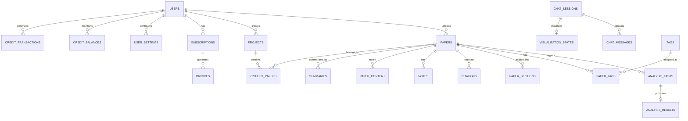

# 4. Database Design

## 4.1 Overview

Answer42 uses PostgreSQL as its primary database, hosted on Supabase. The database design follows a normalized approach with carefully designed tables, relationships, and custom PostgreSQL functions to handle complex operations. The schema is organized within the `answer42` schema to isolate it from other database objects.

## 4.2 Schema Organization

All database objects are contained within the `answer42` schema:

```sql
CREATE SCHEMA answer42;
ALTER SCHEMA answer42 OWNER TO postgres;
```

This organization provides:

- **Namespace isolation**: Prevents naming conflicts with other applications
- **Security boundary**: Simplifies permission management
- **Logical grouping**: Clearly identifies system components

## 4.3 Entity Relationship Diagram

The following diagram illustrates the key entities and their relationships:



## 4.4 Core Tables

### 4.4.1 User Management

**users**
```sql
CREATE TABLE answer42.users (
    id uuid NOT NULL,
    email character varying(255),
    password character varying(255) NOT NULL,
    username character varying(255) NOT NULL,
    enabled boolean NOT NULL,
    created_at timestamp(6) without time zone,
    last_login timestamp(6) without time zone
);
```

**user_settings**
```sql
CREATE TABLE answer42.user_settings (
    id uuid NOT NULL,
    user_id uuid NOT NULL,
    academic_field character varying(255),
    email_notifications_enabled boolean NOT NULL,
    study_material_generation_enabled boolean NOT NULL,
    system_notifications_enabled boolean NOT NULL,
    openai_api_key character varying(255),
    perplexity_api_key character varying(255),
    anthropic_api_key character varying(255),
    created_at timestamp with time zone DEFAULT now() NOT NULL,
    updated_at timestamp with time zone DEFAULT now() NOT NULL
);
```

**user_roles**
```sql
CREATE TABLE answer42.user_roles (
    user_id uuid NOT NULL,
    role character varying(255)
);
```

### 4.4.2 Paper Management

**papers**
```sql
CREATE TABLE answer42.papers (
    id uuid NOT NULL,
    user_id uuid,
    title character varying(255) NOT NULL,
    authors jsonb NOT NULL,
    journal character varying(255),
    year integer,
    file_path character varying(255) NOT NULL,
    text_content character varying(255),
    status character varying(255),
    processing_status character varying(255),
    paper_abstract character varying(255),
    metadata jsonb,
    doi character varying(255),
    arxiv_id character varying(255),
    semantic_scholar_id character varying(255),
    crossref_doi character varying(255),
    file_type character varying(255),
    file_size bigint,
    metadata_source character varying(255),
    metadata_source_details jsonb,
    metadata_confidence double precision,
    main_concepts jsonb,
    key_findings jsonb,
    glossary jsonb,
    research_questions jsonb,
    methodology_details jsonb,
    topics jsonb,
    citations jsonb,
    references_count integer,
    quality_score double precision,
    quality_feedback jsonb,
    semantic_scholar_verified boolean,
    semantic_scholar_score double precision,
    semantic_scholar_metadata jsonb,
    semantic_scholar_last_verified timestamp(6) with time zone,
    crossref_verified boolean,
    crossref_score double precision,
    crossref_metadata jsonb,
    crossref_last_verified timestamp(6) with time zone,
    is_public boolean,
    publication_date date,
    summary_brief character varying(255),
    summary_standard character varying(255),
    summary_detailed character varying(255),
    created_at timestamp(6) with time zone,
    updated_at timestamp(6) with time zone
);
```

**paper_content**
```sql
CREATE TABLE answer42.paper_content (
    id uuid DEFAULT gen_random_uuid() NOT NULL,
    paper_id uuid NOT NULL,
    content text NOT NULL,
    created_at timestamp with time zone DEFAULT now(),
    updated_at timestamp with time zone DEFAULT now()
);
```

**paper_sections**
```sql
CREATE TABLE answer42.paper_sections (
    id uuid DEFAULT gen_random_uuid() NOT NULL,
    paper_id uuid NOT NULL,
    title text NOT NULL,
    content text NOT NULL,
    index integer NOT NULL,
    created_at timestamp with time zone DEFAULT now(),
    updated_at timestamp with time zone DEFAULT now()
);
```

### 4.4.3 Project Management

**projects**
```sql
CREATE TABLE answer42.projects (
    id uuid DEFAULT extensions.uuid_generate_v4() NOT NULL,
    user_id uuid,
    name character varying(255) NOT NULL,
    description character varying(255),
    settings jsonb DEFAULT '{}'::jsonb,
    created_at timestamp with time zone DEFAULT now(),
    updated_at timestamp with time zone DEFAULT now(),
    is_public boolean DEFAULT false
);
```

**project_papers**
```sql
CREATE TABLE answer42.project_papers (
    project_id uuid NOT NULL,
    paper_id uuid NOT NULL,
    "order" integer DEFAULT 0,
    added_at timestamp with time zone DEFAULT now()
);
```

### 4.4.4 AI Analysis System

**analysis_tasks**
```sql
CREATE TABLE answer42.analysis_tasks (
    id uuid NOT NULL,
    user_id uuid NOT NULL,
    paper_id uuid NOT NULL,
    analysis_type character varying(255) NOT NULL,
    status character varying(255) NOT NULL,
    progress integer DEFAULT 0,
    options jsonb DEFAULT '{}'::jsonb,
    result_id uuid,
    error_message character varying(32600),
    created_at timestamp with time zone DEFAULT now() NOT NULL,
    updated_at timestamp with time zone DEFAULT now() NOT NULL,
    completed_at timestamp(6) without time zone,
    task_id uuid,
    CONSTRAINT analysis_tasks_analysis_type_check CHECK (((analysis_type)::text = ANY ((ARRAY['DEEP_SUMMARY'::character varying, 'METHODOLOGY_ANALYSIS'::character varying, 'RESULTS_INTERPRETATION'::character varying, 'CRITICAL_EVALUATION'::character varying, 'RESEARCH_IMPLICATIONS'::character varying])::text[]))),
    CONSTRAINT analysis_tasks_status_check CHECK (((status)::text = ANY ((ARRAY['PENDING'::character varying, 'PROCESSING'::character varying, 'COMPLETED'::character varying, 'FAILED'::character varying])::text[])))
);
```

**analysis_results**
```sql
CREATE TABLE answer42.analysis_results (
    id uuid NOT NULL,
    task_id uuid NOT NULL,
    user_id uuid NOT NULL,
    paper_id uuid NOT NULL,
    analysis_type character varying(255) NOT NULL,
    content text NOT NULL,
    sections jsonb DEFAULT '[]'::jsonb,
    citations jsonb DEFAULT '[]'::jsonb,
    visual_elements jsonb DEFAULT '[]'::jsonb,
    metadata jsonb DEFAULT '{}'::jsonb,
    created_at timestamp with time zone DEFAULT now() NOT NULL,
    is_archived boolean NOT NULL,
    last_accessed_at timestamp(6) without time zone,
    CONSTRAINT analysis_results_analysis_type_check CHECK (((analysis_type)::text = ANY ((ARRAY['DEEP_SUMMARY'::character varying, 'METHODOLOGY_ANALYSIS'::character varying, 'RESULTS_INTERPRETATION'::character varying, 'CRITICAL_EVALUATION'::character varying, 'RESEARCH_IMPLICATIONS'::character varying])::text[])))
);
```

**tasks**
```sql
CREATE TABLE answer42.tasks (
    id text NOT NULL,
    agent_id text NOT NULL,
    user_id uuid NOT NULL,
    input jsonb NOT NULL,
    status text NOT NULL,
    error text,
    result jsonb,
    created_at timestamp with time zone DEFAULT now(),
    started_at timestamp with time zone,
    completed_at timestamp with time zone
);
```

### 4.4.5 Chat System

**chat_sessions**
```sql
CREATE TABLE answer42.chat_sessions (
    id uuid DEFAULT extensions.uuid_generate_v4() NOT NULL,
    user_id uuid,
    mode character varying(255) DEFAULT 'general'::text NOT NULL,
    context jsonb DEFAULT '{}'::jsonb,
    created_at timestamp with time zone DEFAULT now(),
    updated_at timestamp with time zone DEFAULT now(),
    last_message_at timestamp with time zone DEFAULT now(),
    provider character varying(255) NOT NULL,
    title character varying(255)
);
```

**chat_messages**
```sql
CREATE TABLE answer42.chat_messages (
    id uuid DEFAULT extensions.uuid_generate_v4() NOT NULL,
    session_id uuid NOT NULL,
    role character varying(255) NOT NULL,
    content text NOT NULL,
    citations jsonb DEFAULT '[]'::jsonb,
    metadata jsonb DEFAULT '{}'::jsonb,
    created_at timestamp with time zone DEFAULT now(),
    sequence_number integer DEFAULT 0 NOT NULL,
    message_type character varying(255) DEFAULT 'message'::text NOT NULL,
    is_edited boolean DEFAULT false NOT NULL,
    token_count integer,
    last_edited_at timestamp with time zone,
    CONSTRAINT chat_messages_role_check CHECK (((role)::text = ANY (ARRAY['user'::text, 'assistant'::text, 'system'::text])))
);
```

### 4.4.6 Credit and Subscription System

**credit_balances**
```sql
CREATE TABLE answer42.credit_balances (
    id uuid DEFAULT gen_random_uuid() NOT NULL,
    user_id uuid NOT NULL,
    balance integer DEFAULT 0 NOT NULL,
    used_this_period integer DEFAULT 0 NOT NULL,
    next_reset_date timestamp with time zone NOT NULL,
    created_at timestamp with time zone DEFAULT now() NOT NULL,
    updated_at timestamp with time zone DEFAULT now() NOT NULL,
    CONSTRAINT positive_balance CHECK ((balance >= 0)),
    CONSTRAINT positive_used CHECK ((used_this_period >= 0))
);
```

**credit_transactions**
```sql
CREATE TABLE answer42.credit_transactions (
    id uuid DEFAULT gen_random_uuid() NOT NULL,
    user_id uuid NOT NULL,
    transaction_type character varying(255) NOT NULL,
    amount integer NOT NULL,
    balance_after integer NOT NULL,
    operation_type character varying(255),
    description character varying(255) NOT NULL,
    reference_id character varying(255),
    created_at timestamp with time zone DEFAULT now() NOT NULL,
    CONSTRAINT balance_after_non_negative CHECK ((balance_after >= 0))
);
```

**user_operations**
```sql
CREATE TABLE answer42.user_operations (
    id uuid DEFAULT extensions.uuid_generate_v4() NOT NULL,
    user_id uuid NOT NULL,
    operation_type text NOT NULL,
    created_at timestamp with time zone DEFAULT now(),
    metadata jsonb DEFAULT '{}'::jsonb,
    reference_id text,
    ai_tier text,
    credit_cost integer
);
```

**operation_costs**
```sql
CREATE TABLE answer42.operation_costs (
    id uuid DEFAULT gen_random_uuid() NOT NULL,
    operation_type answer42.operation_type_upper NOT NULL,
    basic_cost integer NOT NULL,
    pro_cost integer NOT NULL,
    scholar_cost integer,
    description text NOT NULL,
    created_at timestamp with time zone DEFAULT now() NOT NULL,
    updated_at timestamp with time zone DEFAULT now() NOT NULL
);
```

**subscriptions**
```sql
CREATE TABLE answer42.subscriptions (
    id uuid DEFAULT extensions.uuid_generate_v4() NOT NULL,
    user_id uuid,
    plan_id character varying(255) NOT NULL,
    status character varying(255) NOT NULL,
    current_period_start timestamp with time zone,
    current_period_end timestamp with time zone,
    payment_provider character varying(255) NOT NULL,
    payment_provider_id character varying(255),
    created_at timestamp with time zone DEFAULT now(),
    updated_at timestamp with time zone DEFAULT now()
);
```

**subscription_plans**
```sql
CREATE TABLE answer42.subscription_plans (
    id character varying(255) NOT NULL,
    name character varying(255) NOT NULL,
    description character varying(255),
    price_monthly numeric(38,2) NOT NULL,
    price_annually numeric(38,2) NOT NULL,
    features jsonb DEFAULT '{}'::jsonb,
    base_credits integer DEFAULT 0 NOT NULL,
    rollover_limit integer DEFAULT 0 NOT NULL,
    is_active boolean DEFAULT true,
    is_free boolean DEFAULT false,
    default_ai_tier character varying(255),
    created_at timestamp with time zone DEFAULT now(),
    updated_at timestamp with time zone DEFAULT now()
);
```

## 4.5 Advanced Database Features

### 4.5.1 Custom Types

The system defines custom enumeration types for strict type checking:

```sql
CREATE TYPE answer42.operation_type_upper AS ENUM (
    'PAPER_UPLOAD',
    'GENERATE_SUMMARY',
    'CONCEPT_EXPLANATION',
    'STUDY_GUIDE_CREATION',
    'QA_SESSION',
    'PERPLEXITY_QUERY',
    'CROSS_REFERENCE_CHAT',
    'PAPER_CHAT',
    'RESEARCH_EXPLORER_CHAT',
    'DEEP_SUMMARY',
    'METHODOLOGY_ANALYSIS',
    'RESULTS_INTERPRETATION',
    'CRITICAL_EVALUATION',
    'RESEARCH_IMPLICATIONS',
    'COMPARISON_MATRIX',
    'VENN_DIAGRAM_ANALYSIS',
    'TIMELINE_ANALYSIS',
    'METRICS_COMPARISON',
    'RESEARCH_EXPLORER_CHAT_P',
    'RESEARCH_EXPLORER_CHAT_C',
    'RESEARCH_EXPLORER',
    'PAPER'
);
```

### 4.5.2 Custom Functions

Several custom PostgreSQL functions implement business logic directly in the database:

**add_credits**
```sql
CREATE FUNCTION answer42.add_credits(p_user_id uuid, p_amount integer, p_transaction_type text, p_description text, p_reference_id text) RETURNS boolean
    LANGUAGE plpgsql
    AS $$
DECLARE
  v_balance INTEGER;
  v_balance_after INTEGER;
  v_credit_balance_exists BOOLEAN;
BEGIN
  -- Check if amount is positive
  IF p_amount <= 0 THEN
    RAISE EXCEPTION 'Credit amount must be positive';
  END IF;
  
  -- Check if user already has a credit balance
  SELECT EXISTS (
    SELECT 1 FROM answer42.credit_balances WHERE user_id = p_user_id
  ) INTO v_credit_balance_exists;
  
  -- If user doesn't have a credit balance, create one
  IF NOT v_credit_balance_exists THEN
    INSERT INTO answer42.credit_balances (
      user_id,
      balance,
      used_this_period,
      next_reset_date
    ) VALUES (
      p_user_id,
      0, -- Will be updated below
      0,
      date_trunc('month', now()) + interval '1 month'
    );
  END IF;
  
  -- Get the user's current balance
  SELECT balance INTO v_balance
  FROM answer42.credit_balances
  WHERE user_id = p_user_id
  FOR UPDATE;
  
  -- Calculate new balance
  v_balance_after := v_balance + p_amount;
  
  -- Update balance
  UPDATE answer42.credit_balances
  SET 
    balance = v_balance_after,
    updated_at = now()
  WHERE user_id = p_user_id;
  
  -- Record transaction
  INSERT INTO answer42.credit_transactions (
    user_id,
    transaction_type,
    amount,
    balance_after,
    description,
    reference_id
  ) VALUES (
    p_user_id,
    p_transaction_type,
    p_amount,
    v_balance_after,
    p_description,
    p_reference_id
  );
  
  RETURN true;
END;
$$;
```

**update_session_last_message_timestamp**
```sql
CREATE FUNCTION answer42.update_session_last_message_timestamp() RETURNS trigger
    LANGUAGE plpgsql
    AS $$
BEGIN
  UPDATE answer42.chat_sessions
  SET last_message_at = NEW.created_at
  WHERE id = NEW.session_id;
  RETURN NEW;
END;
$$;
```

### 4.5.3 Triggers

Triggers automate various operations:

**update_session_timestamp**
```sql
CREATE TRIGGER update_session_timestamp AFTER INSERT ON answer42.chat_messages FOR EACH ROW EXECUTE FUNCTION answer42.update_session_last_message_timestamp();
```

**update_user_settings_updated_at_trigger**
```sql
CREATE TRIGGER update_user_settings_updated_at_trigger BEFORE UPDATE ON answer42.user_settings FOR EACH ROW EXECUTE FUNCTION answer42.update_user_settings_updated_at();
```

### 4.5.4 Indexes

Strategic indexes improve query performance:

```sql
-- Chat system indexes
CREATE INDEX chat_messages_session_id_idx ON answer42.chat_messages USING btree (session_id);
CREATE INDEX idx_chat_messages_session_sequence ON answer42.chat_messages USING btree (session_id, sequence_number);
CREATE INDEX chat_sessions_user_id_idx ON answer42.chat_sessions USING btree (user_id);
CREATE INDEX chat_sessions_last_message_at_idx ON answer42.chat_sessions USING btree (last_message_at);

-- Paper analysis indexes
CREATE INDEX analysis_tasks_paper_id_idx ON answer42.analysis_tasks USING btree (paper_id);
CREATE INDEX analysis_tasks_user_id_idx ON answer42.analysis_tasks USING btree (user_id);
CREATE INDEX analysis_tasks_status_idx ON answer42.analysis_tasks USING btree (status);
CREATE INDEX analysis_results_paper_id_idx ON answer42.analysis_results USING btree (paper_id);
CREATE INDEX analysis_results_user_id_idx ON answer42.analysis_results USING btree (user_id);
CREATE INDEX analysis_results_analysis_type_idx ON answer42.analysis_results USING btree (analysis_type);

-- Credit system indexes
CREATE INDEX credit_transactions_user_id_idx ON answer42.credit_transactions USING btree (user_id);
CREATE INDEX credit_transactions_created_at_idx ON answer42.credit_transactions USING btree (created_at);
CREATE INDEX credit_balances_user_id_idx ON answer42.credit_balances USING btree (user_id);
CREATE INDEX user_operations_user_id_idx ON answer42.user_operations USING btree (user_id);
CREATE INDEX user_operations_operation_type_idx ON answer42.user_operations USING btree (operation_type);
CREATE INDEX user_operations_created_at_idx ON answer42.user_operations USING btree (created_at);
```

## 4.6 JSON and JSONB Usage

The database makes extensive use of PostgreSQL's JSONB data type for flexible storage of structured data:

1. **Configuration Storage**: Settings and preferences in JSONB fields
2. **Metadata Storage**: Paper metadata and analysis results
3. **Complex Data Structures**: Citations, visual elements, features
4. **Schema Evolution**: Easily adding new attributes without schema changes

Example JSONB fields:
- `papers.authors`: Array of author information
- `papers.metadata`: Publication metadata
- `chat_sessions.context`: Chat context information
- `analysis_results.sections`: Structured analysis sections
- `subscription_plans.features`: Plan feature details

## 4.7 Database Access Patterns

### 4.7.1 Repository Layer

Spring Data JPA repositories provide the data access layer:

```java
@Repository
public interface PaperRepository extends JpaRepository<Paper, UUID> {
    
    List<Paper> findByUserIdOrderByCreatedAtDesc(UUID userId);
    
    @Query("SELECT p FROM Paper p WHERE p.userId = :userId AND " +
           "LOWER(p.title) LIKE LOWER(CONCAT('%', :searchTerm, '%'))")
    List<Paper> searchPapersByTitle(UUID userId, String searchTerm);
    
    Optional<Paper> findByIdAndUserId(UUID id, UUID userId);
    
    @Query("SELECT COUNT(p) FROM Paper p WHERE p.userId = :userId")
    long countByUserId(UUID userId);
}
```

### 4.7.2 Entity Classes

Entities map to database tables using JPA annotations:

```java
@Entity
@Table(name = "papers", schema = "answer42")
@Data
@NoArgsConstructor
@AllArgsConstructor
public class Paper {
    
    @Id
    @GeneratedValue(strategy = GenerationType.UUID)
    private UUID id;
    
    @Column(name = "user_id")
    private UUID userId;
    
    @Column(name = "title", nullable = false)
    private String title;
    
    @JdbcTypeCode(SqlTypes.JSON)
    @Column(columnDefinition = "jsonb", nullable = false)
    private List<String> authors;
    
    @Column(name = "journal")
    private String journal;
    
    @Column(name = "year")
    private Integer year;
    
    @Column(name = "file_path", nullable = false)
    private String filePath;
    
    // Additional fields and relationships
}
```

## 4.8 Database Migration Strategy

Database migrations are managed through:

1. **Version Control**: SQL scripts are version-controlled
2. **Incremental Changes**: Migrations are applied sequentially
3. **Backward Compatibility**: Maintaining compatibility with previous versions
4. **Testing**: Migration scripts are tested in development environments

Migration scripts follow the naming convention: `YYYYMMDDHHMMSS_description.sql`

## 4.9 Data Security

Database security is implemented through:

1. **Schema Isolation**: Dedicated schema for application data
2. **Connection Security**: SSL/TLS encrypted connections
3. **Access Control**: Role-based permissions
4. **Password Security**: Secure password storage with bcrypt
5. **Data Encryption**: Sensitive data is encrypted
