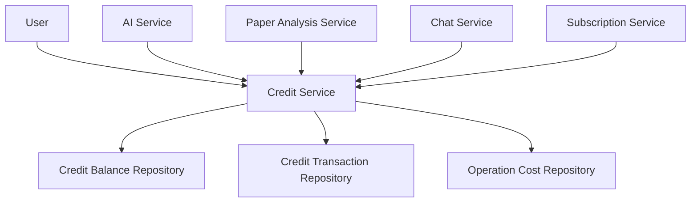

# 8. Credit System

## 8.1 Overview

Answer42 implements a credit-based monetization system where users consume credits for AI operations like paper analysis, chat interactions, and research queries. This system enables fine-grained control over resource usage while providing flexibility for users. Credits are consumed when users perform operations and are replenished through subscriptions.

## 8.2 System Components

The credit system consists of several integrated components:



## 8.3 Data Models

### 8.3.1 Credit Balance

The `CreditBalance` entity tracks a user's current credit balance:

```java
@Entity
@Table(name = "credit_balances", schema = "answer42")
@Data
@NoArgsConstructor
public class CreditBalance {
    @Id
    @GeneratedValue(strategy = GenerationType.UUID)
    private UUID id;
    
    @Column(name = "user_id", nullable = false)
    private UUID userId;
    
    @Column(name = "balance", nullable = false)
    private Integer balance = 0;
    
    @Column(name = "used_this_period", nullable = false)
    private Integer usedThisPeriod = 0;
    
    @Column(name = "total_earned", nullable = false)
    private Integer totalEarned = 0;
    
    @Column(name = "total_used", nullable = false)
    private Integer totalUsed = 0;
    
    @Column(name = "created_at")
    private ZonedDateTime createdAt;
    
    @Column(name = "updated_at")
    private ZonedDateTime updatedAt;
    
    @Column(name = "next_reset_at")
    private ZonedDateTime nextResetAt;
}
```

### 8.3.2 Credit Transaction

The `CreditTransaction` entity records all credit transactions:

```java
@Entity
@Table(name = "credit_transactions", schema = "answer42")
@Data
@NoArgsConstructor
public class CreditTransaction {
    @Id
    @GeneratedValue(strategy = GenerationType.UUID)
    private UUID id;
    
    @Column(name = "user_id", nullable = false)
    private UUID userId;
    
    @Column(name = "transaction_type", nullable = false)
    private String transactionType;
    
    @Column(name = "amount", nullable = false)
    private Integer amount;
    
    @Column(name = "balance_after", nullable = false)
    private Integer balanceAfter;
    
    @Column(name = "operation_type")
    private String operationType;
    
    @Column(name = "operation_id")
    private UUID operationId;
    
    @Column(name = "description")
    private String description;
    
    @Column(name = "created_at")
    private ZonedDateTime createdAt = ZonedDateTime.now();
}
```

### 8.3.3 Operation Type

The `OperationType` enum defines different operations and their credit costs:

```java
public enum OperationType {
    // Paper operations
    PAPER_UPLOAD("PAPER_UPLOAD", 2, 1),
    BASIC_SUMMARY("BASIC_SUMMARY", 3, 2),
    DEEP_SUMMARY("DEEP_SUMMARY", 5, 3),
    KEY_CONCEPTS("KEY_CONCEPTS", 4, 2),
    CRITICAL_ANALYSIS("CRITICAL_ANALYSIS", 7, 5),
    
    // Chat operations
    PAPER_CHAT("PAPER_CHAT", 4, 7),
    CROSS_REFERENCE_CHAT("CROSS_REFERENCE_CHAT", 4, 7),
    RESEARCH_EXPLORER_CHAT("RESEARCH_EXPLORER_CHAT", 4, 6),
    
    // Study material operations
    GENERATE_FLASHCARDS("GENERATE_FLASHCARDS", 6, 4),
    GENERATE_QUESTIONS("GENERATE_QUESTIONS", 6, 4),
    GENERATE_CONCEPT_MAP("GENERATE_CONCEPT_MAP", 8, 5);
    
    private final String id;
    private final int basicCost;
    private final int proCost;
    
    // Constructor and getters
    
    // Utility methods to get costs based on subscription tier
    public int getCost(String planId) {
        if ("pro".equals(planId) || "researcher".equals(planId)) {
            return proCost;
        } else {
            return basicCost;
        }
    }
    
    // Conversion methods
    public static OperationType fromAnalysisType(String analysisType) {
        switch (analysisType) {
            case "basic_summary": return BASIC_SUMMARY;
            case "deep_summary": return DEEP_SUMMARY;
            case "key_concepts": return KEY_CONCEPTS;
            case "critical_analysis": return CRITICAL_ANALYSIS;
            default: throw new IllegalArgumentException("Unknown analysis type: " + analysisType);
        }
    }
    
    public static OperationType fromChatMode(String mode) {
        switch (mode) {
            case "paper_chat": return PAPER_CHAT;
            case "cross_reference_chat": return CROSS_REFERENCE_CHAT;
            case "research_explorer_chat": return RESEARCH_EXPLORER_CHAT;
            default: throw new IllegalArgumentException("Unknown chat mode: " + mode);
        }
    }
}
```

## 8.4 Credit Service

The `CreditService` manages credit balances and transactions:

```java
@Service
public class CreditService {
    private static final Logger LOG = LoggerFactory.getLogger(CreditService.class);
    
    private final CreditBalanceRepository creditBalanceRepository;
    private final CreditTransactionRepository creditTransactionRepository;
    private final SubscriptionService subscriptionService;
    
    // Constructor with dependencies
    
    @Transactional
    public boolean hasCreditsForOperation(UUID userId, OperationType operationType) {
        CreditBalance balance = creditBalanceRepository.findByUserId(userId)
            .orElseThrow(() -> new CreditBalanceNotFoundException(
                "No credit balance found for user: " + userId));
        
        // Get cost based on user's subscription tier
        int cost = getCostForOperation(userId, operationType);
        
        return balance.getBalance() >= cost;
    }
    
    @Transactional
    public void deductCreditsForOperation(UUID userId, OperationType operationType) {
        // Check credits
        if (!hasCreditsForOperation(userId, operationType)) {
            throw new InsufficientCreditsException(
                "Not enough credits for operation: " + operationType.getId());
        }
        
        // Get cost
        int cost = getCostForOperation(userId, operationType);
        
        // Get current balance
        CreditBalance balance = creditBalanceRepository.findByUserId(userId).get();
        
        // Update balance
        balance.setBalance(balance.getBalance() - cost);
        balance.setUsedThisPeriod(balance.getUsedThisPeriod() + cost);
        balance.setTotalUsed(balance.getTotalUsed() + cost);
        balance.setUpdatedAt(ZonedDateTime.now());
        
        // Save balance
        creditBalanceRepository.save(balance);
        
        // Record transaction
        CreditTransaction transaction = new CreditTransaction();
        transaction.setUserId(userId);
        transaction.setTransactionType("DEDUCTION");
        transaction.setAmount(cost);
        transaction.setBalanceAfter(balance.getBalance());
        transaction.setOperationType(operationType.getId());
        transaction.setDescription("Credit deduction for " + operationType.getId());
        
        creditTransactionRepository.save(transaction);
        
        LoggingUtil.info(LOG, "deductCreditsForOperation", 
            "Deducted %d credits for operation %s, new balance: %d", 
            cost, operationType.getId(), balance.getBalance());
    }
    
    @Transactional
    public void addCredits(UUID userId, int amount, String reason) {
        // Get or create balance
        CreditBalance balance = creditBalanceRepository.findByUserId(userId)
            .orElse(createNewBalance(userId));
        
        // Update balance
        balance.setBalance(balance.getBalance() + amount);
        balance.setTotalEarned(balance.getTotalEarned() + amount);
        balance.setUpdatedAt(ZonedDateTime.now());
        
        // Save balance
        creditBalanceRepository.save(balance);
        
        // Record transaction
        CreditTransaction transaction = new CreditTransaction();
        transaction.setUserId(userId);
        transaction.setTransactionType("ADDITION");
        transaction.setAmount(amount);
        transaction.setBalanceAfter(balance.getBalance());
        transaction.setDescription(reason);
        
        creditTransactionRepository.save(transaction);
        
        LoggingUtil.info(LOG, "addCredits", 
            "Added %d credits for reason: %s, new balance: %d", 
            amount, reason, balance.getBalance());
    }
    
    @Transactional
    public void resetMonthlyUsage(UUID userId) {
        CreditBalance balance = creditBalanceRepository.findByUserId(userId)
            .orElseThrow(() -> new CreditBalanceNotFoundException(
                "No credit balance found for user: " + userId));
        
        balance.setUsedThisPeriod(0);
        balance.setUpdatedAt(ZonedDateTime.now());
        
        // Calculate next reset date
        ZonedDateTime now = ZonedDateTime.now();
        ZonedDateTime nextMonth = now.plusMonths(1);
        ZonedDateTime nextReset = ZonedDateTime.of(
            nextMonth.getYear(), 
            nextMonth.getMonthValue(), 
            1, 0, 0, 0, 0, 
            nextMonth.getZone()
        );
        
        balance.setNextResetAt(nextReset);
        
        creditBalanceRepository.save(balance);
        
        LoggingUtil.info(LOG, "resetMonthlyUsage", 
            "Reset monthly usage for user %s, next reset at %s", 
            userId, nextReset);
    }
    
    private int getCostForOperation(UUID userId, OperationType operationType) {
        // Get user's subscription
        String planId = subscriptionService.getCurrentPlanId(userId);
        
        // Get cost based on plan
        return operationType.getCost(planId);
    }
    
    private CreditBalance createNewBalance(UUID userId) {
        CreditBalance balance = new CreditBalance();
        balance.setUserId(userId);
        balance.setBalance(0);
        balance.setUsedThisPeriod(0);
        balance.setTotalEarned(0);
        balance.setTotalUsed(0);
        balance.setCreatedAt(ZonedDateTime.now());
        balance.setUpdatedAt(ZonedDateTime.now());
        
        // Calculate next reset date
        ZonedDateTime now = ZonedDateTime.now();
        ZonedDateTime nextMonth = now.plusMonths(1);
        ZonedDateTime nextReset = ZonedDateTime.of(
            nextMonth.getYear(), 
            nextMonth.getMonthValue(), 
            1, 0, 0, 0, 0, 
            nextMonth.getZone()
        );
        
        balance.setNextResetAt(nextReset);
        
        return creditBalanceRepository.save(balance);
    }
}
```

## 8.5 Integration with AI Operations

The credit system is integrated with AI operations through service calls:

### 8.5.1 Paper Analysis Integration

```java
@Service
public class PaperAnalysisService {
    private final CreditService creditService;
    
    // Other dependencies
    
    @Transactional
    public AnalysisTask createAnalysisTask(UUID paperId, String analysisType, UUID userId) {
        // Check credit availability
        OperationType operationType = OperationType.fromAnalysisType(analysisType);
        if (!creditService.hasCreditsForOperation(userId, operationType)) {
            throw new InsufficientCreditsException(
                "Not enough credits to perform " + analysisType);
        }
        
        // Create task
        AnalysisTask task = new AnalysisTask();
        task.setPaperId(paperId);
        task.setUserId(userId);
        task.setAnalysisType(analysisType);
        task.setStatus("PENDING");
        
        // Deduct credits
        creditService.deductCreditsForOperation(userId, operationType);
        
        return analysisTaskRepository.save(task);
    }
}
```

### 8.5.2 Chat Service Integration

```java
@Service
public class ChatService {
    private final CreditService creditService;
    
    // Other dependencies
    
    @Transactional
    public ChatMessage generateAIResponse(UUID sessionId, UUID userId) {
        // Get session
        ChatSession session = chatSessionRepository.findById(sessionId)
            .orElseThrow(() -> new SessionNotFoundException("Session not found: " + sessionId));
        
        // Check credits
        OperationType operationType = OperationType.fromChatMode(session.getMode());
        if (!creditService.hasCreditsForOperation(userId, operationType)) {
            throw new InsufficientCreditsException(
                "Not enough credits for AI response in mode: " + session.getMode());
        }
        
        // Generate response
        // ...
        
        // Deduct credits
        creditService.deductCreditsForOperation(userId, operationType);
        
        return aiMessage;
    }
}
```

## 8.6 UI Components

### 8.6.1 Credits View

The `CreditsView` displays the user's credit balance and transaction history:

```java
@Route(value = "credits", layout = MainLayout.class)
@PageTitle("Credits | Answer42")
public class CreditsView extends Div implements BeforeEnterObserver {
    private final CreditService creditService;
    private final SubscriptionService subscriptionService;
    
    // Constructor with dependencies
    
    @Override
    public void beforeEnter(BeforeEnterEvent event) {
        // Set up UI components
        
        UUID userId = getCurrentUserId();
        
        // Get credit balance
        CreditBalance balance = creditService.getBalanceForUser(userId);
        
        // Get credit transactions
        List<CreditTransaction> transactions = 
            creditService.getRecentTransactionsForUser(userId, 20);
        
        // Get current subscription plan
        String planId = subscriptionService.getCurrentPlanId(userId);
        SubscriptionPlan plan = subscriptionService.getPlanById(planId);
        
        // Display credit information
        createCreditOverview(balance, plan);
        createTransactionHistory(transactions);
        createSubscriptionSection(plan);
    }
    
    private void createCreditOverview(CreditBalance balance, SubscriptionPlan plan) {
        // Create UI components for credit overview
        H2 creditTitle = new H2("Your Credits");
        creditTitle.addClassName("credits-title");
        
        Div balanceCard = new Div();
        balanceCard.addClassName("balance-card");
        
        H1 balanceValue = new H1(balance.getBalance().toString());
        balanceValue.addClassName("balance-value");
        
        Span balanceLabel = new Span("Credits Available");
        balanceLabel.addClassName("balance-label");
        
        balanceCard.add(balanceValue, balanceLabel);
        
        Div usageCard = new Div();
        usageCard.addClassName("usage-card");
        
        H3 usedValue = new H3(balance.getUsedThisPeriod().toString());
        usedValue.addClassName("usage-value");
        
        Span usedLabel = new Span("Credits Used This Period");
        usedLabel.addClassName("usage-label");
        
        usageCard.add(usedValue, usedLabel);
        
        // Add other components
        
        add(creditTitle, balanceCard, usageCard);
    }
    
    // Other UI methods
}
```

## 8.7 Credit Management Workflow

```mermaid
sequenceDiagram
    participant User
    participant Service as Service Layer
    participant CreditService
    participant DB as Database
    
    User->>Service: Request operation (analysis, chat, etc.)
    Service->>CreditService: Check credits
    CreditService->>DB: Get credit balance
    DB-->>CreditService: Return balance
    
    alt Sufficient Credits
        CreditService-->>Service: Credits available
        Service->>Service: Perform operation
        Service->>CreditService: Deduct credits
        CreditService->>DB: Update balance
        CreditService->>DB: Record transaction
        Service-->>User: Operation result
    else Insufficient Credits
        CreditService-->>Service: Insufficient credits
        Service-->>User: Error message with upgrade options
    end
