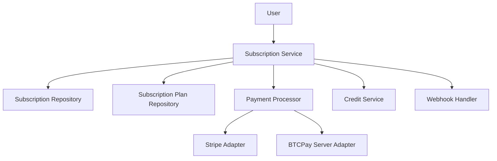

# 8.1 Subscription Models

## 8.1.1 Overview

Answer42's subscription system provides users with recurring access to platform features and credit allocations. It integrates with the credit system to periodically grant credits based on the user's subscription tier. The system supports multiple payment providers, subscription tiers, and billing cycles.

## 8.1.2 System Components

The subscription system consists of several integrated components:



## 8.1.3 Data Models

### 8.1.3.1 Subscription Entity

The `Subscription` entity represents a user's subscription:

```java
@Entity
@Table(name = "subscriptions", schema = "answer42")
@Data
@NoArgsConstructor
public class Subscription {
    @Id
    @GeneratedValue(strategy = GenerationType.UUID)
    private UUID id;
    
    @Column(name = "user_id", nullable = false)
    private UUID userId;
    
    @Column(name = "plan_id", nullable = false)
    private String planId;
    
    @Column(name = "status", nullable = false)
    private String status;
    
    @Column(name = "current_period_start")
    private ZonedDateTime currentPeriodStart;
    
    @Column(name = "current_period_end")
    private ZonedDateTime currentPeriodEnd;
    
    @Column(name = "payment_provider", nullable = false)
    private String paymentProvider;
    
    @Column(name = "payment_provider_id")
    private String paymentProviderId;
    
    @Column(name = "created_at")
    private ZonedDateTime createdAt;
    
    @Column(name = "updated_at")
    private ZonedDateTime updatedAt;
}
```

### 8.1.3.2 Subscription Plan Entity

The `SubscriptionPlan` entity defines available subscription plans:

```java
@Entity
@Table(name = "subscription_plans", schema = "answer42")
@Data
@NoArgsConstructor
public class SubscriptionPlan {
    @Id
    private String id;
    
    @Column(name = "name", nullable = false)
    private String name;
    
    @Column(name = "description")
    private String description;
    
    @Column(name = "monthly_price", nullable = false)
    private BigDecimal monthlyPrice;
    
    @Column(name = "yearly_price")
    private BigDecimal yearlyPrice;
    
    @Column(name = "bitcoin_price")
    private BigDecimal bitcoinPrice;
    
    @Column(name = "bitcoin_yearly_price")
    private BigDecimal bitcoinYearlyPrice;
    
    @Column(name = "currency", nullable = false)
    private String currency = "USD";
    
    @Column(name = "monthly_credits", nullable = false)
    private Integer monthlyCredits;
    
    @Column(name = "features", columnDefinition = "jsonb")
    @JdbcTypeCode(SqlTypes.JSON)
    private Map<String, Object> features = new HashMap<>();
    
    @Column(name = "is_active", nullable = false)
    private Boolean isActive = true;
    
    @Column(name = "tier", nullable = false)
    private Integer tier;
}
```

## 8.1.4 Repositories

### 8.1.4.1 Subscription Repository

The repository interface for managing subscriptions:

```java
@Repository
public interface SubscriptionRepository extends JpaRepository<Subscription, UUID> {
    
    Optional<Subscription> findByUserIdAndStatus(UUID userId, String status);
    
    List<Subscription> findByStatus(String status);
    
    List<Subscription> findByStatusAndCurrentPeriodEndBefore(String status, ZonedDateTime endDate);
    
    @Query("SELECT s FROM Subscription s WHERE s.userId = :userId ORDER BY s.createdAt DESC")
    List<Subscription> findAllByUserIdOrderByCreatedAtDesc(UUID userId);
    
    @Query("SELECT COUNT(s) FROM Subscription s WHERE s.planId = :planId AND s.status = 'active'")
    long countActiveByPlanId(String planId);
}
```

### 8.1.4.2 Subscription Plan Repository

The repository interface for managing subscription plans:

```java
@Repository
public interface SubscriptionPlanRepository extends JpaRepository<SubscriptionPlan, String> {
    
    List<SubscriptionPlan> findByIsActiveOrderByTier(boolean isActive);
    
    @Query("SELECT p FROM SubscriptionPlan p WHERE p.tier <= :maxTier AND p.isActive = true ORDER BY p.tier")
    List<SubscriptionPlan> findActivePlansUpToTier(int maxTier);
}
