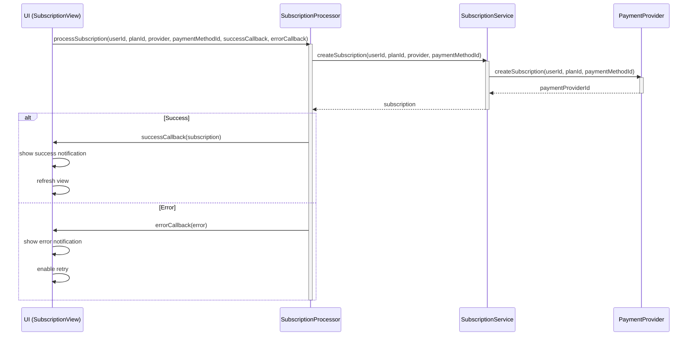

# 8.5 Subscription Processor

## 8.5.1 Overview

The `SubscriptionProcessor` component handles the interaction between the UI and the backend subscription service. It provides methods for processing subscriptions, managing payment UIs, and handling payment provider-specific integrations.

## 8.5.2 Subscription Processor Implementation

```java
@Component
public class SubscriptionProcessor {
    private static final Logger LOG = LoggerFactory.getLogger(SubscriptionProcessor.class);
    
    private final SubscriptionService subscriptionService;
    private final BTCPayProvider btcPayProvider;
    
    // Constructor with dependencies
    public SubscriptionProcessor(
            SubscriptionService subscriptionService,
            @Autowired(required = false) BTCPayProvider btcPayProvider) {
        this.subscriptionService = subscriptionService;
        this.btcPayProvider = btcPayProvider;
    }
    
    /**
     * Process subscription signup
     */
    public void processSubscription(UUID userId, String planId, 
            String paymentProvider, String paymentMethodId,
            Consumer<Subscription> successCallback,
            Consumer<Throwable> errorCallback) {
        try {
            // Create subscription
            Subscription subscription = subscriptionService.createSubscription(
                userId, planId, paymentProvider, paymentMethodId);
            
            LoggingUtil.info(LOG, "processSubscription", 
                "Created subscription for user %s, plan %s", userId, planId);
            
            // Call success callback
            if (successCallback != null) {
                successCallback.accept(subscription);
            }
        } catch (Exception e) {
            LoggingUtil.error(LOG, "processSubscription", 
                "Error creating subscription for user %s, plan %s", 
                e, userId, planId);
            
            // Call error callback
            if (errorCallback != null) {
                errorCallback.accept(e);
            }
        }
    }
    
    /**
     * Process subscription cancellation
     */
    public void cancelSubscription(UUID subscriptionId,
            Runnable successCallback,
            Consumer<Throwable> errorCallback) {
        try {
            // Cancel subscription
            subscriptionService.cancelSubscription(subscriptionId);
            
            LoggingUtil.info(LOG, "cancelSubscription", 
                "Canceled subscription %s", subscriptionId);
            
            // Call success callback
            if (successCallback != null) {
                successCallback.run();
            }
        } catch (Exception e) {
            LoggingUtil.error(LOG, "cancelSubscription", 
                "Error canceling subscription %s", e, subscriptionId);
            
            // Call error callback
            if (errorCallback != null) {
                errorCallback.accept(e);
            }
        }
    }
    
    /**
     * Process plan change
     */
    public void changePlan(UUID subscriptionId, String newPlanId,
            Consumer<Subscription> successCallback,
            Consumer<Throwable> errorCallback) {
        try {
            // Change plan
            Subscription subscription = subscriptionService.changeSubscriptionPlan(
                subscriptionId, newPlanId);
            
            LoggingUtil.info(LOG, "changePlan", 
                "Changed subscription %s to plan %s", 
                subscriptionId, newPlanId);
            
            // Call success callback
            if (successCallback != null) {
                successCallback.accept(subscription);
            }
        } catch (Exception e) {
            LoggingUtil.error(LOG, "changePlan", 
                "Error changing subscription %s to plan %s", 
                e, subscriptionId, newPlanId);
            
            // Call error callback
            if (errorCallback != null) {
                errorCallback.accept(e);
            }
        }
    }
    
    /**
     * Create Stripe Elements payment form
     */
    public void createStripeElements(Element container, String publishableKey, 
            Consumer<String> paymentMethodCallback) {
        // Create Stripe Elements script
        String script = 
            "const stripe = Stripe('" + publishableKey + "');" +
            "const elements = stripe.elements();" +
            "const style = {" +
            "  base: {" +
            "    color: '#32325d'," +
            "    fontFamily: 'Arial, sans-serif'," +
            "    fontSmoothing: 'antialiased'," +
            "    fontSize: '16px'," +
            "    '::placeholder': {" +
            "      color: '#aab7c4'" +
            "    }" +
            "  }," +
            "  invalid: {" +
            "    color: '#fa755a'," +
            "    iconColor: '#fa755a'" +
            "  }" +
            "};" +
            "const card = elements.create('card', {style: style});" +
            "card.mount('#card-element');" +
            // Error handling
            "card.on('change', function(event) {" +
            "  const displayError = document.getElementById('card-errors');" +
            "  if (event.error) {" +
            "    displayError.textContent = event.error.message;" +
            "  } else {" +
            "    displayError.textContent = '';" +
            "  }" +
            "});" +
            // Form submission
            "const form = document.getElementById('payment-form');" +
            "form.addEventListener('submit', function(event) {" +
            "  event.preventDefault();" +
            "  stripe.createPaymentMethod('card', card).then(function(result) {" +
            "    if (result.error) {" +
            "      const errorElement = document.getElementById('card-errors');" +
            "      errorElement.textContent = result.error.message;" +
            "    } else {" +
            "      window.paymentMethodCallback(result.paymentMethod.id);" +
            "    }" +
            "  });" +
            "});";
        
        // Create payment form HTML
        String html = 
            "<form id='payment-form' class='stripe-form'>" +
            "  <div class='form-row'>" +
            "    <div id='card-element'></div>" +
            "    <div id='card-errors' role='alert'></div>" +
            "  </div>" +
            "</form>";
        
        // Add to container
        container.getElement().setProperty("innerHTML", html);
        
        // Add script
        Page page = UI.getCurrent().getPage();
        page.addJavaScript("https://js.stripe.com/v3/");
        
        // Register callback
        page.executeJs("window.paymentMethodCallback = function(paymentMethodId) { $0(paymentMethodId); }", 
            paymentMethodCallback);
        
        // Execute script
        page.executeJs(script);
    }
    
    /**
     * Create Bitcoin payment QR code
     */
    public void createBitcoinPayment(Element container, UUID userId, String planId,
            Consumer<Map<String, Object>> successCallback,
            Consumer<Throwable> errorCallback) {
        try {
            // Check if btcPayProvider is available
            if (btcPayProvider == null) {
                throw new IllegalStateException("BTCPay Provider is not available");
            }
            
            // Create subscription
            String invoiceId = subscriptionService.createSubscription(
                userId, planId, "btcpay", null);
            
            // Get invoice data
            Map<String, Object> invoiceData = btcPayProvider.getInvoice(invoiceId);
            
            // Extract payment details
            String paymentUrl = (String) invoiceData.get("checkoutLink");
            String bitcoinAddress = extractBitcoinAddress(invoiceData);
            String amount = extractBitcoinAmount(invoiceData);
            
            // Create QR code image
            String qrCodeUrl = generateQRCodeUrl(bitcoinUri(bitcoinAddress, amount));
            
            // Create HTML
            String html = 
                "<div class='bitcoin-payment'>" +
                "  <div class='qr-code'>" +
                "    " +
                "  </div>" +
                "  <div class='payment-details'>" +
                "    <div class='amount'>Amount: " + amount + " BTC</div>" +
                "    <div class='address'>Address: " + bitcoinAddress + "</div>" +
                "    <div class='instructions'>Scan the QR code or copy the address to pay</div>" +
                "    <a href='" + paymentUrl + "' target='_blank' class='checkout-link'>" +
                "      <button class='wallet-button'>Open in Wallet</button>" +
                "    </a>" +
                "  </div>" +
                "</div>";
            
            // Add to container
            container.getElement().setProperty("innerHTML", html);
            
            // Call success callback
            if (successCallback != null) {
                successCallback.accept(invoiceData);
            }
        } catch (Exception e) {
            LoggingUtil.error(LOG, "createBitcoinPayment", 
                "Error creating Bitcoin payment for user %s, plan %s", 
                e, userId, planId);
            
            // Call error callback
            if (errorCallback != null) {
                errorCallback.accept(e);
            }
        }
    }
    
    // Helper methods
    
    private String extractBitcoinAddress(Map<String, Object> invoiceData) {
        // Extract Bitcoin address from invoice data
        // Implementation depends on BTCPay Server response format
        try {
            @SuppressWarnings("unchecked")
            Map<String, Object> cryptoInfo = (Map<String, Object>) 
                ((List<?>) invoiceData.get("cryptoInfo")).get(0);
            return (String) cryptoInfo.get("address");
        } catch (Exception e) {
            LoggingUtil.error(LOG, "extractBitcoinAddress", 
                "Error extracting Bitcoin address from invoice data", e);
            return "Unknown";
        }
    }
    
    private String extractBitcoinAmount(Map<String, Object> invoiceData) {
        // Extract Bitcoin amount from invoice data
        // Implementation depends on BTCPay Server response format
        try {
            @SuppressWarnings("unchecked")
            Map<String, Object> cryptoInfo = (Map<String, Object>) 
                ((List<?>) invoiceData.get("cryptoInfo")).get(0);
            return (String) cryptoInfo.get("due");
        } catch (Exception e) {
            LoggingUtil.error(LOG, "extractBitcoinAmount", 
                "Error extracting Bitcoin amount from invoice data", e);
            return "Unknown";
        }
    }
    
    private String bitcoinUri(String address, String amount) {
        // Generate bitcoin: URI for QR code
        return "bitcoin:" + address + "?amount=" + amount;
    }
    
    private String generateQRCodeUrl(String content) {
        // Generate QR code URL using Google Charts API
        try {
            String encodedContent = URLEncoder.encode(content, StandardCharsets.UTF_8.toString());
            return "https://chart.googleapis.com/chart?cht=qr&chs=250x250&chl=" + encodedContent;
        } catch (UnsupportedEncodingException e) {
            LoggingUtil.error(LOG, "generateQRCodeUrl", 
                "Error encoding content for QR code", e);
            return "";
        }
    }
}
```

## 8.5.3 Callback Architecture

The `SubscriptionProcessor` implements a callback-based architecture to handle asynchronous operations:



## 8.5.4 Payment Provider Integration

The `SubscriptionProcessor` integrates with payment providers through UI components:

### 8.5.4.1 Stripe Integration

The processor creates and manages Stripe Elements UI components:

1. Loads the Stripe.js library
2. Creates a card element for secure credit card input
3. Handles form submission and validation
4. Securely communicates with Stripe to create a payment method
5. Returns the payment method ID to the callback function

This approach ensures that sensitive payment information never passes through our servers, complying with PCI DSS requirements.

### 8.5.4.2 Bitcoin Integration

For Bitcoin payments, the processor:

1. Creates a BTCPay invoice via the API
2. Generates a QR code containing the Bitcoin URI (address and amount)
3. Displays payment instructions and details
4. Provides a link to open the invoice in a wallet application

The actual subscription activation happens via webhook when the Bitcoin transaction is confirmed.

## 8.5.5 CSS Styling for Payment UIs

```css
/* Stripe form styles */
.stripe-form {
  width: 100%;
}

#card-element {
  padding: var(--lumo-space-m);
  border: 1px solid var(--lumo-contrast-20pct);
  border-radius: var(--lumo-border-radius-m);
  background-color: var(--lumo-base-color);
}

#card-errors {
  color: var(--lumo-error-color);
  font-size: var(--lumo-font-size-s);
  margin-top: var(--lumo-space-xs);
  min-height: 1.5em;
}

/* Bitcoin payment styles */
.bitcoin-payment {
  display: flex;
  flex-direction: column;
  align-items: center;
  padding: var(--lumo-space-m);
}

.qr-code {
  margin-bottom: var(--lumo-space-m);
}

.qr-code-image {
  max-width: 250px;
  border: 1px solid var(--lumo-contrast-10pct);
  padding: var(--lumo-space-xs);
  background-color: white;
}

.payment-details {
  text-align: center;
}

.amount {
  font-weight: bold;
  margin-bottom: var(--lumo-space-xs);
}

.address {
  font-family: monospace;
  background-color: var(--lumo-contrast-5pct);
  padding: var(--lumo-space-xs);
  border-radius: var(--lumo-border-radius-s);
  margin-bottom: var(--lumo-space-s);
  word-break: break-all;
}

.instructions {
  margin-bottom: var(--lumo-space-m);
  color: var(--lumo-secondary-text-color);
}

.wallet-button {
  background-color: var(--lumo-primary-color);
  color: var(--lumo-primary-contrast-color);
  border: none;
  border-radius: var(--lumo-border-radius-m);
  padding: var(--lumo-space-s) var(--lumo-space-m);
  font-weight: 500;
  cursor: pointer;
  transition: background-color 0.3s;
}

.wallet-button:hover {
  background-color: var(--lumo-primary-color-50pct);
}

/* Responsive adjustments */
@media (min-width: 600px) {
  .bitcoin-payment {
    flex-direction: row;
    align-items: flex-start;
  }
  
  .qr-code {
    margin-right: var(--lumo-space-l);
    margin-bottom: 0;
  }
  
  .payment-details {
    text-align: left;
  }
}
```

## 8.5.6 Integration with CreditsView

The `CreditsView` also uses the `SubscriptionProcessor` to handle upgrades directly from the credits page:

```java
@Route(value = "credits", layout = MainLayout.class)
@PageTitle("Credits | Answer42")
public class CreditsView extends Div implements BeforeEnterObserver {
    // Other fields...
    
    private final SubscriptionProcessor subscriptionProcessor;
    
    // Constructor and other methods...
    
    private void createUpgradeSection() {
        // Only show for free or basic users
        String planId = subscriptionService.getCurrentPlanId(getCurrentUserId());
        if ("free".equals(planId) || "basic".equals(planId)) {
            Div upgradeSection = new Div();
            upgradeSection.addClassName("upgrade-section");
            
            H3 upgradeTitle = new H3("Need More Credits?");
            
            Paragraph upgradeText = new Paragraph(
                "Upgrade your subscription to get more credits each month. " +
                "Pro and Researcher plans include advanced features and higher credit allocations."
            );
            
            Button upgradeButton = new Button("View Subscription Plans");
            upgradeButton.addThemeVariants(ButtonVariant.LUMO_PRIMARY);
            upgradeButton.addClickListener(e -> {
                UI.getCurrent().navigate(SubscriptionView.class);
            });
            
            upgradeSection.add(upgradeTitle, upgradeText, upgradeButton);
            add(upgradeSection);
        }
    }
}
```

## 8.5.7 Error Handling

The `SubscriptionProcessor` handles various error scenarios:

1. **Network Errors**: Communication failures with payment providers
2. **Validation Errors**: Invalid payment details or plan IDs
3. **Payment Declined**: Card declined or insufficient funds
4. **Subscription Conflicts**: Attempting to create a subscription when one already exists
5. **Provider-Specific Errors**: Handling provider-specific error codes and messages

Error handling follows these principles:

- Detailed logging of all errors with context
- User-friendly error messages for display
- Appropriate HTTP status codes for API responses
- Structured error objects for frontend handling
- Retry mechanisms for transient errors
