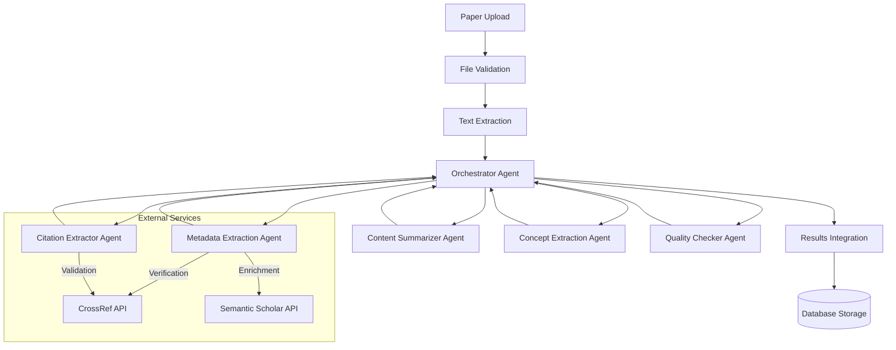

# 9. Multi-Agent Paper Processing Pipeline

## 9.1 Overview

The Answer42 platform implements a sophisticated multi-agent pipeline for processing academic papers. This pipeline is central to the system's ability to extract, analyze, and generate insights from scientific literature. The architecture employs specialized AI agents that work together in a coordinated workflow to process papers efficiently and comprehensively.

## 9.2 AI Provider Configuration

The system integrates multiple AI providers through Spring AI, configured in our `AIConfig` class:

```java
@Configuration
public class AIConfig {
    @Value("${spring.ai.anthropic.api-key:test-key}")
    private String anthropicApiKey;

    @Value("${spring.ai.anthropic.chat.options.model}")
    private String anthropicModel;

    @Value("${spring.ai.openai.api-key:test-key}")
    private String openaiApiKey;

    @Value("${spring.ai.openai.chat.options.model}")
    private String openaiModel;

    @Value("${spring.ai.perplexity.api-key:test-key}")
    private String perplexityApiKey;

    // More configuration values...

    // Bean definitions for AI providers...

    @Bean
    @Primary
    public AnthropicChatModel anthropicChatModel(AnthropicApi anthropicApi) {
        AnthropicChatOptions options = AnthropicChatOptions.builder()
                .model(anthropicModel)
                .maxTokens(anthropicMaxTokens)
                .temperature(anthropicTemperature)
                .build();

        return new AnthropicChatModel(
                anthropicApi, 
                options, 
                toolCallingManager(), 
                retryTemplate(), 
                observationRegistry());
    }

    @Bean
    public OpenAiChatModel openAiChatModel(OpenAiApi openAiApi) {
        OpenAiChatOptions options = OpenAiChatOptions.builder()
                .model(openaiModel)
                .maxTokens(openaiMaxTokens)
                .temperature(openaiTemperature)
                .build();

        return new OpenAiChatModel(
                openAiApi, 
                options, 
                toolCallingManager(), 
                retryTemplate(), 
                observationRegistry());
    }

    @Bean
    public OpenAiChatModel perplexityChatModel(OpenAiApi perplexityApi) {
        OpenAiChatOptions options = OpenAiChatOptions.builder()
                .model("llama-3.1-sonar-small-128k-online")
                .maxTokens(perplexityMaxTokens)
                .temperature(perplexityTemperature)
                .build();

        return new OpenAiChatModel(
                perplexityApi, 
                options, 
                toolCallingManager(), 
                retryTemplate(), 
                observationRegistry());
    }

    // ChatClient beans for each provider...
}
```

The configuration provides important features:

1. **User-Specific API Keys**: Users can provide their own API keys through settings
2. **Model Configuration**: Temperature, max tokens, and other parameters are configurable
3. **Provider Fallbacks**: System defaults apply when user-specific keys are not available
4. **Retry Mechanisms**: Resilience through RetryTemplate for transient API failures
5. **Tool Integration**: Support for AI model tools through the ToolCallingManager

## 9.3 Asynchronous Execution Framework

Paper processing tasks run asynchronously using our `ThreadConfig` configuration:

```java
@Configuration
@EnableAsync
@EnableScheduling
public class ThreadConfig {
    @Value("${spring.task.execution.thread-name-prefix}")
    private String executionThreadNamePrefix;

    // More configuration values...

    @Bean
    public Executor taskExecutor() {
        ThreadPoolTaskExecutor executor = new ThreadPoolTaskExecutor();
        executor.setThreadNamePrefix(executionThreadNamePrefix);
        executor.setCorePoolSize(4);
        executor.setMaxPoolSize(10);
        executor.setQueueCapacity(25);
        executor.setWaitForTasksToCompleteOnShutdown(executionAwaitTermination);
        long terminationSeconds = parseDurationToSeconds(executionAwaitTerminationPeriod);
        executor.setAwaitTerminationSeconds((int) terminationSeconds);
        executor.initialize();
        return executor;
    }

    @Bean
    public ThreadPoolTaskScheduler taskScheduler() {
        ThreadPoolTaskScheduler scheduler = new ThreadPoolTaskScheduler();
        scheduler.setThreadNamePrefix(schedulingThreadNamePrefix);
        scheduler.setPoolSize(4);
        scheduler.setWaitForTasksToCompleteOnShutdown(schedulingAwaitTermination);
        long terminationSeconds = parseDurationToSeconds(schedulingAwaitTerminationPeriod);
        scheduler.setAwaitTerminationSeconds((int) terminationSeconds);
        return scheduler;
    }

    // Helper methods...
}
```

This thread configuration is essential for:

1. **Parallel Processing**: Multiple papers can be processed simultaneously
2. **Background Operations**: Long-running tasks don't block the UI thread
3. **Resource Management**: Thread pools limit concurrent operations for system stability
4. **Graceful Shutdown**: Awaiting task completion during system shutdown

## 9.4 Vaadin UI Thread Integration

Due to Vaadin's single-threaded UI model, we carefully coordinate between background processing threads and the UI thread:

1. **Access Control**: All UI updates happen through `UI.access()`
2. **Progress Updates**: Background threads push progress updates to the UI
3. **Event Bus**: Custom events coordinate between processing and UI threads
4. **Session Management**: Vaadin session scope is respected in background tasks

Example of safe UI thread access from an asynchronous task:

```java
@Async
public void processInBackground(Paper paper, UI ui) {
    try {
        // Perform long-running operation
        AnalysisResult result = paperAnalysisService.analyze(paper);

        // Update UI safely
        ui.access(() -> {
            statusLabel.setText("Processing completed");
            resultsGrid.setItems(result.getSections());
            loadingIndicator.setVisible(false);
        });
    } catch (Exception e) {
        // Handle errors and update UI safely
        ui.access(() -> {
            errorLabel.setText("Error processing paper: " + e.getMessage());
            loadingIndicator.setVisible(false);
        });
    }
}
```

## 9.5 Pipeline Architecture

The paper processing pipeline follows an orchestrator-based architecture where a central orchestrator agent coordinates the activities of specialized agents:



## 9.6 Agent Responsibilities and AI Provider Assignments

Each specialized agent is assigned to a specific AI provider based on their strengths:

| Agent Type         | AI Provider      | Justification                                       |
| ------------------ | ---------------- | --------------------------------------------------- |
| Orchestrator       | OpenAI           | Superior planning and coordination capabilities     |
| Content Summarizer | Anthropic Claude | Excellent at producing concise, accurate summaries  |
| Concept Explainer  | OpenAI           | Strong ability to simplify complex concepts         |
| Citation Formatter | OpenAI           | Precision in structured outputs like citations      |
| Quality Checker    | Anthropic Claude | Better at fact-checking and reducing hallucinations |
| Research Explorer  | Perplexity       | Specialized for online research capabilities        |

These assignments are configured through our AI provider factory:

```java
// AI Provider Factory pattern
public class AIProviderFactory {

    private final AIConfig aiConfig;
    // Constructor with dependency injection

    public ChatClient getProviderForAgentType(AgentType agentType) {
        switch (agentType) {
            case CONTENT_SUMMARIZER:
            case QUALITY_CHECKER:
                return aiConfig.anthropicChatClient(aiConfig.anthropicChatModel(aiConfig.anthropicApi()));

            case RESEARCH_EXPLORER:
            case PERPLEXITY_RESEARCHER:
                return aiConfig.perplexityChatClient(aiConfig.perplexityChatModel(aiConfig.perplexityApi()));

            case ORCHESTRATOR:
            case CONCEPT_EXPLAINER:
            case CITATION_FORMATTER:
            default:
                return aiConfig.openAiChatClient(aiConfig.openAiChatModel(aiConfig.openAiApi()));
        }
    }
}
```

## 9.7 Processing Workflow

The paper processing workflow occurs in the following sequence:

1. **Paper Upload & Validation**
   
   - The user uploads a PDF file
   - The system validates the file format and structure
   - A unique ID is assigned to the paper

2. **Text Extraction**
   
   - PDF content is extracted and converted to plain text
   - Text structure (sections, paragraphs) is preserved
   - Tables and figures are identified

3. **Orchestrator Initialization**
   
   - The orchestrator agent creates a processing plan
   - Required agents are identified based on paper characteristics
   - Processing resources are allocated

4. **Parallel Processing**
   
   - Metadata extraction begins immediately
   - Text is analyzed for structure and content quality
   - Specialized agents are invoked based on dependencies

5. **Metadata Enrichment**
   
   - Extracted metadata is verified with external sources
   - Additional metadata is added from bibliographic databases
   - Confidence scores are calculated for metadata fields

6. **Content Analysis**
   
   - Paper sections are identified and categorized
   - Key concepts are extracted and explained
   - Citations are parsed and structured

7. **Summary Generation**
   
   - Multiple summary levels are generated
   - Key findings are highlighted
   - Research implications are identified

8. **Quality Verification**
   
   - Generated content is checked for accuracy
   - Potential inaccuracies are flagged or corrected
   - Content is adjusted based on confidence scores

9. **Results Integration**
   
   - All agent outputs are integrated into a cohesive structure
   - Cross-references between sections are established
   - Final quality check is performed

10. **Database Storage**
    
    - Processed data is stored in structured database tables
    - Full-text content is indexed for search
    - Relationships between papers are established

## 9.8 Spring AI Implementation

Our implementation leverages Spring AI for model interactions:

```java
@Service
public class PaperAnalysisService {
    private final ChatClient anthropicChatClient;
    private final ChatClient openAiChatClient;
    private final AIProviderFactory aiProviderFactory;

    // Constructor with dependency injection

    @Async
    public AnalysisResult analyzePaper(Paper paper, AnalysisTask task) {
        // Determine which AI provider to use based on task type
        ChatClient chatClient = aiProviderFactory.getProviderForAgentType(
            AgentType.fromAnalysisType(task.getAnalysisType()));

        // Create prompt
        Prompt prompt = createPromptForAnalysisType(paper, task);

        // Execute AI call with proper error handling and retry
        try {
            ChatResponse response = chatClient.call(prompt);

            // Process and structure the response
            AnalysisResult result = parseResponseToAnalysisResult(response, task);

            // Save the result
            return analysisResultRepository.save(result);
        } catch (Exception e) {
            LoggingUtil.error(LOG, "analyzePaper", 
                "Error analyzing paper %s with task %s", e, 
                paper.getId(), task.getId());
            throw new PaperAnalysisException("Failed to analyze paper", e);
        }
    }

    // Helper methods for prompt creation, response parsing, etc.
}
```

## 9.9 Error Handling and Resilience

The pipeline implements robust error handling:

1. **Spring Retry**: `RetryTemplate` for transient API failures
2. **Exception Hierarchy**: Specialized exceptions for different error types
3. **Fallback Strategies**: Graceful degradation when services are unavailable
4. **Transaction Management**: Database operations are properly transactional
5. **Logging**: Comprehensive logging with `LoggingUtil`

Example error handling:

```java
try {
    // AI model call
    result = chatClient.call(prompt);
} catch (AIModelNotFoundException e) {
    // Handle model not found
    LoggingUtil.error(LOG, "analyzeContent", "Model not found", e);
    throw new PaperAnalysisException("AI model not available", e);
} catch (AIModelAccessException e) {
    // Handle API access issues
    LoggingUtil.error(LOG, "analyzeContent", "API access error", e);
    throw new PaperAnalysisException("Cannot access AI provider", e);
} catch (Exception e) {
    // Generic error handling
    LoggingUtil.error(LOG, "analyzeContent", "Unexpected error", e);
    throw new PaperAnalysisException("Analysis failed", e);
}
```

## 9.10 Vaadin UI Integration

UI integration for the pipeline leverages Vaadin's push capabilities:

```java
@Push
@Route(value = "papers/upload", layout = MainLayout.class)
public class UploadPaperView extends Div implements BeforeEnterObserver {
    private final PaperService paperService;
    private final PaperAnalysisService analysisService;

    private ProgressBar progressBar;
    private Span statusLabel;

    // Constructor and initialization

    private void uploadPaper(InputStream fileContent, String fileName) {
        // Create initial paper record
        Paper paper = paperService.createPaper(fileContent, fileName);

        // Start async processing
        UI ui = UI.getCurrent();
        analysisService.processAsync(paper, progress -> {
            // Update UI with progress
            ui.access(() -> {
                progressBar.setValue(progress / 100.0);
                statusLabel.setText("Processing: " + progress + "%");

                if (progress == 100) {
                    // Complete processing
                    Notification.show("Paper processed successfully");
                    // Navigate to paper view
                    ui.navigate(PaperView.class, paper.getId().toString());
                }
            });
        });
    }
}
```

## 9.11 Credit System Integration

The multi-agent pipeline integrates with the credit system:

```java
@Service
public class PaperAnalysisService {
    private final CreditService creditService;

    // Other dependencies

    @Transactional
    public AnalysisTask createAnalysisTask(UUID paperId, String analysisType, UUID userId) {
        // Check credit availability
        OperationType operationType = OperationType.fromAnalysisType(analysisType);
        if (!creditService.hasCreditsForOperation(userId, operationType)) {
            throw new InsufficientCreditsException(
                "Not enough credits to perform " + analysisType);
        }

        // Create task
        AnalysisTask task = new AnalysisTask();
        task.setPaperId(paperId);
        task.setUserId(userId);
        task.setAnalysisType(analysisType);
        task.setStatus("PENDING");

        // Deduct credits
        creditService.deductCreditsForOperation(userId, operationType);

        return analysisTaskRepository.save(task);
    }
}
```

## 9.12 Performance Optimization

The pipeline includes several performance optimizations:

1. **Caching**: Common processing results are cached
2. **Parallelization**: Independent tasks execute concurrently
3. **Batching**: API requests are batched when possible
4. **Resource Allocation**: Thread pool parameters are tuned for performance
5. **Request Throttling**: API requests are throttled to avoid rate limits

## 9.13 Monitoring and Logging

The system incorporates comprehensive monitoring:

```java
// Standardized logging with context
LoggingUtil.info(LOG, "analyzeContent", 
    "Processing paper %s with model %s", paperId, modelName);

// Performance metrics
long startTime = System.currentTimeMillis();
result = chatClient.call(prompt);
long processingTime = System.currentTimeMillis() - startTime;
LoggingUtil.debug(LOG, "analyzeContent", 
    "Processed in %dms, tokens: %d", processingTime, result.getTokenCount());

// Operation tracking
userOperationRepository.save(new UserOperation(
    userId, 
    OperationType.DEEP_SUMMARY, 
    new Date(),
    Map.of("paperId", paperId, "processingTime", processingTime)
));
```

## 9.14 Future Enhancements

Planned enhancements to the pipeline include:

1. **Vector Database Integration**: Enhanced semantic search capabilities
2. **Enhanced Streaming Responses**: Real-time generation of analysis results
3. **Customizable Agent Configurations**: User-defined parameters for agents
4. **Multi-Paper Analysis**: Comparative analysis across paper collections
5. **Domain-Specific Agents**: Specialized agents for different academic fields
