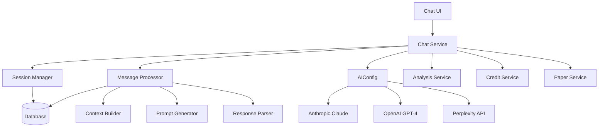

# 10. Chat System Architecture

## 10.1 Overview

The Answer42 chat system provides AI-powered conversational interfaces for interacting with academic papers. It supports multiple chat modes, each optimized for different research scenarios, and leverages different AI providers based on their strengths. The system integrates deeply with the paper processing pipeline, credit system, and user preferences.

## 10.2 Chat System Components

The chat system consists of several integrated components:



## 10.3 Chat Models

### 10.3.1 Chat Session

The chat session represents a conversation between the user and the AI:

```java
@Entity
@Table(name = "chat_sessions", schema = "answer42")
@Data
@NoArgsConstructor
public class ChatSession {
    @Id
    @GeneratedValue(strategy = GenerationType.UUID)
    private UUID id;

    @Column(name = "user_id")
    private UUID userId;

    @Column(name = "mode", nullable = false)
    private String mode = "general";

    @JdbcTypeCode(SqlTypes.JSON)
    @Column(columnDefinition = "jsonb")
    private Map<String, Object> context = new HashMap<>();

    @Column(name = "created_at")
    private ZonedDateTime createdAt;

    @Column(name = "updated_at")
    private ZonedDateTime updatedAt;

    @Column(name = "last_message_at")
    private ZonedDateTime lastMessageAt;

    @Column(name = "provider", nullable = false)
    private String provider;

    @Column(name = "title")
    private String title;
}
```

The session includes:

- A unique identifier
- The user who owns the session
- The chat mode (paper, cross-reference, research explorer)
- A context object containing session-specific data (paper IDs, settings, etc.)
- Timestamps for creation, update, and last message
- The AI provider being used
- An optional title for the session

### 10.3.2 Chat Message

Individual messages within a session are represented by the ChatMessage entity:

```java
@Entity
@Table(name = "chat_messages", schema = "answer42")
@Data
@NoArgsConstructor
public class ChatMessage {
    @Id
    @GeneratedValue(strategy = GenerationType.UUID)
    private UUID id;

    @Column(name = "session_id", nullable = false)
    private UUID sessionId;

    @Column(name = "role", nullable = false)
    private String role;

    @Column(name = "content", nullable = false, columnDefinition = "text")
    private String content;

    @JdbcTypeCode(SqlTypes.JSON)
    @Column(columnDefinition = "jsonb")
    private List<Map<String, Object>> citations = new ArrayList<>();

    @JdbcTypeCode(SqlTypes.JSON)
    @Column(columnDefinition = "jsonb")
    private Map<String, Object> metadata = new HashMap<>();

    @Column(name = "created_at")
    private ZonedDateTime createdAt;

    @Column(name = "sequence_number", nullable = false)
    private Integer sequenceNumber = 0;

    @Column(name = "message_type", nullable = false)
    private String messageType = "message";

    @Column(name = "is_edited", nullable = false)
    private Boolean isEdited = false;

    @Column(name = "token_count")
    private Integer tokenCount;

    @Column(name = "last_edited_at")
    private ZonedDateTime lastEditedAt;
}
```

The message includes:

- A unique identifier
- The session it belongs to
- The role (user, assistant, system)
- The message content
- Citations referenced in the message
- Additional metadata
- A sequence number for ordering
- A message type (standard message, analysis result, etc.)
- Edit tracking information
- Token count for billing purposes

## 10.4 Chat Modes

The system supports multiple specialized chat modes:

```java
public enum ChatMode {
    PAPER_CHAT("paper_chat", "Paper Chat"),
    CROSS_REFERENCE_CHAT("cross_reference_chat", "Cross-Reference Chat"),
    RESEARCH_EXPLORER_CHAT("research_explorer_chat", "Research Explorer"),
    GENERAL_CHAT("general_chat", "General Chat");

    private final String id;
    private final String displayName;

    // Constructor and getters
}
```

### 10.4.1 Paper Chat

Paper Chat focuses on single-paper discussions using the Anthropic Claude model:

- **Purpose**: In-depth questions about a specific paper
- **Context**: Includes the paper's full text, metadata, and analysis results
- **Features**: 
  - Direct citations from the paper
  - Section-specific questions
  - Detailed explanations of concepts
  - Connection to paper analyses

### 10.4.2 Cross-Reference Chat

Cross-Reference Chat enables comparisons across multiple papers using OpenAI's GPT-4 model:

- **Purpose**: Find agreements, contradictions, and relationships between papers
- **Context**: Includes multiple papers' texts, metadata, and relationships
- **Features**:
  - Comparative analysis of methodologies
  - Identification of conflicting findings
  - Synthesis of related information
  - Visualization of paper relationships

### 10.4.3 Research Explorer Chat

Research Explorer leverages Perplexity API for external research:

- **Purpose**: Expand research beyond uploaded papers
- **Context**: Papers plus external knowledge sources
- **Features**:
  - Web search integration
  - Citation of external sources
  - Discovery of related papers
  - Fact verification

## 10.5 AI Provider Configuration

The system uses AIConfig to manage AI providers:

```java
@Configuration
public class AIConfig {
    @Value("${spring.ai.anthropic.api-key:test-key}")
    private String anthropicApiKey;

    @Value("${spring.ai.anthropic.chat.options.model}")
    private String anthropicModel;

    @Value("${spring.ai.openai.api-key:test-key}")
    private String openaiApiKey;

    @Value("${spring.ai.openai.chat.options.model}")
    private String openaiModel;

    @Value("${spring.ai.perplexity.api-key:test-key}")
    private String perplexityApiKey;

    private final UserPreferencesService userPreferencesService;

    // User-specific API keys (cached after login)
    private String currentOpenaiApiKey;
    private String currentAnthropicApiKey;
    private String currentPerplexityApiKey;

    // Constructor and key management methods

    /**
     * Updates API keys based on user preferences when a user logs in.
     * 
     * @param user The user who has logged in
     */
    public void updateKeysForUser(User user) {
        if (user == null) {
            LoggingUtil.warn(LOG, "updateKeysForUser", "Attempted to update keys for null user");
            resetToSystemDefaults();
            return;
        }

        try {
            UserPreferences prefs = userPreferencesService.getByUserId(user.getId());

            if (prefs != null) {
                // Update keys if user has custom ones
                if (prefs.getOpenaiApiKey() != null && !prefs.getOpenaiApiKey().trim().isEmpty()) {
                    this.currentOpenaiApiKey = prefs.getOpenaiApiKey();
                } else {
                    this.currentOpenaiApiKey = openaiApiKey;
                }

                // Similar logic for Anthropic and Perplexity keys
            }
        } catch (Exception e) {
            resetToSystemDefaults();
        }
    }

    // Chat model beans
    @Bean
    @Primary
    public AnthropicChatModel anthropicChatModel(AnthropicApi anthropicApi) {
        AnthropicChatOptions options = AnthropicChatOptions.builder()
                .model(anthropicModel)
                .maxTokens(anthropicMaxTokens)
                .temperature(anthropicTemperature)
                .build();

        return new AnthropicChatModel(
                anthropicApi, 
                options, 
                toolCallingManager(), 
                retryTemplate(), 
                observationRegistry());
    }

    @Bean
    public OpenAiChatModel openAiChatModel(OpenAiApi openAiApi) {
        OpenAiChatOptions options = OpenAiChatOptions.builder()
                .model(openaiModel)
                .maxTokens(openaiMaxTokens)
                .temperature(openaiTemperature)
                .build();

        return new OpenAiChatModel(
                openAiApi, 
                options, 
                toolCallingManager(), 
                retryTemplate(), 
                observationRegistry());
    }

    @Bean
    public OpenAiChatModel perplexityChatModel(OpenAiApi perplexityApi) {
        OpenAiChatOptions options = OpenAiChatOptions.builder()
                .model("llama-3.1-sonar-small-128k-online")
                .maxTokens(perplexityMaxTokens)
                .temperature(perplexityTemperature)
                .build();

        return new OpenAiChatModel(
                perplexityApi, 
                options, 
                toolCallingManager(), 
                retryTemplate(), 
                observationRegistry());
    }

    // ChatClient beans for each provider
    @Bean
    @Primary
    public ChatClient anthropicChatClient(AnthropicChatModel anthropicChatModel) {
        return ChatClient.builder(anthropicChatModel).build();
    }

    @Bean
    public ChatClient openAiChatClient(OpenAiChatModel openAiChatModel) {
        return ChatClient.builder(openAiChatModel).build();
    }

    @Bean
    public ChatClient perplexityChatClient(OpenAiChatModel perplexityChatModel) {
        return ChatClient.builder(perplexityChatModel).build();
    }
}
```

## 10.6 Chat Service Implementation

The ChatService class manages chat operations:

```java
@Service
public class ChatService {
    private static final Logger LOG = LoggerFactory.getLogger(ChatService.class);

    private final ChatSessionRepository chatSessionRepository;
    private final ChatMessageRepository chatMessageRepository;
    private final ChatClient anthropicChatClient;
    private final ChatClient openAiChatClient;
    private final ChatClient perplexityChatClient;
    private final CreditService creditService;
    private final ChatSessionHelper chatSessionHelper;
    private final ChatMessageHelper chatMessageHelper;

    // Constructor with dependencies

    @Transactional
    public ChatSession createSession(UUID userId, String mode, Map<String, Object> context) {
        // Validate mode
        if (!isValidMode(mode)) {
            throw new InvalidChatModeException("Invalid chat mode: " + mode);
        }

        // Check credits
        if (!creditService.hasCreditsForOperation(userId, 
                OperationType.fromChatMode(mode))) {
            throw new InsufficientCreditsException(
                "Not enough credits for chat mode: " + mode);
        }

        // Create session
        ChatSession session = new ChatSession();
        session.setUserId(userId);
        session.setMode(mode);
        session.setContext(context != null ? context : new HashMap<>());
        session.setCreatedAt(ZonedDateTime.now());
        session.setUpdatedAt(ZonedDateTime.now());
        session.setLastMessageAt(ZonedDateTime.now());
        session.setProvider(getProviderForMode(mode));

        // Save and return
        return chatSessionRepository.save(session);
    }

    @Transactional
    public ChatMessage addMessage(UUID sessionId, String role, 
            String content, Map<String, Object> metadata) {
        // Validate session
        ChatSession session = chatSessionRepository.findById(sessionId)
            .orElseThrow(() -> new SessionNotFoundException("Session not found: " + sessionId));

        // Get next sequence number
        Integer nextSeq = chatMessageHelper.getNextSequenceNumber(sessionId);

        // Create message
        ChatMessage message = new ChatMessage();
        message.setSessionId(sessionId);
        message.setRole(role);
        message.setContent(content);
        message.setMetadata(metadata != null ? metadata : new HashMap<>());
        message.setCreatedAt(ZonedDateTime.now());
        message.setSequenceNumber(nextSeq);

        // Calculate token count
        message.setTokenCount(calculateTokenCount(content));

        // Save and return
        return chatMessageRepository.save(message);
    }

    @Transactional
    public ChatMessage generateAIResponse(UUID sessionId, UUID userId) {
        // Get session
        ChatSession session = chatSessionRepository.findById(sessionId)
            .orElseThrow(() -> new SessionNotFoundException("Session not found: " + sessionId));

        // Check user ownership
        if (!session.getUserId().equals(userId)) {
            throw new UnauthorizedAccessException("User does not own this session");
        }

        // Check credits
        OperationType operationType = OperationType.fromChatMode(session.getMode());
        if (!creditService.hasCreditsForOperation(userId, operationType)) {
            throw new InsufficientCreditsException(
                "Not enough credits for AI response in mode: " + session.getMode());
        }

        // Get appropriate AI client based on session mode
        ChatClient chatClient = getChatClientForMode(session.getMode());

        // Build context from session and messages
        List<ChatMessage> messageHistory = chatMessageRepository
            .findBySessionIdOrderBySequenceNumber(sessionId);

        // Create prompt
        Prompt prompt = chatMessageHelper.createPromptFromMessages(
            session, messageHistory, session.getContext());

        try {
            // Get AI response
            ChatResponse response = chatClient.call(prompt);

            // Process response
            String content = response.getResult().getOutput().getContent();

            // Create message
            ChatMessage aiMessage = addMessage(sessionId, "assistant", content, null);

            // Update metrics and deduct credits
            creditService.deductCreditsForOperation(userId, operationType);

            return aiMessage;
        } catch (Exception e) {
            LoggingUtil.error(LOG, "generateAIResponse", 
                "Error generating AI response for session %s", e, sessionId);
            throw new AIResponseGenerationException("Failed to generate AI response", e);
        }
    }

    // Get the appropriate chat client based on mode
    private ChatClient getChatClientForMode(String mode) {
        switch (mode) {
            case "paper_chat":
                return anthropicChatClient; // Claude for paper chat
            case "research_explorer_chat":
                return perplexityChatClient; // Perplexity for research explorer
            case "cross_reference_chat":
                return openAiChatClient; // OpenAI for cross-reference
            default:
                return anthropicChatClient; // Default to Claude
        }
    }

    // Additional methods for managing sessions and messages
}
```

## 10.7 Message Storage Strategy

The system implements a normalized storage strategy for chat messages:

### 10.7.1 Session Management

Chat sessions store metadata and context:

- Basic session information (user, mode, timestamps)
- JSON context object for session-specific data
- References to papers, analyses, and other related entities
- No embedded messages (normalized approach)

### 10.7.2 Message Organization

Messages are stored in their own table with:

- Sequence numbers for ordering
- Role identification (user/assistant/system)
- Message types for specialized content
- Metadata for additional context
- Citations for reference tracking

### 10.7.3 Database Triggers

A trigger automatically updates the session's `last_message_at` timestamp:

```sql
CREATE FUNCTION answer42.update_session_last_message_timestamp() RETURNS trigger
    LANGUAGE plpgsql
    AS $$
BEGIN
  UPDATE answer42.chat_sessions
  SET last_message_at = NEW.created_at
  WHERE id = NEW.session_id;
  RETURN NEW;
END;
$$;

CREATE TRIGGER update_session_timestamp 
AFTER INSERT ON answer42.chat_messages 
FOR EACH ROW 
EXECUTE FUNCTION answer42.update_session_last_message_timestamp();
```

## 10.8 Integration with Paper Analysis

The chat system integrates with paper analyses through:

1. **Context Integration**:
   
   ```json
   {
     "paperIds": ["paper-uuid-1"],
     "analysisIds": ["analysis-uuid-1", "analysis-uuid-2"]
   }
   ```

2. **Analysis Messages**:
   
   - Introduction message with analysis overview
   - Content message with detailed analysis results
   - Both linked to the analysis through metadata

3. **Message Metadata**:
   
   ```json
   {
     "analysis": {
       "id": "analysis-uuid-1",
       "type": "deep_summary",
       "paper_id": "paper-uuid-1"
     },
     "message_type": "analysis"
   }
   ```

## 10.9 UI Implementation

The chat UI leverages Vaadin components:

```java
@Route(value = "chat/:sessionId?", layout = MainLayout.class)
@PageTitle("AI Chat | Answer42")
public class AIChatView extends Div implements BeforeEnterObserver {
    private final ChatService chatService;
    private final AIChatMessageProcessor messageProcessor;
    private final AIChatViewHelper viewHelper;

    private VerticalLayout chatContainer;
    private TextArea messageInput;
    private Button sendButton;
    private UUID currentSessionId;

    // Constructor and initialization

    @Override
    public void beforeEnter(BeforeEnterEvent event) {
        // Parse parameters and initialize view

        // Extract session ID from route parameter
        String sessionIdParam = event.getRouteParameters().get("sessionId").orElse(null);

        if (sessionIdParam != null) {
            try {
                currentSessionId = UUID.fromString(sessionIdParam);
                loadExistingSession(currentSessionId);
            } catch (IllegalArgumentException e) {
                event.rerouteToError(NotFoundException.class);
            }
        } else {
            // Prepare for new session
            setupNewSessionOptions();
        }
    }

    private void setupChatInterface() {
        // Create UI components
        chatContainer = new VerticalLayout();
        chatContainer.addClassName("chat-container");
        chatContainer.setHeightFull();

        messageInput = new TextArea("Message");
        messageInput.addClassName("chat-input");
        messageInput.setPlaceholder("Type your message here...");

        sendButton = new Button("Send", e -> sendMessage());
        sendButton.addThemeVariants(ButtonVariant.LUMO_PRIMARY);

        // Layout components
        HorizontalLayout inputLayout = new HorizontalLayout(messageInput, sendButton);
        inputLayout.setWidthFull();

        add(chatContainer, inputLayout);
    }

    private void loadExistingSession(UUID sessionId) {
        try {
            // Load session and messages
            ChatSession session = chatService.getSession(sessionId);
            List<ChatMessage> messages = chatService.getSessionMessages(sessionId);

            // Verify user has access
            if (!session.getUserId().equals(getCurrentUserId())) {
                UI.getCurrent().navigate(AIChatView.class);
                Notification.show("You don't have access to this chat session", 
                    3000, Position.MIDDLE);
                return;
            }

            // Update UI
            setupChatInterface();

            // Render existing messages
            messages.forEach(this::renderMessage);

            // Set title
            updateViewTitle(session.getTitle());

        } catch (SessionNotFoundException e) {
            UI.getCurrent().navigate(AIChatView.class);
            Notification.show("Chat session not found", 3000, Position.MIDDLE);
        }
    }

    private void sendMessage() {
        String content = messageInput.getValue().trim();
        if (content.isEmpty()) {
            return;
        }

        try {
            // If no current session, create one
            if (currentSessionId == null) {
                createNewSession();
            }

            // Send user message
            ChatMessage userMessage = chatService.addMessage(
                currentSessionId, "user", content, null);

            // Render user message
            renderMessage(userMessage);

            // Clear input
            messageInput.clear();

            // Show loading indicator
            Div loadingIndicator = viewHelper.createLoadingIndicator();
            chatContainer.add(loadingIndicator);

            // Generate AI response asynchronously
            UI ui = UI.getCurrent();
            CompletableFuture.runAsync(() -> {
                try {
                    // Generate response
                    ChatMessage aiMessage = chatService.generateAIResponse(
                        currentSessionId, getCurrentUserId());

                    // Update UI
                    ui.access(() -> {
                        // Remove loading indicator
                        chatContainer.remove(loadingIndicator);

                        // Render AI message
                        renderMessage(aiMessage);

                        // Scroll to bottom
                        Page page = ui.getPage();
                        page.executeJs(
                            "document.querySelector('.chat-container').scrollTop = " +
                            "document.querySelector('.chat-container').scrollHeight"
                        );
                    });
                } catch (Exception e) {
                    // Handle error
                    ui.access(() -> {
                        // Remove loading indicator
                        chatContainer.remove(loadingIndicator);

                        // Show error
                        Notification.show(
                            "Error generating response: " + e.getMessage(), 
                            5000, Position.MIDDLE
                        );
                    });
                }
            });

        } catch (Exception e) {
            Notification.show("Error sending message: " + e.getMessage(), 
                5000, Position.MIDDLE);
        }
    }

    private void renderMessage(ChatMessage message) {
        Component messageComponent = messageProcessor.createMessageComponent(message);
        chatContainer.add(messageComponent);
    }

    // Additional methods for UI interaction
}
```

## 10.10 Credit System Integration

Chat operations consume credits based on the operation type:

```java
public enum OperationType {
    PAPER_CHAT("PAPER_CHAT", 4, 7),
    CROSS_REFERENCE_CHAT("CROSS_REFERENCE_CHAT", 4, 7),
    RESEARCH_EXPLORER_CHAT("RESEARCH_EXPLORER_CHAT", 4, 6),
    // Other operation types

    private final String id;
    private final int basicCost;
    private final int proCost;

    // Constructor and getters

    public static OperationType fromChatMode(String mode) {
        switch (mode) {
            case "paper_chat": return PAPER_CHAT;
            case "cross_reference_chat": return CROSS_REFERENCE_CHAT;
            case "research_explorer_chat": return RESEARCH_EXPLORER_CHAT;
            default: throw new IllegalArgumentException("Unknown chat mode: " + mode);
        }
    }
}
```

The credit service verifies and deducts credits for chat operations:

```java
public class CreditService {
    @Transactional
    public boolean hasCreditsForOperation(UUID userId, OperationType operationType) {
        CreditBalance balance = creditBalanceRepository.findByUserId(userId)
            .orElseThrow(() -> new CreditBalanceNotFoundException(
                "No credit balance found for user: " + userId));

        // Get cost based on user's subscription tier
        int cost = getCostForOperation(userId, operationType);

        return balance.getBalance() >= cost;
    }

    @Transactional
    public void deductCreditsForOperation(UUID userId, OperationType operationType) {
        // Check credits
        if (!hasCreditsForOperation(userId, operationType)) {
            throw new InsufficientCreditsException(
                "Not enough credits for operation: " + operationType.getId());
        }

        // Get cost
        int cost = getCostForOperation(userId, operationType);

        // Get current balance
        CreditBalance balance = creditBalanceRepository.findByUserId(userId).get();

        // Update balance
        balance.setBalance(balance.getBalance() - cost);
        balance.setUsedThisPeriod(balance.getUsedThisPeriod() + cost);
        balance.setUpdatedAt(ZonedDateTime.now());

        // Save balance
        creditBalanceRepository.save(balance);

        // Record transaction
        CreditTransaction transaction = new CreditTransaction();
        transaction.setUserId(userId);
        transaction.setTransactionType("DEDUCTION");
        transaction.setAmount(cost);
        transaction.setBalanceAfter(balance.getBalance());
        transaction.setOperationType(operationType.getId());
        transaction.setDescription("Credit deduction for " + operationType.getId());

        creditTransactionRepository.save(transaction);
    }
}
```

## 10.11 Chat Helper Classes

Several helper classes support the chat system:

### 10.11.1 ChatSessionHelper

Manages chat session operations:

```java
@Component
public class ChatSessionHelper {
    private final ChatSessionRepository chatSessionRepository;

    public ChatSessionHelper(ChatSessionRepository chatSessionRepository) {
        this.chatSessionRepository = chatSessionRepository;
    }

    public void updateSessionContext(UUID sessionId, Map<String, Object> contextUpdates) {
        ChatSession session = chatSessionRepository.findById(sessionId)
            .orElseThrow(() -> new SessionNotFoundException("Session not found: " + sessionId));

        Map<String, Object> currentContext = session.getContext();

        // Merge updates with current context
        contextUpdates.forEach(currentContext::put);

        // Update session
        session.setContext(currentContext);
        session.setUpdatedAt(ZonedDateTime.now());

        chatSessionRepository.save(session);
    }

    // Other helper methods for session management
}
```

### 10.11.2 ChatMessageHelper

Manages message operations and AI interactions:

```java
@Component
public class ChatMessageHelper {
    private final ChatMessageRepository chatMessageRepository;

    public ChatMessageHelper(ChatMessageRepository chatMessageRepository) {
        this.chatMessageRepository = chatMessageRepository;
    }

    public Integer getNextSequenceNumber(UUID sessionId) {
        return chatMessageRepository.findMaxSequenceNumberBySessionId(sessionId)
            .map(seq -> seq + 1)
            .orElse(0);
    }

    public Prompt createPromptFromMessages(
            ChatSession session, List<ChatMessage> messages, Map<String, Object> context) {
        // Create appropriate prompt based on session mode
        switch (session.getMode()) {
            case "paper_chat":
                return createPaperChatPrompt(session, messages, context);
            case "cross_reference_chat":
                return createCrossReferenceChatPrompt(session, messages, context);
            case "research_explorer_chat":
                return createResearchExplorerPrompt(session, messages, context);
            default:
                return createGeneralChatPrompt(session, messages, context);
        }
    }

    // Methods for creating different prompt types

    private Prompt createPaperChatPrompt(
            ChatSession session, List<ChatMessage> messages, Map<String, Object> context) {
        // Extract paper information from context
        String paperId = (String) context.getOrDefault("paperId", "");

        // Create system message with paper context
        String systemPrompt = "You are an academic research assistant..." +
            "You are discussing the paper with ID " + paperId + "...";

        // Convert messages to prompt format
        List<Message> promptMessages = new ArrayList<>();
        promptMessages.add(new SystemMessage(systemPrompt));

        // Add conversation history
        for (ChatMessage message : messages) {
            if ("user".equals(message.getRole())) {
                promptMessages.add(new UserMessage(message.getContent()));
            } else if ("assistant".equals(message.getRole())) {
                promptMessages.add(new AssistantMessage(message.getContent()));
            }
        }

        return new Prompt(promptMessages);
    }

    // Other prompt creation methods
}
```

## 10.12 Performance Considerations

The chat system includes several performance optimizations:

1. **Message Pagination**: Only a limited number of messages are loaded initially
2. **Context Windowing**: Only relevant context is included in prompts
3. **Asynchronous Processing**: UI remains responsive during AI generation
4. **Token Optimization**: Prompts are optimized to reduce token usage
5. **Caching**: Frequently accessed data is cached for performance

## 10.13 Security Considerations

Chat system security includes:

1. **Session Ownership**: Strict validation that users can only access their own sessions
2. **Data Isolation**: Row-level security ensures data separation
3. **Content Filtering**: User inputs are validated and sanitized
4. **Rate Limiting**: Prevents abuse of the chat system
5. **Audit Logging**: Chat operations are logged for security purposes
